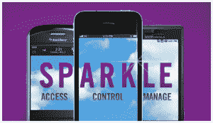

# 位置即服务提供商 Location Labs 收购 Wirkle 和 Volly 

> 原文：<https://web.archive.org/web/https://techcrunch.com/2011/10/24/location-as-a-service-provider-location-labs-acquires-wirkle-and-volly/>

# 位置即服务提供商 Location Labs 收购 Wirkle 和 Volly

位置实验室(Location Labs)是一家位置服务提供商，也是移动父母控制工具[安全](https://web.archive.org/web/20230205000539/http://www.safely.com/)的制造商，今天宣布收购移动领域的两家公司 [Wirkle](https://web.archive.org/web/20230205000539/http://www.wirkle.com/) 和 [Volly](https://web.archive.org/web/20230205000539/http://vol.ly/) 。作为各自交易的一部分，移动产品开发公司 Wirkle 和群发信息公司 Volly 将把他们的产品组合、IP 和团队带到位置实验室。

尽管交易条款没有披露，但两家公司的累计价值都达到了数百万美元。

 Location Labs 可能不是一个家喻户晓的名字，但它的技术已预装在美国数百万部手机上。该公司的 [Sparkle](https://web.archive.org/web/20230205000539/http://www.locationlabs.com/products/sparkle/) 移动平台是 Safely 的基础，并预装在 Sprint 的所有智能手机上。除了 Sprint，该公司也是 T 和 T-Mobile 的合作伙伴之一，其解决方案为运营商品牌的家庭定位器应用以及 Sprint 和 T-Mobile 的“开车时不发短信”服务提供支持。

首席执行官 Tasso Roumeliotis 表示，新的收购将有助于 Location Labs 进一步发展成为一家成熟的移动安全公司。“赛门铁克保护你的电脑上的数据，但你的手机是一个个人安全设备，”他解释说。该公司计划更深入地研究手机可以帮助用户保持安全，甚至在你不得不独自走过黑暗的停车场时保护你。

但它将如何做到这一点呢？在这里，Roumeliotis 有点含糊其辞，但暗示位置实验室已经与 911 提供商合作，建立某种移动报警功能(也许是短信)。它还在开发一些服务，可以为那些“非紧急”紧急情况提供警报功能——比如当你的轮胎漏气或汽油用完，需要朋友来接你的时候。

Wirkle 拥有移动平台开发经验，这将有助于加快这些新解决方案的上市时间，而 Volly 的群组消息功能可用于 Location Labs 当前和未来的安全和安保应用程序。

总部位于旧金山的 Location Labs 此前从 Draper Fisher Jurvetson、BlueRun Ventures、高通风险投资公司、英特尔投资公司和三井风险投资公司筹集了 2600 万美元的风险融资。它现在有 150 名员工，盈利，不再认为自己是一家初创公司。