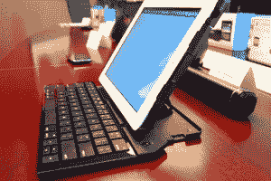
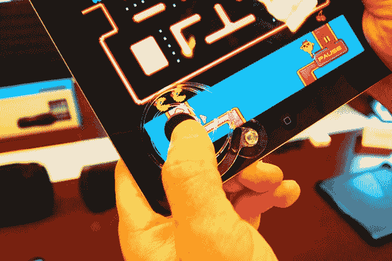

# 罗技推出惊人有用的新 iPad 配件 TechCrunch

> 原文：<https://web.archive.org/web/http://techcrunch.com/2011/08/24/logitech-introduces-surprisingly-useful-new-ipad-accessories/>

我从来没有真正喜欢过与电子产品一起出售的所有特殊附件和配件。在我看来，一个漂亮的坚固外壳是手机/平板电脑配件应该有的。但在最近与罗技的一次会议上，几个 iPad 配件绝对吸引了我的眼球。

两者在本质上非常不同——一个用于游戏，而另一个更像是一种实用设备——但它们吸引我的原因是因为它们将为平板电脑本身带来附加值。有很多时髦的可连接扬声器条和相机镜头可以放在你的 iPad 上，但说真的，你会经常使用这些东西吗？也许你会为聚会准备一个音箱，或者在去度假前把镜头放在口袋里，但这真的是极限了。

罗技的新产品适用于日常使用，可能会改变每次 iPad 会话的时长，以及在平板电脑上执行的活动。所以事不宜迟，下面我就给大家介绍一下罗技最新的 iPad 配件。

**罗技 iPad 2 折叠键盘**

 这东西真他妈的俏皮。它基本上是二合一的 iPad 2 支架和蓝牙键盘基座，与苹果的智能外壳配合良好。虽然罗技不会推荐它，但它也可能会防止一些轻微的跌落和碰撞(结合智能外壳)。它还可以通过 USB 充电，所以你可以不用担心要换多少次电池了。

合上时，键盘会自动关闭以省电。打开时，它会自动打开并连接到 iPad。更重要的是，折叠键盘实际上是一个全尺寸键盘，所以你不仅摆脱了我们都经历过的触摸屏打字的挫败感，而且你实际上获得了一个舒适的物理键盘，空间足够两个人使用。

我对这个键盘基座的唯一真正问题是，它像婴儿的尿布一样笨重。轻薄，轻薄，轻薄。这就是苹果，以及几乎所有平板电脑/智能手机制造商的意义所在。罗技的折叠键盘虽然功能强大，但却没有同样轻薄。仔细想想，价格也不是那么吸引人。

罗技的 iPad 2 折叠键盘的建议零售价为 129.99 美元，将于 9 月在美国和欧洲上市。

**用于 iPad 的罗技操纵杆**

【T2

我们最近已经看到了一些[古怪的操纵杆样式的装置](//web.archive.org/web/20230205090447/http://techcrunch.com/2011/06/16/joystick-it-because-your-iphone-needs-a-gigantic-oldschool-joystick-right/%E2%80%9D)，但是没有一个像罗技的一样有思想。如果你曾经在你的 iPad 上玩过一个需要操纵杆或 D-pad 的游戏，你就会明白我为什么说失败很糟糕。不是因为我或你或其他任何人缺乏击败游戏的技能，而是因为关注游戏和你的手指放置会让它感觉不公平。

罗技的操纵杆相当彻底地解决了这些问题，没有给你的平板电脑增加任何沉重的垃圾。它用吸盘连接 iPad，超级轻。它的螺旋设计确保拇指垫总是回到中间位置，最终在 iPad 上提供一些触觉反馈。

罗技 iPad 操纵杆的建议零售价为 19.99 美元，将于 9 月开始在美国和欧洲上市。