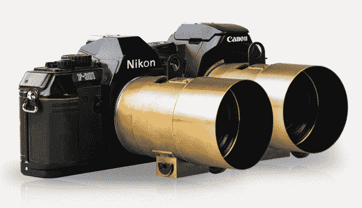

# Lomography 的 Kickstarter 支持的佩兹瓦尔 DSLR 镜头是一个肖像英雄 

> 原文：<https://web.archive.org/web/https://techcrunch.com/2013/07/25/lomographys-kickstarter-backed-petzval-dslr-lens-is-a-portrait-hero/>

# Lomography 的 Kickstarter 支持的佩兹瓦尔 DSLR 镜头是一个肖像英雄

一些公司已经开始使用 Kickstarter 作为他们产品管道中几乎默认的一步，纽约的 Lomography 就是其中之一。这家专注于摄影的公司已经成功启动了其 iPhone 胶片扫描仪，现在它正寻求[资助一款基于 19 世纪历史性的“Petzval”设计的数码单反](https://web.archive.org/web/20221006144838/http://www.kickstarter.com/projects/lomography/the-lomography-petzval-portrait-lens)复古人像镜头。

Petzval 镜头是 19 世纪最受欢迎的照片选择，可以产生独特的散景(背景模糊)效果，景深非常窄。一旦你看到用它们拍摄的一些样本，它们就非常容易辨认，当与现代单反相机的传感器和成像功能搭配时，效果非常令人印象深刻。

Lomography 的版本将保留标志性的视觉风格，但也为佳能 EF 和尼康 F 兼容相机提供了支架，以及非常 bring f/2.2 的最大光圈，这至少比经典的 Petzval 的大了一个句号。根据 Lomography 的说法，它还具有出色的色彩饱和度和高对比度，在对焦区域非常清晰。Petzval 的渐晕效果也很明显，形成了一种艺术效果。

petz val 的设计独一无二，它被刻意设计成捕捉超窄的景深，这是拍摄真正流行的人像照片的关键因素。从美学角度来看，全新的 Lomography Petzval 将采用黄铜制作，就像原版一样。

十多年来，Lomography 一直在制造镜头和复古低保真相机，Petzval 雄心勃勃，但绝对在他们的范围内。该运动正在寻求 10 万美元，并且已经承诺了一半以上。预购支持者级别从 300 美元开始，尽管这个价格很少剩下，还有 350 美元，400 美元和更高的支持者级别。

像 Lomography 这样的公司使用 Kickstarter 作为一种方式来调查对潜在产品的兴趣，同时还创建了一个预购渠道，并承担了一些开发新产品的风险，这种趋势对消费者来说非常好，因为它将值得信赖的品牌与创新平台相结合。Kickstarter 因未能兑现承诺的项目受到了很多批评，但它最终可能会在这种规模上取得更大的成功，中型公司会寻求更广泛的受众，而不是作为钱包鼓鼓的早期采用者的资金真空。