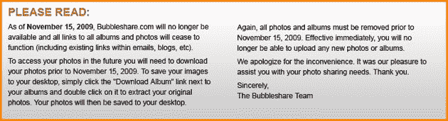

# 漫长的泡沫之旅结束于死亡池 

> 原文：<https://web.archive.org/web/https://techcrunch.com/2009/08/13/long-journey-for-bubbleshare-ends-in-deadpool/>

# 漫长的泡泡之旅结束于死亡之池

加拿大图片分享初创公司 [BubbleShare](https://web.archive.org/web/20221007091003/http://www.bubbleshare.com/) 将于 2009 年 11 月 15 日关闭。用户通过电子邮件和网站主页上的通知得到通知。

该网站由[阿尔伯特·赖](https://web.archive.org/web/20221007091003/http://www.crunchbase.com/person/albert-lai-2)创建，于 2005 年末首次推出，我们很快就喜欢上了它:*“多伦多的在线照片共享 BubbleShare 非常棒，而且非常容易使用。他们的界面团队应该得到一个金星什么的……"*增加界面功能[比如 zoom](https://web.archive.org/web/20221007091003/http://www.beta.techcrunch.com/2006/03/02/bubbleshare-adds-ajax-zoom-feature/) 让使用起来更加有趣。

【2007 年初，公司以 225 万美元的价格[出售给 Kaboose Inc .](https://web.archive.org/web/20221007091003/http://www.beta.techcrunch.com/2007/01/04/bubbleshare-finally-gets-its-payday/)([TSX:KAB](https://web.archive.org/web/20221007091003/http://finance.google.com/finance?q=KAB&hl=en))，这是一家小型上市的“以家庭为中心的在线媒体公司”,根据可赚得条款，该公司还获得了 75 万美元。

2009 年 4 月，迪士尼以 1840 万美元的价格收购了 Kaboose 的部分资产。

没有关于他们为什么关闭的消息，但是[这个](https://web.archive.org/web/20221007091003/http://siteanalytics.compete.com/bubbleshare.com/)可能与此有关。我们将永远拥有 BubbleShare 的美好回忆，但它现在在 TechCrunch [DeadPool](https://web.archive.org/web/20221007091003/http://www.beta.techcrunch.com/tag/deadpool) 中。