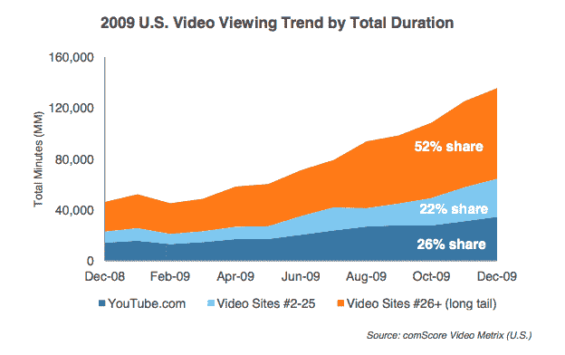

# 视频网站的长尾占据了一半的观看时间 

> 原文：<https://web.archive.org/web/https://techcrunch.com/2010/02/08/long-tail-video-half-viewing-minutes/>

# 视频网站的长尾占据了一半的观看时间

YouTube 一个月可能会播放超过 130 亿个 T2 视频，占总视频流的近 40 %,但是如果以花费的时间来衡量，YouTube 去年只占网络观看时间的 26%。这并不奇怪，因为大多数 YouTube 视频都很短，所以它花在观看视频上的时间比观看的视频流数量少。但令人惊讶的是，一旦你离开排名前 25 的网站，网络视频的格局仍然是多么的支离破碎。

根据 comScore 的 [2009 年美国数字年回顾](https://web.archive.org/web/20221007042326/http://www.comscore.com/Press_Events/Presentations_Whitepapers/2010/The_2009_U.S._Digital_Year_in_Review)，去年超过一半的时间(52 %)是在排名前 25 的长尾视频网站上观看的。你看到的是一个真正的杠铃分布，一端是 Youtube，另一端是长尾网站。从 2008 年 12 月到 2009 年 12 月，视频总浏览量翻了一番多，从 140 亿增加到 330 亿。所以对于小众视频制作人来说，还是有希望的。

第 2 到第 25 个网站占据了剩余的 22%的视频时间。这一组包括排名第二的视频网站 Hulu 和迅速崛起的网飞(排名第 19)，前者在去年 12 月的月视频流量刚刚达到 10 亿。Hulu 的 10 亿个流占据了 58 亿分钟的观看时间，比一年前增长了 140%。

关于 comScore 报告的更多内容，请参见我之前关于网上十大广告发布商的文章，或者点击这里下载完整的报告。

