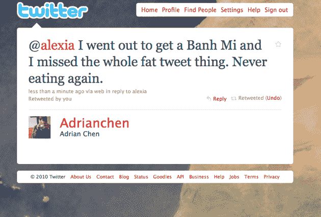

# 长推文很长:Bug 让你超过 140 TechCrunch

> 原文：<https://web.archive.org/web/https://techcrunch.com/2010/08/14/long-tweet-is-long-t-co-bug-lets-you-go-way-over-140/>

# 长微博很长:Bug 让你超过 140

昨天深夜，日本推特用户 [@sskhybrid](https://web.archive.org/web/20221007095920/https://twitter.com/sskhybrid) 发了[以下 2135 个字符的推文](https://web.archive.org/web/20221007095920/https://twitter.com/sskhybrid/status/21148452562)，不可避免地被 100 多人转发。翻译过来似乎是他使用 Twitter 经历的一个混杂版本。

用户 [@esehara](https://web.archive.org/web/20221007095920/https://twitter.com/esehara/status/21176424996) 也加入了长文的行列，发了完整的《创世纪 1》(3157 个字符)。让[许多人困惑的 Twitter 漏洞是](https://web.archive.org/web/20221007095920/http://teensintech.com/2010/08/14/twitter-bug-leaves-me-scratching-my-head/)利用了[新 t.co 网址缩写器](https://web.archive.org/web/20221007095920/https://beta.techcrunch.com/2010/06/08/twitter-to-begin-wrapping-all-links-with-official-t-co-link-shortener/)中的长度限制缺陷，允许用户[发出超过 140 个字符的非网址链接](https://web.archive.org/web/20221007095920/http://support.twitter.com/articles/109623-about-twitter-s-link-service-http-t-co)。

如果你想重现这种效果，而且它 **[似乎正在捕捉](https://web.archive.org/web/20221007095920/http://twitter.com/gaberivera/status/21184380367)** ，你可以访问[http://twitter.com/share?text=&URL = yourtext，](https://web.archive.org/web/20221007095920/http://twitter.com/share?text=&url=yourtext)添加任何你想要的东西来代替“your text”，复制并粘贴你的新 t.co URL 到 Twitter(或使用方便的 tweet 按钮)并发布长推。

140 个字符的限制基本上是 Twitter 的定义。现在你可以走得更远了，看看会有什么变化会很有趣。无论如何，我真的很期待[注释。](https://web.archive.org/web/20221007095920/http://dev.twitter.com/pages/annotations_overview) 

**更新:** [看起来](https://web.archive.org/web/20221007095920/https://twitter.com/sskhybrid/status/21148452562)推特上敏捷的工程师在这个帖子发布的一个小时内就关闭了这个功能，这让[所有人都很沮丧。](https://web.archive.org/web/20221007095920/http://twitter.com/Adrianchen/statuses/21191563714) [脚本新闻](https://web.archive.org/web/20221007095920/http://scripting.com/stories/2010/08/14/twitters140charLimitIsBrok.html)戴夫·温纳甚至为[肥胖推文创建了一个网络应用。](https://web.archive.org/web/20221007095920/http://scripting.com/stories/2010/08/14/twitters140charLimitIsBrok.html)

