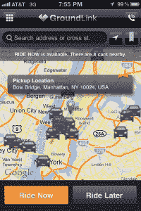

# 当心优步:GroundLink 为纽约人推出一项负担得起的移动私家车服务 

> 原文：<https://web.archive.org/web/http://techcrunch.com/2011/10/17/look-out-uber-groundlink-launches-an-affordable-mobile-private-car-service-for-new-yorkers/>

TechCrunch 的读者可能对优步很熟悉，这是一种按需出租车/私家车服务，让用户绕过等待出租车的恼人过程或租用豪华轿车的昂贵前景——所有这一切都通过你的移动设备和短信来实现。

今天，一家汽车服务公司在纽约市推出了一项新功能，它希望借助优步越来越受欢迎以及按需移动预订和送餐服务，如 [OpenTable](https://web.archive.org/web/20230203110718/http://www.opentable.com/default.aspx) 或 [Seamless](https://web.archive.org/web/20230203110718/http://www.seamless.com/) ，让获得私家车变得更加容易。(因为显然没有人再喜欢通过电话订购了。)

总部位于纽约市的汽车服务公司 GroundLink 成立于 2003 年，是地面旅行行业的聚合者和解决方案提供商，如今它将实现移动化，让用户可以随时通过智能手机在 iOS[和 Android](https://web.archive.org/web/20230203110718/http://itunes.apple.com/us/app/groundlink/id459161879?mt=8)[上预订私家车，无论是立即预订还是在预定时间预订。](https://web.archive.org/web/20230203110718/https://market.android.com/details?id=com.infinum.groundlink)

凭借其新的按需移动功能，GroundLink 旨在通过在用户预订乘车之前提供完全透明的价格，而不是在乘车结束后收到令人望而生畏的账单，为其他地铁车辆和出租车服务提供有吸引力的替代方案。

GroundLink 希望消除隐藏的费用和长时间的等待(这对任何试图在纽约使用类似服务的人来说都是一个大问题)，并通过提供完全基于距离而不是竞争对手的统一费率来提高透明度，竞争对手在定价方案中包括交通(通过测量速度)，由于交通堵塞和收费交通等有趣的事情，经常导致价格大幅上涨。在往返纽约市(或旧金山)的途中，真的会有不需要处理交通问题的时候吗？

 通过 GroundLink 租用私家车的统一价格极具竞争力；例如，在纽约市机场租车，该服务目前提供的乘车费为 49 美元，波士顿为 60 美元，旧金山为 59 美元。当然，这些费用不包括等待时间、停车次数、通行费和停车费等。但是，与黄色出租车相比，考虑到你将有自己的车，而不必应付一些出租车司机的暴虐 B.O .，这是一个相当不错的交易。([点击](https://web.archive.org/web/20230203110718/http://www.groundlink.com/prices/limos-us)查看更多服务价格。)

此外，GroundLink 首席执行官 Charlie Fraas 表示，与其他提供按需移动功能的竞争对手相比，该服务“在纽约市的车队中拥有十倍多的汽车”，因为它已经在纽约市建立了声誉。此外，由于可用性通常是通过移动电话按需预订汽车时最关心的问题，GroundLink 提供了一个巨大的价值主张，因为它已经在全球 110 个国家的 5，000 个城市提供。

该服务已经拥有自己的库存充足的车队(300 辆专用汽车)，并将利用分支机构(全球超过 45，000 家运输提供商)来确保当用户需要时有车可用。根据你住的地方，GroundLink 可以在 30 分钟内派车到那里。但是，如果你住在苔原的中部，预计需要 12 个小时。(他们不是魔术师，人。)

注册 GroundLink 用户可以利用其基于位置的移动“立即乘车”功能，通过 GroundLink 的应用程序实时(按需)订购汽车，或通过“稍后乘车”提前预订，让用户设置具体的日期、时间和地点来取车。在每种情况下(如优步)，乘客可以跟踪他们的汽车的位置(结合其准确的到达时间)，并在过程中的任何时间点直接与司机沟通。这项功能今天在纽约市推出，根据结果，将在不久的将来在全球推出。

该移动服务还提供了一个社交共享工具，以便乘客可以在旅行期间更新朋友和粉丝，并为好司机和不太好的司机留下评论和建议。

为了庆祝“现在就骑”在纽约市的推出，GroundLink 为通过 ots iPhone 或 Android 应用程序预订的客户提供了赢得超过 15，000 美元现金和其他奖品的机会。从今天开始，GroundLink 的车队将在五天内堆放各种奖品，包括每天两个装有 1000 美元现金的信封。其他奖品包括扬基队、巨人队和喷气机队比赛的门票，Momofuku 和 Peter Luger 礼品卡，Brooklyn Bowl，Barneys 和 Tiffany 礼品卡等。

“GroundLink 不仅仅是一个应用程序”，GroundLink 首席执行官说。“我们是第一家通过应用程序访问超过 10 万辆汽车的全球车队的公司。到目前为止，商务旅行者还没有办法在全国和全球范围内找到可靠的、价格有竞争力的私家车服务。随着我们在 iPhone 和 Android 上推出移动应用，我们正在拥抱一种在我们的行业中独一无二的多平台商业模式，”他说。

更多关于 GroundLink 的信息，请点击这里。