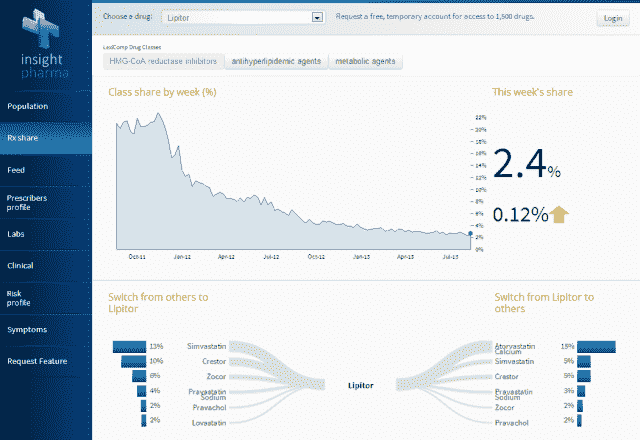
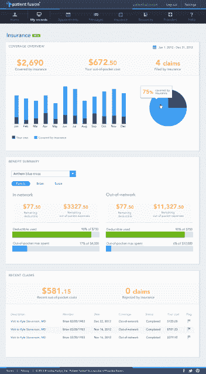

# 实践融合获得了 7000 万美元的巨额资金，为医疗危机带来了大数据疗法 

> 原文：<https://web.archive.org/web/https://techcrunch.com/2013/09/24/looking-beyond-medical-records-practice-fusion-lands-a-whopping-70m-to-bring-a-big-data-cure-to-the-healthcare-crisis/>

过去两年，数字健康创业公司的世界已经开始爆炸——医疗保健领域的创新也随之而来——但尽管如此，[最新的报告显示出一个前景，即](https://web.archive.org/web/20221206222023/https://beta.techcrunch.com/2013/07/08/amidst-dabbling-investors-and-dearth-of-seed-capital-digital-health-startups-turn-to-crowdfunding/)仍然缺乏种子投资，投资者仍然“涉猎”，并且缺乏像谷歌或脸书这样的强大参与者。然而，今天，[实践融合](https://web.archive.org/web/20221206222023/http://www.practicefusion.com/)似乎准备接管统治，并可能创造一个轰动的 IPO，数字健康领域一直在等待。

自 2005 年成立以来，Practice Fusion 一直致力于通过为医生、他们的诊所和他们的患者提供免费的电子病历(EMRs)数字平台，来重新发明陈旧过时的医疗保健 IT 世界。快进到 2013 年，超过 100，000 名医生已经采用了 Practice Fusion 的 EMR 平台，现在正在使用它来开处方、与提供商通信、订购实验室和记录就诊。

今天，这家初创公司清楚地表明了它在过去几年中的增长有多强劲，宣布了 7000 万美元的巨额 D 轮投资，由凯鹏华盈(KPCB)和机构投资者或 biMed Advisors 和 Deerfield Management Company 领投。该初创公司的现有投资者，包括 Artis Ventures、摩根塔勒风险投资公司和 Felicis Ventures 也参与了这轮投资，使其资本总额达到 1.34 亿美元。

当然，最大的问题是，在游戏的这个阶段，这种大规模的资本注入对一家公司意味着什么。在本周的一次谈话中，Practice Fusion 的创始人兼首席执行官瑞安·霍华德(Ryan Howard)不愿意给出潜在 IPO 的时间表，但他确实表示，该公司新的 7000 万美元将为其提供朝着这个方向发展所需的资本，展望未来，他“非常希望(Practice Fusion)上市。”

据彭博报道，新一轮融资对该公司的估值约为 7 亿美元，Practice Fusion 已经成为新一代最大的数字健康创业公司之一，似乎在 IPO 方面，这不是“如果”而是“何时”的问题 Howard 说，自 2012 年 6 月在 C 轮融资中筹集到 3400 万美元[以来，公司的增长已经复合。](https://web.archive.org/web/20221206222023/https://beta.techcrunch.com/2012/06/28/practice-fusion/)

如今，这家初创公司的平台上管理着超过 400 万人次的患者就诊，这一数字在过去的 24 个多月里同比增长了 75%。反过来，这使得 Practice Fusion 能够扩展其在数据领域的抱负，增加其去身份化的数据平台，Howard 声称该平台现在是美国最大的实时临床数据集。他说，今天，医疗保健市场的公司感受到了整合的压力，这就是为什么该团队一直在尽可能快地利用所有可用的杠杆进行扩展。

该团队本身已经扩大到 300 多人，其中很大一部分是在过去 12 个月里招聘的，该公司最近在旧金山市中心的办公楼里又买了几层楼。霍华德表示，有了新的资金，他计划继续扩大团队和利用数据平台的方式，数据平台已经成为收入增长的重要驱动力，顺便提一下，增长率自 2012 年以来增加了 300%，他说。

霍华德声称，这个临床数据集现在几乎是凯撒医疗机构和退伍军人管理局拥有的可比系统的四倍。今年早些时候，该公司为医生、记者、分析师和制药公司推出了一款名为“Insight”的新订阅研究工具，旨在展示它开始利用其数据集来增加对患者健康信息的访问的方式，并帮助医疗保健领域的各种参与者从这些数据中收集洞察力。

该公司还推出了 Patient Fusion，这是该公司如何将其数据集产品化的另一个例子，自那以来，该公司一直致力于成为“医生的 Salesforce.com 和健康的脸书”，正如我们今年早些时候写的。通过 Patient Fusion，该公司的平台现在允许任何人在到达医生办公室的一个小时内比较医生评论和预约。

然而，与 Yelp 不同的是，[正如我在许多](https://web.archive.org/web/20221206222023/https://beta.techcrunch.com/2013/05/22/practice-fusion-continues-to-reach-beyond-digital-health-records-adds-free-expense-tracking-to-new-booking-engine/)中所写的那样，“它允许用户对医生进行评级，即使他们从未踏进过他们的办公室，而 Patient Fusion 会在患者就诊后汇总他们的评级。这使得该公司不仅可以建立一个经过验证的评论数据库(基于它知道实际发生的访问)，还可以为一个相当大的本地医生搜索引擎奠定基础。”

该网站的评论数以百万计，通过这些产品，以及帮助患者更好地了解和管理他们的医疗支出的工具，该公司一直在寻求向成为一个全方位服务的健康信息平台迈出下一步。“如果最初推出的 Patient Fusion 将该公司带入了 Yelp(和 ZocDoc)的领地，”[我们当时推测](https://web.archive.org/web/20221206222023/https://beta.techcrunch.com/2013/05/22/practice-fusion-continues-to-reach-beyond-digital-health-records-adds-free-expense-tracking-to-new-booking-engine/)“那么它的新免费服务标志着 Practice Fusion 自己版本的 Mint.com 健康的开始。”

该公司一直忙于产品方面的耐心融合和洞察力，但在新一轮中，Practice Fusion 也一直在寻求加强其战略合作伙伴，特别是那些可以帮助公司利用其增长(在产品和业务方面)并引导其走向未来 IPO 的合作伙伴。

例如，作为 7000 万美元注资的一部分，凯鹏华盈(Kleiner Perkins)普通合伙人、医学博士贝丝塞登伯格(Beth Seidenberg)将加入这家初创公司的董事会。到目前为止，尽管 Practice Fusion 在一个由传统医疗保健公司组成的旧世界中运营，但它更像是一家技术公司，而不是传统意义上的医疗保健公司。但是，随着 Seidenberg 现在进入董事会，他带来了作为两家生物技术公司的创始首席执行官和 Amgen 的前高级副总裁兼首席医疗官的经验，以及来自 OrbiMed Advisors 和 Deerfield Management Company 的战略投资，Practice Fusion 也开始听取旧世界的意见。

 而且，随着公司加速增长(和扩张)的速度，并朝着潜在的 IPO 努力，来自这些利益相关者的建议和忠告将变得越来越有价值。尤其是考虑到美国医疗保健领域正在经历翻天覆地的变化，尤其是在护理协调方面，医疗保健提供商如何衡量自己的绩效并优化成本效益。医疗保健正朝着更加以患者为中心的模式发展，在这种模式下，护理的成功将更加关注患者的结果，他们是否理解治疗和护理，以及护理是否真正兑现了承诺。

Howard 认为，Practice Fusion 处于一个独特的位置，因为它位于技术和医疗保健行业之间，可以影响国家医疗改革，并通过与生命科学公司的合作伙伴关系，帮助他们开发新的人口健康管理计划，包括遵守公共卫生指南和报告市场趋势等。Howard 说，如今，Practice Fusion 已经与美国 20 家最大的制药公司中的 18 家建立了合作关系。

反过来，它的新资金也将使 Practice Fusion 继续扩大与企业的关系，包括实验室、计费中心和成像中心，这些中心目前已超过 300 个。通过这些企业合作伙伴关系(及其 API)，该公司仅在 9 月份就帮助其合作伙伴管理了超过 100 万次实验室交易和 270 万份处方。

展望未来，这位首席执行官表示，他的公司将在未来一年扩展其 API 平台，以进一步发展与健康开发者和工程师的关系，并进入市场上广阔(且不断增长)的移动健康应用领域——这个数字接近 100，000。

总而言之，Practice Fusion 正在朝着其目标快速前进，即向医疗保健提供商和患者提供更全面的健康视图，从电子病历到费用。霍华德认为，其不断增长的数据集可以帮助打开一个新创新、治疗的洗衣清单，并通过合作伙伴关系，帮助解决普通患者面临的一些最大的成本和痛点。考虑到美国 30%的医疗保健支出(或每年超过 7500 亿美元)可以在不减少结果的情况下避免，Practice Fusion 的贡献完全可以帮助移动这根针。