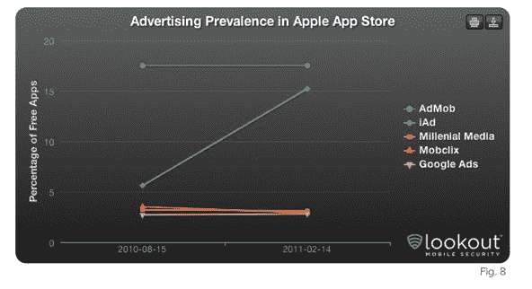

# 展望:Android 市场增长更快，但 App Store 吸引了更多开发者 TechCrunch

> 原文：<https://web.archive.org/web/https://techcrunch.com/2011/02/16/lookout-android-market-growing-faster-but-app-store-attracting-more-developers/>

# 展望:安卓市场增长更快，但应用商店吸引了更多开发者

Lookout，[一家为许多智能手机提供安全服务](https://web.archive.org/web/20230203043725/https://techcrunch.com/2010/05/18/lookout-lands-11-million-from-accel-khosla-and-others-for-smartphone-security-platform/)的公司，今天发布了一项针对美国用户的安卓市场和苹果应用商店的新研究。值得一看——[报告](https://web.archive.org/web/20230203043725/https://www.mylookout.com/appgenome)有许多关于增长、开发者、移动广告网络等有趣的数据点。

根据 Lookout 的数据，自 2010 年 8 月以来，安卓可用的应用数量增长了约 127%，而 iPhone 的增长率为 44%。当然，安卓市场增长更快的事实并不新鲜。如果继续以同样的速度为每个平台开发应用程序，Android 应用程序将在 2012 年年中超过 iPhone 应用程序。

虽然 Android 市场的增长速度可能快于苹果应用商店，但苹果应用商店继续吸引着相当一部分开发者。2010 年 8 月至 2011 年 2 月期间，App Store 吸引了近 24，000 名开发者，而同期 Android 市场仅吸引了 4，000 多名开发者。

在过去的 6 个月中，苹果应用商店中的独立开发者数量增长了约 48%，而安卓市场中的独立开发者数量增长了 40%多一点。Android Market 通常比 App Store 拥有更多的应用。每个开发者平均提交的应用数量在 Android Market 是 6.6 个，在 App Store 是 4.8 个。

就免费和付费应用而言，以前，Android 市场上的应用主要是免费的；然而，在过去的 6 个月里，Android 市场已经出现了大量的付费应用。Lookout 表示，相比之下，苹果应用商店的免费应用比例有所增加，付费应用的价格保持稳定。在过去的 6 个月里，安卓市场的付费应用从 22%增长到 34%。过去 6 个月，苹果应用商店的付费应用数量从 70%下降到 66%。

就移动广告网络而言，AdMob SDK 在安卓市场和苹果应用商店中集成的免费应用比其他任何广告平台都多。然而，Lookout 表示，iAd 正在 App Store 上迅速获得牵引力，并预计在 2011 年上半年，iAd 将在免费苹果应用商店应用中超过 AdMob。在过去的 6 个月里，iAd 的流行程度已经从免费苹果应用商店应用的 5.6%上升到 15%

Lookout 还调查了访问用户位置的应用数量，声称应用商店中访问联系人和位置的应用比例更高。报告显示，安卓市场所有应用中的 28%和苹果应用商店所有应用中的 35%访问位置。此外，7%的 Android Market 应用程序和 13%的 Apple App Store 应用程序具有访问联系人的功能。

Lookout 基于网络的云连接应用程序适用于 Android、Windows Mobile 和黑莓手机，帮助用户防止丢失手机，并识别和阻止消费者手机上的威胁。用户只需将该软件下载到一个设备上，它就会像下载到电脑上的安全软件一样，充当跟踪应用程序和病毒防护程序。这家初创公司还赞助了 App Genome Project，这是一个移动应用数据集，旨在绘制跨多个移动平台和应用市场的移动应用解剖图，以提供对移动市场动态的洞察，并识别应用中的安全威胁。