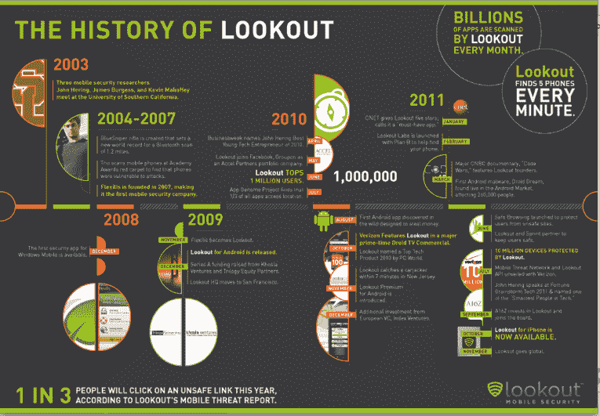

# Lookout 将智能手机安全和跟踪应用程序引入澳大利亚、加拿大和英国 TechCrunch

> 原文：<https://web.archive.org/web/https://techcrunch.com/2011/11/09/lookout-brings-smartphone-security-and-tracking-app-to-australia-canada-and-the-uk/>

# Lookout 将智能手机安全和跟踪应用程序带到了澳大利亚、加拿大和英国

[Lookout，](https://web.archive.org/web/20230204122439/https://www.mylookout.com/)一家[为许多智能手机平台提供安全服务](https://web.archive.org/web/20230204122439/https://techcrunch.com/2010/05/18/lookout-lands-11-million-from-accel-khosla-and-others-for-smartphone-security-platform/)的公司，正在澳大利亚、加拿大和英国通过本地应用程序进行国际扩张。

作为背景，Lookout 基于网络的云连接应用程序适用于 Android、Windows Mobile、黑莓和[最新的 iOS 设备](https://web.archive.org/web/20230204122439/https://techcrunch.com/2011/10/18/lookout-finally-brings-intelligent-smartphone-security-and-tracking-application-to-ios/)，帮助用户防止丢失手机，并识别和阻止消费者手机上的威胁。用户只需将该软件下载到一个设备上，它就会像下载到电脑上的安全软件一样，充当跟踪应用程序、数据备份和病毒保护程序。

Lookout 刚刚从 Andreessen Horowitz、Khosla Ventures、Accel Partners 和 Index Ventures 获得了 4000 万美元的新资金，首席执行官 John Hering 当时告诉我们，该公司正在寻求向海外发展。

正如他所解释的，“移动威胁不会因为你在哪里而有所区别。它们往往是全球性的，影响着世界各地的人们。”该公司正在与澳大利亚运营商 Telstra 合作，后者将能够从 Telstra Aisle 或通过访问 Android Market 中的 Telstra 标签下载 Lookout。

Lookout 移动安全应用程序由 Lookout 的移动威胁网络提供支持，这是一个基于云的网络，它不断分析全球威胁数据，以识别并通过无线应用程序更新快速阻止新的威胁。移动威胁网络每月扫描数十亿个应用程序，是最大的智能手机应用程序数据库

迄今为止，Lookout 已经识别并阻止了 1000 多个独特的受感染应用程序。
在 2011 年上半年，带有恶意软件的独特应用程序的数量从 80 个增加到 400 个。事实上，在过去的四个月里，移动恶意软件的实例增加了一倍多，达到了近 1000 个受感染的应用程序——其中一些恶意软件很可能源自俄罗斯或中国，但影响到了世界各地的人们。

每天，Lookout 都会屏蔽数千个恶意链接，随着越来越多的人保护自己的手机，屏蔽的恶意链接数量逐月翻了一番。Lookout 的数据备份功能已经备份了 65 亿个联系人，该应用程序的手机搜索器每分钟发现 5 部手机。

