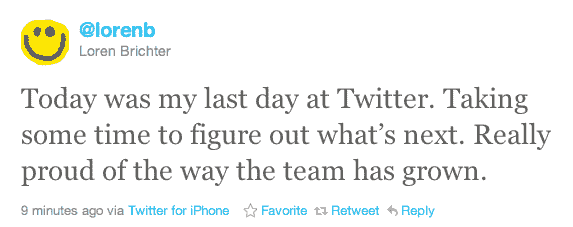

# Mac 和 iPhone 官方 Twitter 应用的开发者 Loren Brichter 离开 Twitter 

> 原文：<https://web.archive.org/web/http://techcrunch.com/2011/11/04/loren-brichter-creator-of-official-twitter-apps-for-mac-and-iphone-leaves-twitter/>

# Mac 和 iPhone 官方 Twitter 应用的开发者 Loren Brichter 离开 Twitter

极有才华的 Tweetie 开发者 Loren Brichter 刚刚宣布他将离开公司，tweet ie 是 iOS 官方 Twitter 应用的创始人。布里切特在[的推特](https://web.archive.org/web/20230204200721/https://twitter.com/#!/lorenb/status/132602670052683777)上写道，今天是他在推特的最后一天，他将“花一些时间来思考下一步该做什么”。

Brichter 通往 Twitter 的道路是不寻常的，也是许多开发者焦虑的来源。

2008 年 11 月，布里切特一个人的公司 [atebits](https://web.archive.org/web/20230204200721/http://www.atebits.com/) 推出了 Tweetie，这是一款为 iPhone 精心打造的 Twitter 客户端，迅速成为 Twitter 用户的最爱。随后，他在 2009 年发布了 Tweetie 2，这也是一个巨大的成功。

然后，在 2010 年 4 月，Twitter [宣布](https://web.archive.org/web/20230204200721/https://techcrunch.com/2010/04/09/twitter-acquires-tweetie/)已经收购了 atebits 和它的 iOS 应用——后来变成了 iPhone 的 Twitter 和 iPad 的 Twitter。在收购时还在开发中的 Mac 版 Tweetie 也已经成为 Mac 版 Twitter。

拥有“官方”应用的想法对 Twitter 的开发者生态系统是一个巨大的打击，其第三方应用首先在很大程度上为 Twitter 的成功铺平了道路。但 Twitter 辩称，官方应用的缺乏正在新用户中造成混乱，因此它推出了自己的应用。除了 iOS 和 Mac 应用，它还推出了 Android、Windows Phone 和黑莓的官方应用。

当然，很难指责布里切特的任何一点——Twitter 的管理层是决策的幕后黑手——他创造了一些非常棒的应用程序。Twitter 无疑会想念他。

