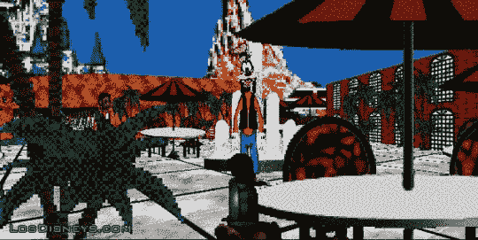

# 洛杉矶迪士尼乐园:一款专为讨厌迪士尼的人设计的游戏 

> 原文：<https://web.archive.org/web/http://techcrunch.com/2007/08/20/los-disneys-a-game-for-people-who-hate-disney/>

# Los Disneys:讨厌迪士尼的人的游戏

我一直担心美国政府有一天会把整个佛罗里达州卖给华特·迪士尼公司来偿还国债。现在能够公开谈论这件事感觉很好，因为游戏*洛杉矶迪士尼乐园*在蛰伏 10 年后重新发布。所以，对于那些说我痴迷于这个话题是疯了，并指责我不断向小孩和老人提起这个话题的人，我要对你们说，“当着你们的面。”有很多其他的疯子和我一样害怕。

> 今年是 2015 年。深陷国债泥潭的美国不情愿地允许华特·迪士尼公司购买整个佛罗里达州半岛，这是自路易斯安那购买案以来最大的地理收购案。在新总统、前首席执行官迈克尔·埃斯纳的领导下，这个新主权国家被重新命名为洛斯·迪斯尼乐园。你的工作是渗透到魔法王国，爆破你的方式通过电子海盗，全息幽灵，游客，保安，甚至米奇自己，试图寻找和摧毁华特·迪士尼的冷冻头。然而，这样做无意中触发了艾斯纳的末日装置…除非你能阻止它。

我不认为迪士尼会对这款游戏获得大量关注的前景感到兴奋。图形也很好，所以没什么帮助。

[洛杉矶迪士尼乐园网站](https://web.archive.org/web/20220925053913/http://www.losdisneys.com/artwork.html)经由[原始馈送](https://web.archive.org/web/20220925053913/http://www.therawfeed.com/2007/08/anti-disney-game-is-back-now-on-pc.html)