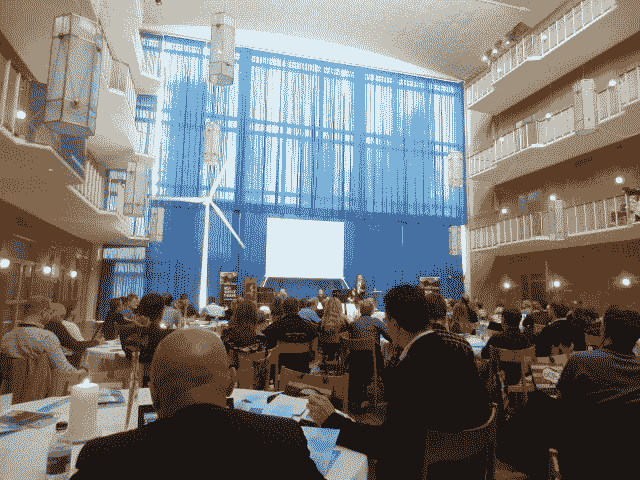

# 迷失在丹麦:黑客、机器人、古怪的办公空间和鲨鱼 

> 原文：<https://web.archive.org/web/https://techcrunch.com/2011/09/04/lost-in-denmark-hackers-robots-wacky-office-spaces-and-sharks/>

# 迷失在丹麦:黑客、机器人、古怪的办公空间和鲨鱼

上周的大部分时间，我都在丹麦与一些科技博客同行们闲逛——更具体地说，是在[奥胡斯](https://web.archive.org/web/20230203104433/http://www.visitaarhus.com/)和[比隆](https://web.archive.org/web/20230203104433/http://en.wikipedia.org/wiki/Billund,_Denmark)——并与那些组织并前往参加、演讲或展示下一届奥胡斯[【美丽的错误】](https://web.archive.org/web/20230203104433/http://nextaarhus.dk/)会议和展览的人打成一片。

[会议](https://web.archive.org/web/20230203104433/http://www.nextaarhus.com/conference)本身确实很吸引人，尽管不完全是 TechCrunch 的帖子材料，即使在& T、 [Google](https://web.archive.org/web/20230203104433/http://thenextweb.com/google/2011/08/31/7-tech-predictions-for-the-future-from-a-google-creative-director/) 和 Katalabs 工作的人在[发言人名单上](https://web.archive.org/web/20230203104433/http://nextaarhus.dk/conference/programme)。主题从生物技术、“绿色”产品化、可持续性和建筑的重新发明，到社交媒体营销、情境感知计算和广告的未来。

**更新:**我也[去了乐高乐园](https://web.archive.org/web/20230203104433/https://techcrunch.com/2011/09/04/lost-in-legoland-a-gazillion-bricks-and-a-mini-star-wars-geekfest/):)

非常有趣的东西，但不是我已经习惯参加的活动类型。没有初创公司的推介，没有科技公司高管的采访或主题演讲，没有产品发布会。换句话说，棒极了。他们甚至在舞台旁边展示了一个正在工作的风力涡轮机，并为这一活动酿造了他们自己的北极香草味啤酒(见 [Ale 404](https://web.archive.org/web/20230203104433/http://robinwauters.posterous.com/a-conference-with-its-own-beer-ale-404-now-th) )。

当我被在创新实验室工作的人从机场接机时，我问他在他看来丹麦最令人兴奋的科技公司或初创公司是什么。他不得不苦苦思索，最终除了 Navision(自从被微软收购后，它实际上是一家美国公司)和 Bang & Olufsen 之外，他无法给我一个答案。

太神奇了，真的。还有:开始工作，[启动训练营](https://web.archive.org/web/20230203104433/http://www.startupbootcamp.org/)哥本哈根！

作为一个自认的极客，随之而来的[展览](https://web.archive.org/web/20230203104433/http://www.nextaarhus.com/exhibitors)是一次真正的款待:逍遥法外的黑客，大量漂亮的机器人，乐高积木，增强现实增强的世嘉 OutRun 街车，可以驾驶([必看视频，在这里](https://web.archive.org/web/20230203104433/http://www.youtube.com/watch?v=TaTB5Q11Dzc))，古代技术文物——作品。

Engadget 的执行主编达伦·墨菲(Darren Murph)发布了[两个](https://web.archive.org/web/20230203104433/http://www.engadget.com/2011/08/30/suffer-11-farming-robot-plays-a-multitude-of-roles-takes-comma/) [视频](https://web.archive.org/web/20230203104433/http://www.engadget.com/2011/08/30/barobo-imobot-teddy-bear-learns-from-your-commands-will-definit/)一些非常酷的机器人，如果你喜欢的话。伦敦的设计艺术家 Vahakn Matossian 在脸书也有一组很棒的展览照片。这些是我拍摄的一些照片:

这里有一段视频，主角是[弗莱明](https://web.archive.org/web/20230203104433/http://osaa.dk/author/flemming/)，一个来自[开放空间奥胡斯](https://web.archive.org/web/20230203104433/http://osaa.dk/)的黑客，展示了一些有趣的东西:

黑客们，团结起来！

正如我提到的，Next Aarhus 是由创新实验室组织的，这是一个新技术的国际知识中心。他们在奥尔胡斯北部有一个超级酷的办公场所，我只是拍了一些照片:

你会问，你在标题中取笑的鲨鱼是怎么回事？给你:

是的，也有蝙蝠鱼和其他鱼类，但鲨鱼听起来更酷，对吗？

上面的视频是在[乐高乐园比伦](https://web.archive.org/web/20230203104433/http://www.legoland.dk/en/)拍摄的。然而，参观那个主题公园是如此令人惊奇的经历，以至于我不得不单独写一篇关于它的文章。马上就来。(**更新:** [起](https://web.archive.org/web/20230203104433/https://techcrunch.com/2011/09/04/lost-in-legoland-a-gazillion-bricks-and-a-mini-star-wars-geekfest/))。