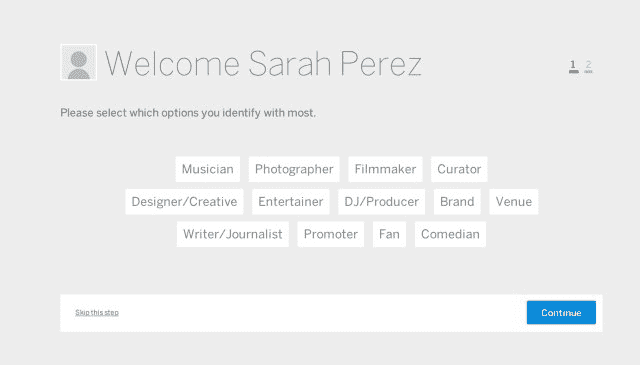
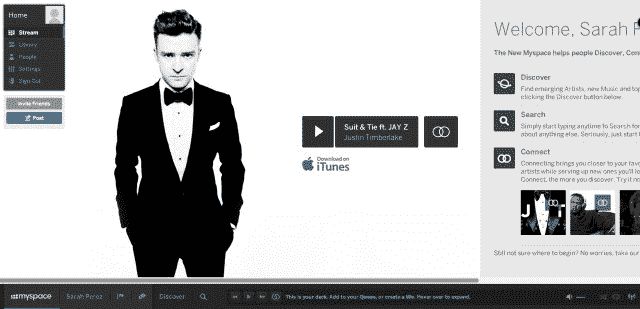
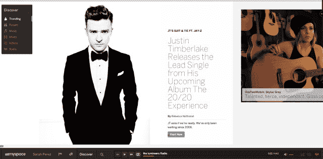
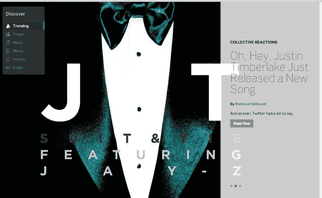
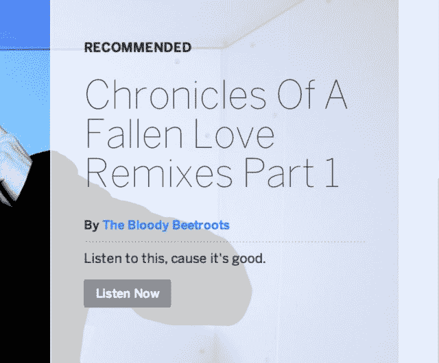

# 迷失在新的 Myspace 上。摆脱不了贾斯汀。发送帮助。TechCrunch

> 原文：<https://web.archive.org/web/https://techcrunch.com/2013/01/15/lost-on-new-myspace-cant-escape-justin-send-help/>

我已经用我的脸书账户登录了我的空间。[他们说你可以使用你的 Myspace ID](https://web.archive.org/web/20230112045339/https://techcrunch.com/2013/01/15/the-new-myspace-opens-hoping-a-justin-timberlake-single-can-help-it-fly/) ，但显然，我的记忆并没有延伸到那么远。该网站要求我表明身份。我是“馆长”吗？一个“场地？”一个“品牌？”不，但有趣的是所有这些选择都在“粉丝”之上我决定更诚实一些，选择“作家/记者”，因为这是最接近“博客”的东西

我加入。贾斯汀·汀布莱克在盯着我看。有点吓人。他看起来很生气我在这里，即使这应该是我自己的主页。

有一个播放按钮可以听他的新歌。iTunes 上的购买链接。

我不喜欢汀布莱克的音乐，但我不太清楚如何才能让他走开。新的 Myspace 只是 Timberlake 的一个巨型广告吗？我一边疑惑，一边开始寻找其他内容。或者贾斯汀只是新的汤姆。每个人的第一个朋友。不过，汤姆似乎开心多了。更无忧无虑。

主页不适合我的 MacBook Pro 15 英寸屏幕。我得翻到说明书。该网站称，发现、搜索、连接。我不得不承认，这个设计很漂亮，尽管它的水平滚动和不连贯的导航有点奇怪。

从哪里开始？

发现。在这里，Myspace 承诺我可以“发现新兴艺术家”我记得以前它是这样的。这就是它的出名之处。好吧，我想我会找到一些新兴的艺术家。我点击链接。

 *有四个:小夜惊，帕克·伊吉尔，布克&加斯和伊丝特尔·迪恩。大图片，每个都有一个小广告。

等等，我的空间怎么知道我会喜欢这些？

每个人看到的都是一样的吗？贾斯汀帮我挑的吗？我的朋友们在听这些家伙吗？我在这里没有上下文。我不明白为什么推荐他们。我决定继续前进。

艾丽西亚·凯斯和另一个贾斯汀(这次是比伯)，正从页面的一侧向外窥视。我很好奇。他们不是新兴艺术家。我刚才不是点了一个明明写着“寻找新兴艺人”的链接吗？我向左滚动，有一长串著名的名字。实际上，这是一个看似无穷无尽的清单。网站上全是顶级艺人。它停在 198，古驰马内，如果你想知道。我猜“发现”也包括找到你已经认识的艺术家。很高兴知道。

但是我想真正地*发现*。可能加了好友就好了吧，我觉得。或许到那时，你可以像 Spotify 一样，窥探其他人在听什么。否则，我可能会玩 90 年代的摇滚，回忆往事，希望垃圾摇滚卷土重来。

我如何回到我的个人资料？我误点了 Myspace 的 logo。(他们反直觉地把它放在页面底部，真是叛逆。)

我又回到贾斯汀身边了。他还是很生气。也许那是他的闷烧。我不知道。我是不是太老了，不适合呆在这里？

我在场景中分散了一会儿注意力。编辑个人资料。编辑封面图像。图像必须至少为 1024×768 像素。没有模板。我从 Flickr 上偷了点东西。

我又点击了“我的空间”。贾斯汀还在那里。等等，什么？

哦，*简介*。我明白了。贾斯汀没有挂在*我的*个人资料上，只是挂在 Myspace *主页*上。但这意味着没有办法消除贾斯汀的形象。那好吧。

为了确保万无一失，我点击了 Myspace 导航旁边我的名字。是的，这是我的资料。它是空的，但至少它现在有一个漂亮的背景。

回到手头的任务。在这件事上我需要一些朋友。在导航栏中，我单击“人物”。但事实证明，这并不意味着是朋友。我应该关注“激励你的人和内容”Myspace 推荐…哇，令人震惊…贾斯汀·汀布莱克。还有提姆巴兰，他是汀布莱克的制片人，经常和他合作。第三种选择？碧昂斯。

我的空间，你不了解我。

我是说真的，我登录了脸书——在我的“赞”中寻找一点个性化的东西会杀了你吗？

我发现“邀请朋友”我想，这就是事情变得社会化的地方。但这只是电子邮件邀请。没有脸书连接。多么老派。不用了，谢谢。

相反，我开始演奏我熟悉的音乐，放弃推荐，放弃与艺术家的“联系”。Myspace 可以让你播放、分享、排列曲目和创作混音。它像预期的那样工作。挺好的。我听着熟悉的歌曲。他们玩。一切正常。有一个广播节目。在我单击箭头之前，它不会显示下一步是什么。但是你可以像在 Pandora 上一样，在没有任何警告的情况下点击很多次。真好。不过，我想知道这是不是一个 bug。

在播放队列中，曲目上有奇怪的双圈。我点击它们，它们变成一个圆圈。再次点击。回到两圈。在某个地方，Myspace 可能认为这意味着什么。凯莉·克莱森！不，不是凯莉·克莱森。凯莉·克莱森！号码

我只是想绕着游戏队列走。

一边听，一边继续点来点去。我尝试主发现链接。它把我带到了“[趋势](https://web.archive.org/web/20230112045339/https://new.myspace.com/discover/trending)”

又是贾斯汀，但他现在离屏幕更近了，微妙地。像[忍者猫](https://web.archive.org/web/20230112045339/http://www.youtube.com/watch?v=NbwpgyRUv5g)。(顺便说一下，在截图中很难看到这一点)。

屏幕闪烁，一个新的图像旋转进来。这是贾斯汀燕尾服的特写吗？是关于他的新专辑。

*叹息*。

我转到“高速旋转”猜猜谁是第一名？

我再次点击。“新专辑。”是的，他也是这里的老大。这个网站上有没有哪个页面在某种程度上没有贾斯汀？

我点击“推荐”最后，我没有看到那个人。“编年史一个堕落的爱情混音第 1 部分”出现。“听听这个原因很好，”简介上写道。《为爱杀人》循环播放。“反复听*，”MySpace 指示道。“没有人知道我们是谁，”似乎。*听听吧。爱死了。Myspace 建议说:“动动你的屁股。**

 *

好吧。

我承认，新的 Myspace 比 Spotify 的网络版有更多的事情要做。但我不知道我在网站上的朋友中流行什么，这是 Spotify 的一大优势。音乐是社会性的。Myspace 感觉它把你和品牌联系起来了。我是说乐队。不是你的朋友。

我一直在导航中迷路。如何从艺术家个人资料页面返回以进行搜索或发现？我发现自己经常点击 Myspace 按钮，因为这将带我回到艺术家、音乐、发现和搜索的链接。在这个过程中我看到了很多贾斯汀。

我讨厌见到他。

我离开 Myspace。我不确定我什么时候回来。**