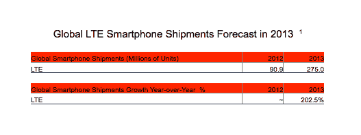

# LTE 手机的出货量将在 2013 年增长两倍，达到 2.75 亿部，亚马逊+ Mozilla 也在其中

> 原文：<https://web.archive.org/web/https://techcrunch.com/2012/12/19/lte-phone-shipments-will-triple-to-275m-units-in-2013-with-amazon-mozilla-among-those-waiting-in-the-wings-to-pounce/>

我们距离 LTE 和其他 4G 网络的全球普及还很远，但在实施了更快移动数据标准的市场中，运营商正迎来蓬勃发展。今天来自 [Strategy Analytics](https://web.archive.org/web/20221006072452/http://www.strategyanalytics.com/) 的数据预测，2013 年 LTE 设备的出货量将达到 2.75 亿部，比今年的 9090 万部增长了三倍。虽然这在很大程度上是由手机制造商和运营商之间的激烈竞争推动的，但 Strategy Analytics 预测，4G 的崛起将带来其他东西:亚马逊和 Mozilla 等新进入者也在尝试 LTE 设备。

“我们预计亚马逊将在 2013 年年中左右为美国市场推出 LTE 智能手机。Strategy Analytics 的执行董事尼尔·莫斯顿(Neil Mawston)告诉 TechCrunch，我们认为亚马逊将希望让更多的消费者手中有一张‘移动购物卡’,因为零售商的战争正越来越多地从商店、PC 和笔记本电脑转移到智能手机上。

然而，分析师也强调，打破苹果和三星目前在智能手机上的垄断地位对任何人来说都是一个挑战。“苹果和三星将在 2013 年主导全球 LTE 智能手机市场，”莫斯顿补充道。“就像今年的 3G 市场一样，明年的 4G 将是两强争霸。大多数 LTE 智能手机的竞争对手，如 HTC 或黑莓，都有许多追赶的工作要做。”

分析师没有预测是否有一家硬件制造商将获得最大的回报，而是将 iPhone 5 和三星 Galaxy S3 作为两种“受欢迎的机型”给予同等的重视目前，三星是世界上最大的智能手机制造商，也是出货量最大的手机制造商。

其他投资 4G 机型的手机制造商包括 LG、诺基亚、HTC、摩托罗拉、黑莓、华为、中兴和泛泰。

随着 LTE 服务在发达市场和新兴市场慢慢铺开(完整列表[此处](https://web.archive.org/web/20221006072452/http://lteworld.org/operator)，Strategy Analytics 表示，发达市场和新兴市场的结合将推动出货量的增长。美国、英国、日本、中国和韩国——这些国家的运营商正在与其他国家运营商展开激烈竞争，大力扩展其 LTE 网络。

“很明显，2013 年将是 4G 之年。全球 LTE 智能手机出货量将首次超过 2.5 亿部。Mawston 写道:“多家运营商和多家手机厂商将在全球多个国家推出数十种 LTE 模式。“LTE 已迅速成为一个高增长、高价值的市场，任何运营商、服务开发商、组件制造商或设备供应商都无法忽视这个市场。”

Strategy Analytics 认为，这种发展轨迹也能让新玩家加入进来。但是受欢迎程度不会降低消费者销售的挑战性。

分析师琳达·苏(Linda Sui)写道:“LTE 智能手机市场已经变得非常有价值，我们相信它最终将吸引寻求在 4G 蛋糕上分一杯羹的新进入者，如亚马逊(Amazon)或 Mozilla。”。“然而，我们警告说，像亚马逊这样的潜在新进入者将不会发现打入竞争激烈的 LTE 智能手机市场很容易，他们将需要在设计、价格或服务等领域具有强烈差异化的突破性产品。”

当然，亚马逊从未证实它将推出手机——尽管许多人猜测这是该公司补充其 Kindle Fire 平板电脑、数字内容和整体消费电子市场实力的合理下一步。与此同时，Mozilla 长期以来一直在与许多运营商和硬件制造商合作开发新的移动操作系统，但它也没有在其路线图中具体提到 LTE。

“Mozilla 对 2G 和 3G 智能手机有明确的计划，但其 4G 计划在现阶段还不太清楚，”amits Mawston 说。“(但)随着 4G 智能手机市场的增长速度超过 3G 智能手机市场，未来一年，Mozilla 将不可避免地在 LTE 领域宣布一些举措。”

