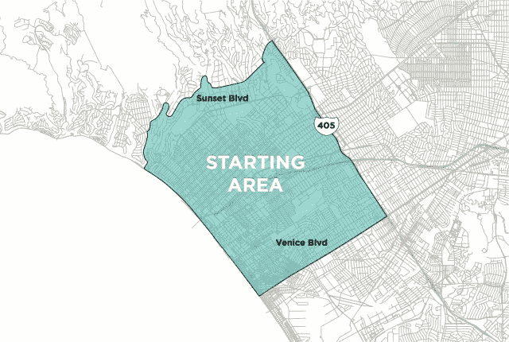

# Lyft 与加州监管机构达成协议，取消罚款，将其拼车服务扩展到 LA 

> 原文：<https://web.archive.org/web/https://techcrunch.com/2013/01/30/lyft-cpuc-deal-la/>

对于拼车服务公司 Lyft 来说，今天有很多好消息。该公司已与加州公共事业委员会达成协议，将取消罚款，并允许其继续在该州运营。今天早上它还宣布了将服务扩展到洛杉矶的计划。

搬到洛杉矶标志着 Lyft 的第一个扩张市场，去年夏天在旧金山向乘客开放。为了扩展到南加州，该公司派出了一个团队来招募司机，并在该市建立最初的社区基础设施。这意味着采访司机，检查他们的汽车，并试图将 Lyft 文化灌输到新的市场中。除了发布团队，它还聘请了一名总经理和社区经理来处理当地的外联工作。

由于洛杉矶的普遍扩张，随着时间的推移，Lyft 将在城市的各个街区铺开。首先是圣莫尼卡、威尼斯和 405 高速公路以西的地区，该公司将在周四早上在那里推出 100 名司机。随着时间的推移，Lyft 计划扩展到更多的社区，逐步向东移动，为西好莱坞、洛杉矶市中心和银湖提供服务。

Lyft 并不是唯一一家寻求扩大业务范围的拼车服务公司。总部位于旧金山的竞争对手 SideCar 最近在西雅图地区推出了服务，并希望在未来几个月里在 T2 更加积极地扩张。

Lyft 在洛杉矶扩张之际，已与监管该州交通系统的加州 PUC 达成协议。11 月，监管机构的执法部门[对 Lyft、SideCar 和优步](https://web.archive.org/web/20221206164010/https://beta.techcrunch.com/2012/11/14/cpuc-uber-lyft-sidecar-citations/)开出了 20，000 美元的罚单，原因是它们在该州经营未经许可的租船业务。罚款是在监管机构发布针对拼车服务的停止函几个月后发生的。

然而，自去年以来，CPUC 一直在努力制定潜在的新法规，使拼车在该州合法化。去年 12 月，它发布了一份关于新规则制定的提案，着眼于移动和数字时代的新交通服务。监管机构还向感兴趣的各方——出租车和豪华轿车运营商，以及拼车公司本身——征求了公众意见，并于周一结束了意见征询期。

一些人可能会说拼车公司目前在非法运营，而另一些人则认为他们在法律的灰色地带运营。现在清楚的是，它们不符合 PUC 目前的监管框架。因此，它正在考虑定义一种新的运输服务类别的可能性，这种服务依赖于电子呼叫的移动技术，并使用 GPS 来测量距离以收取费用。

还有司机和骑手的安全问题。PUC 目前有规则确保租船服务(即豪华轿车服务)对司机进行背景调查，并确保这些司机已投保。但是像 Lyft 和 SideCar 这样的服务认为，他们已经超越了当前对 DMV 和犯罪背景调查的必要要求。此外，由于移动应用程序将身份和评级系统与司机联系在一起，因此与没有这种反馈回路的交通服务相比，它们可以确保更高的服务质量。

在一篇博客文章中，Zimride 的联合创始人 Logan Green 和 John Zimmer 强调了公司已经实施的安全措施，包括每次事故 100 万美元的超额责任保险、对所有社区司机的犯罪背景和 DMV 记录检查、当面筛查和车辆检查、零容忍毒品和酒精政策，以及对社区司机和乘客的五星评级系统。

正如优步为电子商务应用和基于 GPS 定位技术的收费铺平了道路一样，Lyft 和其他服务正在让监管机构认真研究如何连接无证司机和需要乘车的乘客社区。我们会看到规则制定过程本身会发生什么，但所有迹象似乎都有利于让 Lyft 继续上路，无论是在旧金山还是现在的洛杉矶。