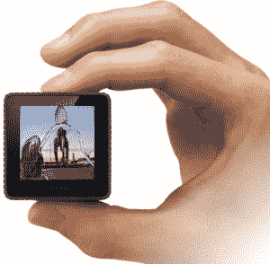

# Lytro 首次亮相:独特的外形，400 美元的价格 TechCrunch

> 原文：<https://web.archive.org/web/https://techcrunch.com/2011/10/19/lytro-makes-its-debut-unique-form-factor-400-price-tag/>

# Lytro 首次亮相:独特的外形，400 美元的价格

Lytro“稍后聚焦”相机在网上引起了很多有趣的讨论。摄影在许多方面仍与一个世纪前相同，这种捕捉图像的新方式无疑触动了人们的神经。我已经[表达了我的怀疑](beta.techcrunch.com/2011/07/22/doubts-about-lytros-focus-later-camera/)，但我不想在这个真正创新的设备首次亮相时泼冷水。如果你忘记了，Lytro 可以让你用最少的努力拍摄一张照片，然后根据你的喜好调整焦距，等等。

在今天旧金山的一次活动中，Lytro 光场技术的首席执行官和创始人 Ren Ng 展示了这款设备，它与传统相机的唯一区别在于它有一个镜头和 LCD 屏幕。它真的比其他任何东西都更像万花筒。正面配备了一个 8 倍变焦的 f/2 镜头——没有说明 F/2 是否在整个变焦范围内保持不变，但根据我对技术的理解，我认为它必须保持不变(更新:是的，F/2 是恒定的)。也没有给出 35mm 的等效焦距。

在这款 4.4 英寸长、仅重 8 盎司的设备的另一端，有一个 1.46 英寸的液晶触摸屏，你可以在上面取景并浏览之前拍摄的图像。该设备上只有两个按钮，一个用于快门，一个用于电源，外加一个用于变焦的滑块。你当然得把它交给他们的设计师:不管你喜不喜欢它的形状，它看起来很独特，在某种程度上也很实用。

Lytro 将有两个版本:399 美元购买一个 8GB 版本(蓝色或灰色)，可容纳 350 张照片；499 美元可以买到一个红色的 16GB 版本，容量是它的两倍。这相当于每张照片 22 兆字节，相当于今天用单反相机拍摄的许多原始照片。实际的“百万像素”值很难确定，Ng 将该相机描述为捕捉“1100 万射线”到 LFP 文件。我在想，最终的图像可能没有正方形那么大，但当然，正方形包含的数据要比正方形 JPEG 多得多。规格上写着“高清质量”，这当然意味着很少。

值得注意的是，你拍摄的照片将可以免费上传到 Lytro 的网站上。让我们希望他们能扩大规模。

它们将于 2012 年初上市，但仍有一些问题。电池能用多久？它是如何应对低光环境的(虽然它确实很亮，但我们不能只看 F/2 镜头的表面价值)？照片将如何显示——Flash，某种自定义容器？会有应用吗？他们花光了那 5000 万美元的全部吗？

[这款相机现在可以在 Lytro 的网站上预订。](https://web.archive.org/web/20230205022756/http://www.lytro.com/)