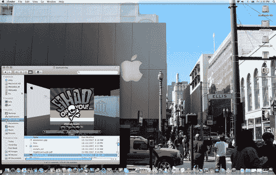
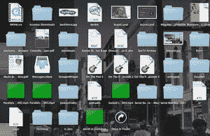

# Mac OSX 豹:值得等待 

> 原文：<https://web.archive.org/web/https://techcrunch.com/2007/10/26/mac-osx-leopard-worth-the-wait/>

# 麦克 OSX 豹:值得等待

全球数百万苹果粉丝对最新版苹果 OSX 操作系统的漫长等待今天终于结束了。OSX 豹于下午 6 点在零售店开始销售，尽管其他人会通过预购和快递更早收到。无论你住在哪里，苹果公司(值得称赞)都会在周五发货，所以我在太平洋时间周四晚上 9 点左右拿到了我的副本。

**安装**

这是我第一次升级 Mac 系统。像许多人一样，我是一个后期 Mac 转换者(目前 Mac 的销售大约有 50%是第一次购买 Mac)，所以我对这个过程可能会如何没有预期。开始很简单:插入 DVD，你会自动弹出一个图标。点击你去，完成与计算机重启。

我首先想到的是“DVD 检查”，这个过程对我来说(Mac Pro，双英特尔双核 2.6 什么的，4gb ram)需要大约 20 分钟。克里斯·皮里洛告诉我，你可以点击跳过按钮绕过它，但作为一名前 Windows 用户，我一直被训练成从不绕过任何检查。在 Macbook Pro 上第二次安装时，我跳过了这一部分，没有出现任何问题。

之后的安装时间大约需要 30-40 分钟。有点像 Windows 机器，估计安装时间的数字是不稳定的，通常会增加然后迅速减少。另一个重启然后豹出现了。

 **你不会认出取景器**

变化是显而易见的。桌面上的图像文件显示的是真实的图像，而不仅仅是一个普通的图标。码头酒吧是不同的，完成了阴影等..，但我知道会这样。最大的惊喜是 Finder 是如此的与众不同。有了 Finder，就可以把 iTunes 想象成一个完整的 coverflow。浏览文件已经变得轻而易举，在 Finder 中浏览 pdf 甚至播放电影的能力对许多人来说将是节省时间的天赐之物。

对于那些在网络环境中的人来说，最积极的方面之一是 Leopard 自动挂载网络计算机和驱动器，包括 Windows 机器和 Windows 共享设备。在我的例子中，它自动挂载了一个 Western Digital 1tb NAS 驱动器(它是在 Windows 共享基础上设置的，所以我的联网 DVD 媒体播放器可以看到它)，我可以立即访问它。我儿子玩游戏用的旧 Windows MCE 盒子也是一样。

**空格很方便**

新的 Spaces 功能提供了虚拟桌面，非常适合在任何给定时间打开太多东西或者没有多台显示器的用户。这是 Linux 的一个标准特性，但对 Mac 来说是新的，在 Windows 中是不可用的。

**码头和堆栈**

dock and stacks 功能允许你从 OSX dock 中拖拽并显示多个项目。这是一个很好的功能，它提供了比以前访问 Finder(或通过快捷方式显示在 Finder 窗口中)更容易的文件夹访问。不过，它确实让我想起了 Windows，但这并不是一件坏事。OSX 是一个很棒的软件包，如果苹果从 Windows 那里窃取了一些想法，让它变得更好，那就这样吧，毕竟归根结底用户才是最重要的。

**不要点击时间机器按钮**

我发现的唯一的负面消息是 Leopard 是时间机器。该功能本身很棒，设置也很容易，假设你有一个额外的硬盘驱动器(外部或内部)用于备份。然而，如果时间机器还没有备份访问，点击时间机器按钮完全 borks OSX…至少对我来说。我花了很多时间重新启动和敲打键盘(在 Mac 上没有 CTRL+ALT+DELETE)来修复它。我敢肯定，现在它正在备份，这将是一个伟大的功能，但只是警告:不要在你的第一天按下按钮。
 **汇总**

总的来说，这真是太棒了。从安装完成的那一刻起，我就感觉更快更好了，虽然可能只是对鼠标更敏感。以前版本的 OSX 的许多缺陷已经被解决了，新的进行基本交互的方式使得已经很好的操作系统变得更好。它的到来可能有点漫长，但对于那些考虑升级的人来说，等待和金钱是值得的。