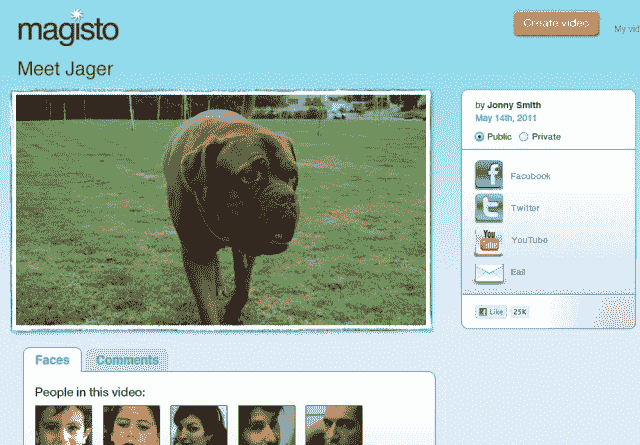

# Magisto 推出自动视频编辑工具，从李嘉诚和其他人那里筹集了 550 万美元 

> 原文：<https://web.archive.org/web/http://techcrunch.com/2011/09/20/magisto-debuts-automatic-video-editing-tool-raises-5-5m-from-li-ka-shing-others/>

# Magisto 推出自动视频编辑工具，从李嘉诚和其他人那里筹集了 550 万美元

提供基于云的视频编辑服务的 Magisto 今天发布了它的公测工具，努力“让你的视频值得分享”。该公司还宣布，它已经筹集了由香港亿万富翁[李嘉诚](https://web.archive.org/web/20230204105124/http://www.crunchbase.com/person/li-ka-shing)的私人投资部门 [Horizons Ventures](https://web.archive.org/web/20230204105124/http://www.crunchbase.com/financial-organization/horizons-ventures) 牵头的[550 万美元](https://web.archive.org/web/20230204105124/http://www.crunchbase.com/company/magisto)B 轮融资，早期的支持者 [Magma Venture Partners](https://web.archive.org/web/20230204105124/http://www.crunchbase.com/financial-organization/magma-venture-partners) 也参与了融资。

Magisto 是一款有趣的产品。它基本上采用未经编辑的视频片段，并自动-在没有真人帮助的情况下-将其转换为更适合与他人分享的短片。

用户可以选择多达 16 个视频剪辑(或高达 600 MB)进行上传，选择标题，选择音乐，只需点击一个按钮，Magisto 就会试图找到视频中的最佳镜头，并将它们编辑成短片，随时可以在脸书、Twitter、YouTube 或通过电子邮件进行共享。

值得注意的是，Magisto 的专有技术显然远远超出了面部识别——该公司声称其视频编辑工具能够理解人、宠物、背景、物体、行为和风景之间的差异，甚至能够通过分析视频中的声音和图像来推断用户的“意图”。

该公司表示，所有主要的视频格式(MOV，ASF，AVI，FLV，MP4 等。)都支持。

正如他们所说:证据在布丁里。去看看，告诉我们 Magisto 是否像广告上说的那样工作。

