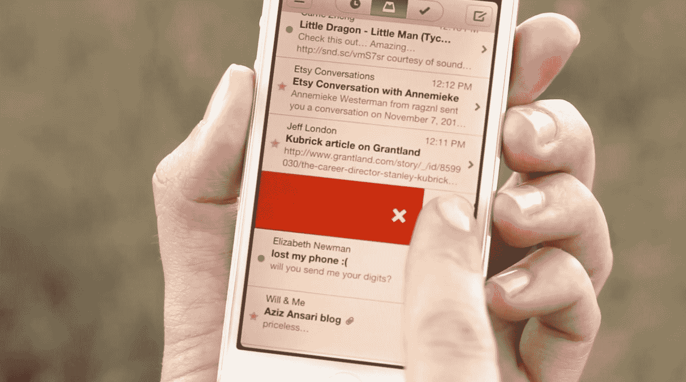

# 邮箱的虚拟队列在等待游戏中成功了，皮特·莫利纽克斯的好奇心绊倒了

> 原文：<https://web.archive.org/web/https://techcrunch.com/2013/02/09/mailboxs-virtual-queue-succeeds-in-the-waiting-game-where-peter-molyneuxs-curiosity-stumbles/>

在撰写本文时，本周测试版发布的 iPhone 电子邮件收件箱管理应用【Mailbox 目前有大约 70 万用户在排队等待访问。这是根据我们许多人已经断断续续盯了几天的应用内计数器得出的，它会告诉你有多少人在你前面排队，还有多少人在后面排队等待轮到自己。

表面上看，这是一种帮助[邮箱服务器管理用户](https://web.archive.org/web/20230315185542/http://mailboxapp.tumblr.com/)对其提出的巨大需求的机制，尽管有些人认为这是一种旨在增加需求的营销策略。其他人认为这可能是人类行为中令人讨厌的实验。我倾向于认为，邮箱的创造者们确实在寻找一种更高效和有效的方法，以一种不会导致大规模中断的方式将服务器密集型应用程序上线，但有意或无意地，邮箱正在开辟虚拟体验的新天地，其他人已经试图用可能不太成功的实验性游戏来探索。

除了应用程序本身之外，邮箱队列本身就是一种体验，根据大多数评论者的看法，这一点非常重要。这可能是我目前在 iPhone 上打开最频繁的应用程序(除了另一个目前正在开发的项目，其中有一些奇怪的类似机制)。尽管事实上暂时没有什么可以真正“做”的:我打开应用程序，一个计数器滴答下降，另一个滴答上升，我关闭应用程序。尽管如此，即使是重复打开和关闭应用程序这种简单的行为，也比我目前在 iPhone 主屏幕上显示的其他 90%的标题更能吸引人。

相比之下，皮特·莫利纽克斯最近对移动设备的耐心练习，好奇心。这款应用由 Molyneux 的新 22cans 工作室开发，它的特点是一个包裹在立方体内的神秘物体，该应用的所有用户协同工作，逐步打破这个立方体，以解开最终的秘密。Molyneux 的游戏具有交互性，这是一个更令人兴奋的最终目标，因为它隐藏在秘密之中，并设法不只是复制排队的体验。然而，在我为一篇发布文章进行初步探索后的几个月里，我没有打开过它。

在好奇号的发布会上，我采访了莫利纽克斯，其中一部分非常有说服力，回想起来，它预示了 Mailbox 目前的成功。莫利纽克斯说，在开发好奇心的过程中，22cans 团队发现，总的来说，玩家们满足于只是坐着观看，而其他人则做这些工作，他们必须想出技巧和激励措施来说服那些潜伏者参与进来。这些“闲散”玩家大大超过了活跃玩家，因此 Mailbox 的虚拟队列(本质上完全是被动参与)会工作得很好是理所当然的。

其他游戏已经尝试了延迟满足，包括由 MacHeist bundle 背后的团队开发的优秀的 The Heist。有趣的是看到这一概念被应用到生产力应用程序中，并且看到这一实现得到了很好的应用。当然，无论是在 Twitter 上还是在邮箱的应用商店评论中，都有人抱怨等待应用程序的荒谬，但我认为，尽管抱怨者一直在大声抱怨，但对应用程序的需求仍然大于其他任何东西。

那么，这是否意味着参与式等待列表成为了移动应用开发的主要内容？不要指望它；Mailbox 受益于发布前的大肆宣传、良好的设计以及在人们对现有解决方案(如电子邮件)非常失望的领域工作的独特组合。但就像之前的好奇号和盗窃案一样，邮箱的例子为软件开发者如何利用延迟满足来吸引用户增加了另一个数据点，这可能会对应用的未来产生有趣的影响。

