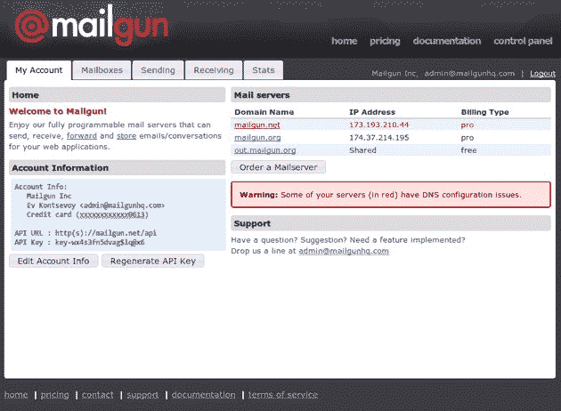

# Mailgun 为开发人员提供了创建和管理在线邮箱的 API 

> 原文：<https://web.archive.org/web/http://techcrunch.com/2010/10/28/mailgun-gives-developers-an-api-for-creating-and-managing-online-mailboxes/>

# Mailgun 为开发人员提供了一个创建和管理在线邮箱的 API

 如今，你注册的最新网络服务肯定会使用电子邮件。更好的服务使这些信息具有互动性——当有人在你的脸书墙上留言时，你不必回 Facebook.com 回复；你可以回复那封邮件。不幸的是，从开发的角度来看，这有点说起来容易做起来难。

[Mailgun](https://web.archive.org/web/20230202214920/http://www.mailgun.net/) 是今天发布的一项新服务，旨在使这种功能易于实现:它提供了一个“邮箱 API ”,让你可以将电子邮件功能嵌入到你的应用程序中。这项服务现已向公众开放，前 50 名注册付费账户并使用注册代码“TCRUNCH”的人将参加新 Macbook Air 的抽奖。

那么 Mailgun 到底是干什么用的？当然，使用 Mailgun 发送通知、时事通讯或任何其他你想大范围分发的内容是可能的——但是已经有其他服务可以执行这些任务。Mailgun 与众不同之处在于它的功能不仅仅是发送信息。

最明显的用例是上面描述的交互式电子邮件通知。除了这些通知之外，CEO Ev Kontsevoy 还给我举了几个例子来说明开发人员如何使用 Mailgun。

*   假设一个开发者想提供一款手机游戏，每个用户都可以通过电子邮件提交他们的动作和附带的照片。Mailgun 将允许开发人员以编程方式为每个用户创建一个邮箱，允许用户发送这些命令，还有一个额外的好处是可以自动存档提交的每封邮件。
*   像 [Stickybits](https://web.archive.org/web/20230202214920/http://www.stickybits.com/) 这样的服务，可以让你通过在现实世界的物体上粘贴条形码标签来创建虚拟存在，可以为每个现实世界的物体建立一个邮箱。如果用户的手机没有条形码扫描应用程序，用户就可以简单地向这个电子邮件地址发送照片或信息。

与其他基于 API 的服务一样，Mailgun 的成功将真正取决于需求——有多少开发人员希望外包这些任务，又有多少人愿意为此付费？鉴于电子邮件是如此无处不在，我认为 Mailgun 有一个战斗的机会，只要他们的服务被证明是可靠的(并节省开发人员所说的时间)。

