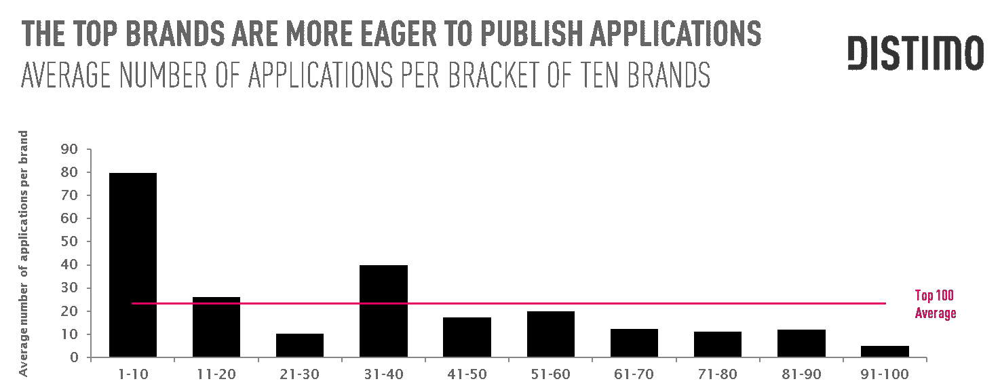

# 大多数顶级品牌现在都有移动应用 

> 原文：<https://web.archive.org/web/http://techcrunch.com/2011/10/27/majority-of-top-100-brands-now-have-mobile-apps-up-from-just-half-18-months-ago/>

移动分析公司 [Distimo](https://web.archive.org/web/20230203080751/http://www.distimo.com/) 今天发布的一份报告发现，前 100 个品牌中的大多数(91%)现在至少在一个主要的移动应用商店中存在，通常是苹果的 iTunes。这一发现值得注意，因为就在 18 个月前，只有一半(51%)的顶级品牌发布了移动应用程序。

【T2

Distimo 新报告中的“顶级品牌”是由 Interbrand 2011 年最佳品牌报告定义的，包括像可口可乐、宝马、迪士尼、通用电气、IBM 等家喻户晓的品牌。

这些品牌，尤其是那些在媒体、商业服务和汽车行业运营的品牌，已经意识到拥有应用商店有助于他们向消费者推广自己的品牌，对一些人来说，甚至有助于销售内容。然而，大多数品牌并不指望通过他们的应用程序赚钱，而是免费赠送。

更有趣的是，在 Interbrand 的报告中排名较高的品牌实际上在各种应用程序商店中的应用程序数量更多。app 越多，排名越高。需要说明的是，这并不是说应用程序*导致*品牌排名上升。这更有可能反映了世界上最大的品牌保持应用商店的存在越来越重要。

这些品牌中的许多也是大量应用发行商——每个品牌的平均应用数量是 24 个。应该注意的是，这个平均值是由于像迪士尼这样的异常值(636 个应用！)和索尼(285 个应用)，都是非常大的发行商。然而，即使你将这两项从平均值中剔除，每个品牌仍有 15 份申请。

就发布地点而言，不出所料，苹果的应用商店是首选。86%的顶级品牌出现在苹果 iPhone 应用商店，66%出现在苹果 iPad 应用商店，59%出现在安卓市场，26%出现在黑莓的应用世界。

在这些网站中，谷歌的 Android Market 作为首选发布网站的地位越来越高。与此同时，诺基亚的 Ovi 商店变得不那么重要了。

关于这份报告的更多细节，包括本月的应用排名，可以从 Distimo 的网站这里获得。