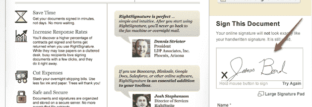

# 留下您的印记:RightSignature 允许您在线(或在您的 iPhone 上)签署文档

> 原文：<https://web.archive.org/web/https://techcrunch.com/2009/05/29/make-your-mark-rightsignature-lets-you-sign-documents-online-or-on-your-iphone/>

# 制作您的标记:RightSignature 允许您在线(或在您的 iPhone 上)签署文档

 在过去的 15 年左右的时间里，我们中的大多数人已经适应了遍布网络的新的交流方式，抛弃了信件(在许多情况下，还有电话),转而使用快速的即时消息和电子邮件。但是，至少有一种我们大多数人都难以克服的形式:个人签名。签署一份文件这一简单的行为，在一个指纹、照片和密码的时代看起来似乎很愚蠢，但却已经深深地印在了我们的脑海里。虽然用“ok”按钮或复选框签署数字文档可能具有法律约束力，但它们太基本了，以至于这种姿态让人感觉不真诚。

提示数字签名——使用鼠标或平板电脑输入手写签名，然后嵌入到有问题的文档中。这些已经存在很长时间了，这个领域的公司包括 [DocuSign](https://web.archive.org/web/20221006192957/http://www.docusign.com/) 和 [EchoSign](https://web.archive.org/web/20221006192957/http://www.echosign.com/) 。现在 [RightSignature](https://web.archive.org/web/20221006192957/http://www.rightsignature.com/) ，一家上个月向公众推出的新创业公司，正在寻求让事情变得更简单。

首席执行官 Daryl Bernstein 说，现有的数字签名公司没有足够重视用户体验，这使得人们很难真正阅读你应该签署的文件。因此，RightSignature 开发了一个专有的 PDF 浏览器，可以显示文档的大部分内容，旁边还有一个签名框。伯恩斯坦还表示，竞争对手往往专注于大公司，因此 RightSignature 正试图让小企业更容易获得其服务(你可以在大约 60 秒内发送一份文件供签署)。您可以在[本页](https://web.archive.org/web/20221006192957/https://rightsignature.com/documents/ZSWTTNCHRKF2SUGE6AC5NV)感受一下文件签署流程。

该服务支持谷歌文档，以及 PDF 和. DOCX 等原生格式。其他额外服务包括要求你的电脑摄像头拍摄照片并附上签名的选项，以及一个免费的 [iPhone 应用程序](https://web.archive.org/web/20221006192957/http://itunes.apple.com/WebObjects/MZStore.woa/wa/viewSoftware?id=306459477&mt=8)，可以让你在旅途中签署文件。该服务提供了多种分发选项，允许用户向大量用户发送文档，也可用于请愿。

用户可以每月免费发送五份文件，或者可以从每个用户每月 11 美元起的许多计划中选择，以获得无限制的文件发送。TechCrunch 的读者可以通过[这个链接](https://web.archive.org/web/20221006192957/https://rightsignature.com/p/TC)注册，免费获得两个月的高级服务。

这项服务似乎运行良好，但 RightSignature 还有很长的路要走——它的竞争已经相当成熟，一些企业可能会犹豫是否要依赖一项新服务来为他们的重要文档签名。也就是说，简化的用户界面可能足以吸引那些之前被这些服务的可怕本质吓退的小企业。