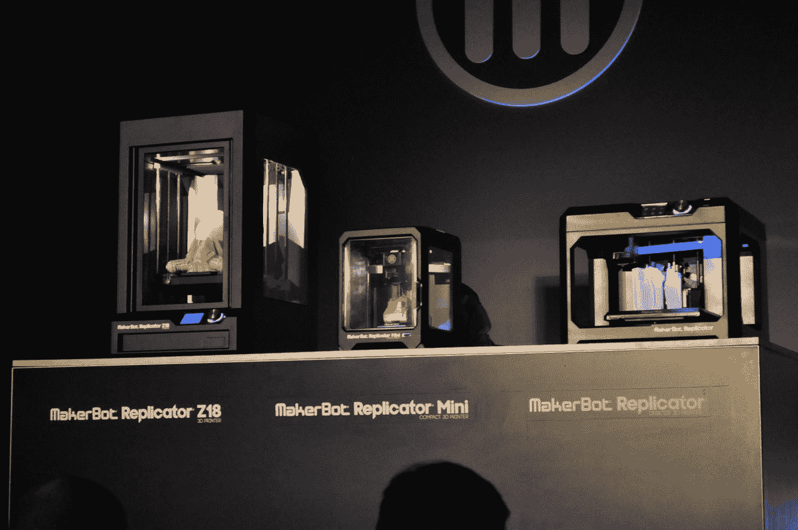

# MakerBot 正在改变世界 

> 原文：<https://web.archive.org/web/https://techcrunch.com/2014/01/07/makerbot-is-changing-the-world/>

这是一个不祥的开端。昨晚在 [CES 2014](https://web.archive.org/web/20221128094955/https://beta.techcrunch.com/tag/ces-2014) 举行的 [MakerBot](https://web.archive.org/web/20221128094955/https://beta.techcrunch.com/tag/Makerbot) 活动上，介绍音乐倾向于软硬摇滚。盘子里是喷火战机乐队轻快的吉他颂歌，然后是梦魔的一首歌，*对不起*。

所以当我着火的时候请原谅我。

幸运的是，什么都没有。

相反，昨晚当我坐在观众席上时，我被这一过程的激动人心所震惊。首席执行官、前学校教师布雷·佩蒂斯(Bre Pettis)咳嗽着走出来，说“酷”，穿着黑色衣服，像个书呆子约翰尼·卡什。他有很多话要说，从某种奇怪的角度来看，他的演讲近乎完美地复制了苹果的主题演讲:该公司正在做的令人惊叹的事情(3D 打印的手，第三世界的学生在周围踢来踢去的足球，然后晚上用来照亮他们的家)，他们在整个东北地区开设的零售空间。销售额、员工总数，这些都是自我推销的糟粕，但却是 CE 舞蹈中必不可少的一部分。

然后有一些关于 MakerBot 学院的信息，这是一项将 MakerBot 推向每个教室的努力。“我的父母给我买了一台 Apple II+，”佩蒂斯说，他将自己的计划与另一家主要硬件公司进行了比较，后者在商界知道发生了什么之前就将他们的产品推向了教室。

可以说，家用个人电脑市场和家用 3D 打印机市场在某种程度上是对立的。家用电脑可以做任何事情，而 3D 打印机只能做任何事情。然而，3D 打印机允许想象力横行。通过凭空创造东西，它们是一种高科技魔杖，一种让我们能够像 Apple II 用户入侵数字世界一样入侵物理世界的技术。

MakerBot 产品做对了两件事:首先，它们反映了 CE 巨头的最佳实践。它们简单易用，提供直观的免费软件解决方案。产品细分为 Mini(适用于所有人)、Replicator(适用于专业消费者)和超大型 Z18(适用于小型制造店),这是一个非常好的商业外观——性感的设计、盒式灯丝支架和可拆卸挤出机将 3D 打印机从书呆子崇拜的摇摇晃晃的家庭自制产品转变为任何对咖啡机有初步了解的人都可以使用的可用产品。

谈到 3D 打印机，MakerBot 也拥有发言权。而网上的补锅匠尖叫着“卖光了！”Pettis 正在为世界定义 3D 打印的面貌。通过品牌、设计和足够多的开源软件和硬件来保持危险，他正在出售一个 3D 打印机像《杀死比尔》中的武士刀一样无处不在的世界——每个人都有、每个人都理解但很少有人能精确或有效地使用的熟悉工具。

如你所知，我是 3D 打印的支持者。我拥有 MakerBot 已经有几年了，它改变了我对事物构建方式的看法，扩展了我的技能组合，就像多年前我最初的 Atari 800XL 教会我计算机并不可怕，它们可以成为快乐的源泉和真正的使命。在 CES 上改变世界的公司是一种难得的享受。马戏团的其他一切都是次要的。MakerBot 是真正的交易。