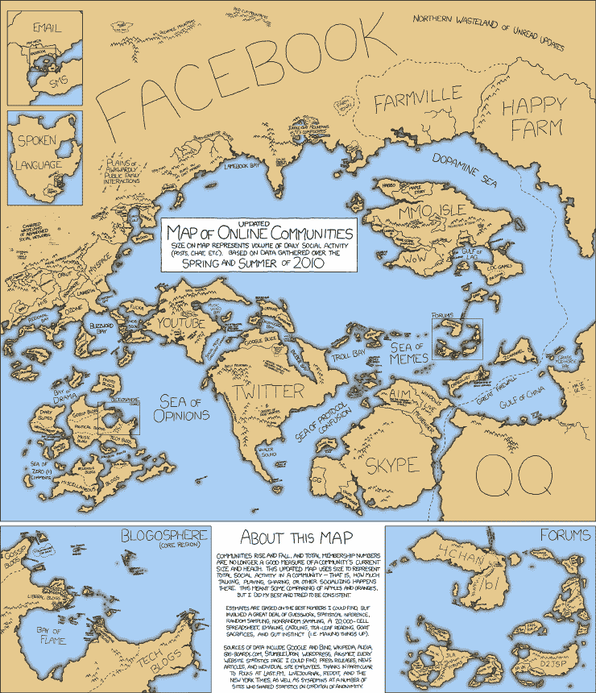
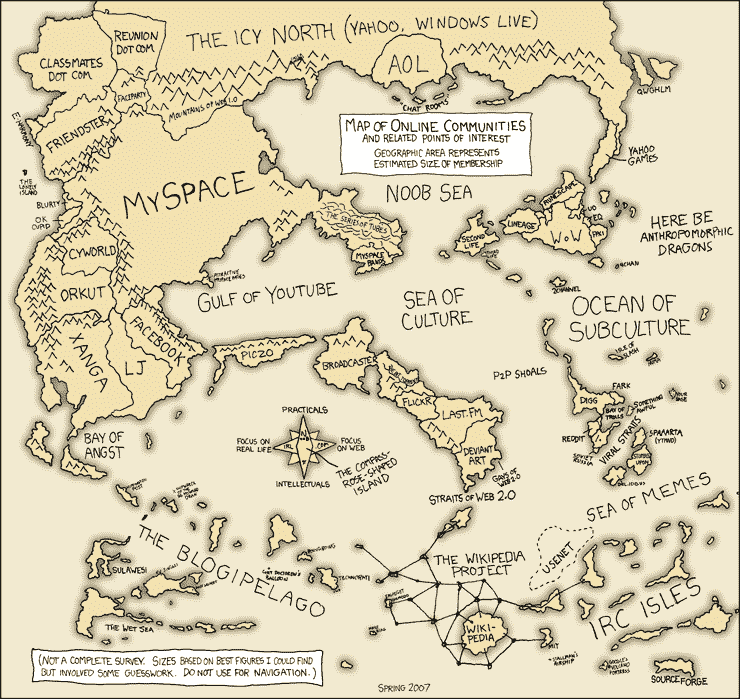

# XKCD 更新地图:我们不再生活在真实的国家，而是生活在数字化的国家 TechCrunch

> 原文：<https://web.archive.org/web/https://techcrunch.com/2010/10/09/map-of-online-communities/>

# XKCD 更新了它的地图:我们不再生活在真实的国家，而是生活在数字化的国家

自从 2007 年插图画家兰德尔·门罗绘制出最初的[XKCD](https://web.archive.org/web/20230214165914/http://xkcd.com/)“在线社区地图”以来，发生了很多变化。本周早些时候，XKCD [更新了其备受喜爱的经典产品](https://web.archive.org/web/20230214165914/http://xkcd.com/802/)，以更准确地反映 2010 年快速变化的网络世界，这证明了我们作为互联网居民已经取得了多大的进步。

来自 2007 年的梦露:

> 我在等着有一天，如果你告诉别人‘我来自互联网’，他们不会笑，而是会问，‘哦，哪一部分？’”

在那一天到来之前(这一天很快就会到来，就像明天),这里是互联网联盟的一个快速状态；2007 年最突出的数字国家是 [Myspace、](https://web.archive.org/web/20230214165914/http://myspace.com/) [Friendster](https://web.archive.org/web/20230214165914/http://friendster.com/) 、 [AOL](https://web.archive.org/web/20230214165914/http://aol.com/) 、 [Live Journal](https://web.archive.org/web/20230214165914/http://livejournal.com/) 和[Xanga](https://web.archive.org/web/20230214165914/http://xanga.com/)…2010 年？脸书、推特、YouTube、Skype、QQ、[开心农场](https://web.archive.org/web/20230214165914/http://happy-farm.en.softonic.com/)和[法姆维尔](https://web.archive.org/web/20230214165914/http://farmville.com/)。 *[加 ca 变，加 c'est la meme 选？](https://web.archive.org/web/20230214165914/http://www.merriam-webster.com/dictionary/plus%20ca%20change,%20plus%20c'est%20la%20meme%20chose)*

嗯，开心农场？是的，没错，[中国 MMOPG](https://web.archive.org/web/20230214165914/http://en.wikipedia.org/wiki/Happy_Farm) 开心农场在最近的地图上比 Farmville 更大，这是基于一个有趣的维基百科统计数据[2 . 28 亿活跃用户，](https://web.archive.org/web/20230214165914/http://en.wikipedia.org/wiki/Happy_Farm)这将使 Farmville 在[6200 万月活跃用户](https://web.archive.org/web/20230214165914/http://www.facebook.com/FarmVille)*“世界上第二大基于浏览器的以社交网络为中心的农业游戏。”*

[放大](https://web.archive.org/web/20230214165914/http://xkcd.com/802_large/)寻找隐藏的宝石，如“社交媒体顾问频道”和“比伯湾”技术博客半岛北端的 TechCrunch/Crunch Gear 岛放大两倍。

下面是 2007 年的原始对比图。

感谢:[大卫·墨菲](https://web.archive.org/web/20230214165914/http://twitter.com/#!/DavidCMurphy/status/26535366811)

**更新:**

TC 读者 [Kai Lukoff](https://web.archive.org/web/20230214165914/http://www.kailukoff.com/) 指出，开心农场 2.28 亿活跃用户的统计有点可疑，看起来他是对的，准确的数字在翻译过程中丢失了。他的解释是:

> 维基百科为这个事实列出了两个链接:
> 1)一篇中文的 Dayoo 文章，一年前只有 2800-3000 万 DAU 的估计。就像 FarmVille 一样，从那以后数量肯定下降了。http://game.dayoo.com/200911/20/68602_100420554.htm 我应该知道 bc 这是我为 VentureBeat 写的一篇早期文章的翻译:http://VentureBeat . com/2009/10/29/China-QQ-farm-happy-farm-games/
> 2)一篇没有提到 2.28 亿英镑的 RWW 文章
> 
> 开心农场在中国仍然很大，但 2.28 亿的活跃用户可能是其实际规模的 2-4 倍。

我仍然在寻找一个准确的统计数据，我正在给梦露和开心农场发电子邮件以获得更多的澄清。《新闻周刊》估计开心农场的用户数量约为 8000 万。