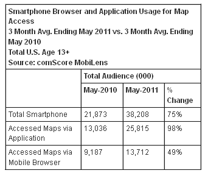

# 地图趋势显示移动和应用增长超过浏览器 

> 原文：<https://web.archive.org/web/https://techcrunch.com/2011/07/18/map-trends-show-mobile-and-app-growth-outpacing-browsers/>

基于位置的服务和不断增长的智能手机销售正在地图世界留下印记:基于移动的地图访问显著增加，而从“固定”点(即台式机和笔记本电脑)的访问实际上略有下降。

这并不特别令人惊讶，但增长率是惊人的。根据康姆斯克的数据，手机使用量同比增长了 39%[,但是通过应用程序的使用量翻了一番。这暗示了 Foursquare 和 Urban Spoon 等本地知识应用的光环效应。手机浏览器的使用也增加了，但我怀疑这种差距只会扩大，或者两者会变得难以分开；web 应用算 web 还是 app？](https://web.archive.org/web/20230203042556/http://www.comscore.com/Press_Events/Press_Releases/2011/7/U.S._Mobile_Map_Audience_Grows_39_Percent_in_Past_Year)

在这一点上，我认为这是一个相对安全的假设，考虑到许多移动网络浏览器仍处于原始状态，这种移动浏览器地图的使用实际上是基于网络的，例如，在谷歌搜索(或搜索)后，通过餐馆网站上的嵌入式地图访问网络界面。由于这种行为破坏了智能手机上的标准“分工”，这种行为很可能只会减少，因为 web 地图被更有力地重定向到原生地图应用程序(如果兼容，这完全是另一个问题)。千万不要派一个浏览器去做一个应用的工作，反之亦然。

康姆斯克的数据还显示，近 90%的地图用户在问路时选择了“开车”作为他们的模式。考虑到在许多情况下驾驶方向是默认选择的，并且至少经常与步行方向相同，这种测量可能是无用的。然而，我很想知道公共交通是如何被查询的；我见过的公交和地铁应用程序相当不错，但公共部门可能想在它们达到临界质量之前介入。

一个方法上的问题是如何量化被动地图的使用，这个问题在接下来的一年肯定会出现。设备闲置时主动跟踪的增加(尽管用户没有主动请求，因此是被动的)肯定会在来年显示出来，它可能会抛弃传统的测量方法。苹果和谷歌不太可能错过被动位置跟踪的可能性(事实上，苹果似乎已经开始庆祝了)，并且已经有大量的应用程序(例如，健身和计步器应用程序)形成了这一浪潮的先锋。

然而，个人计算机绘图的下降更难分析；个人电脑已经或多或少地饱和了美国市场，但是进入浏览器和个人电脑使用的“高级”类别的标准(市场的计算机文盲不能被低估)正在不断下降，鉴于稳定的销售和访问数量，我个人预计网络地图的使用将继续缓慢增长。体面宽带的持续推出也会增加这些使用人数。但似乎这段智能手机快速增长的时期，从个人电脑池中撤出的人比平均进入的人多。

遗憾的是，这些数据并不丰富——了解应用程序故障、成功率、退出率等对于数据分析人员来说将是有趣的数据。