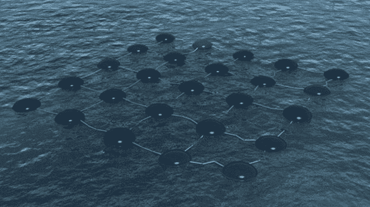
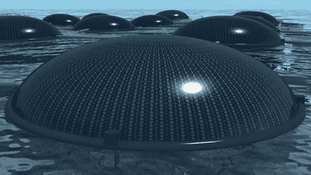

# 海洋太阳能电池充分利用阳光和海浪 

> 原文：<https://web.archive.org/web/https://techcrunch.com/2012/01/03/marine-solar-cells/>

# 海洋太阳能电池充分利用阳光和海浪

英国工业设计师 Phil Pauley 创造了一种不寻常的混合动力[海洋太阳能电池](https://web.archive.org/web/20230205050227/http://www.philpauley.com/msc.php)，可以利用太阳能和水能。

能量发生器网络利用漂浮光伏和自然浮力位移的结合来捕获离岸能量。由于水的反射性质，太阳能组件的效率比陆地高出 20%。

这些设备可以使用回收材料制成，通过将这些装置连接到水下系泊设备上，可以放置在离岸的几乎任何地方，从而形成水下电池或发电厂。

这项技术目前处于概念阶段，所以在你下一次水上运动冒险中，你不需要躲避它们，但它确实有可能成为新能源的重要来源，特别是如果安装在汹涌的公海区域。

*照片由[保利互动](https://web.archive.org/web/20230205050227/http://www.pauley-interactive.co.uk/)*