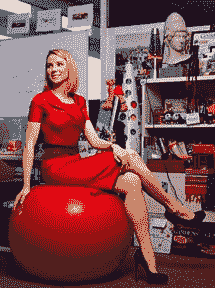

# 玛丽莎·梅耶尔被《魅力》杂志选为年度女性

> 原文：<https://web.archive.org/web/https://techcrunch.com/2009/11/06/marissa-mayer-gets-a-little-love-from-glamour-magazine/>

# 玛丽莎·梅耶尔被《魅力》杂志选为年度女性

谷歌负责搜索产品和用户体验的副总裁[玛丽莎·梅耶尔](https://web.archive.org/web/20230406193013/http://www.crunchbase.com/person/marissa-mayer)最近[在《Vogue》杂志的一篇文章中对](https://web.archive.org/web/20230406193013/http://www.style.com/vogue/feature/2009/07/machine-dreams/)进行了简介，这篇文章深入地展示了这位高管的生活方式、爱情、职业和时尚偏好。现在，梅耶尔被提名为《魅力》杂志 2009 年度女性之一。与梅耶尔一同上榜的还有许多女性名人，包括玛娅·安杰洛、第一夫人米歇尔·奥巴马、苏珊·赖斯、尤娜·李和凌志美。

这些年来，梅耶尔经常出现在商业和技术出版物上，但也很高兴看到她在《Vogue》和《Glamour》等杂志上的成就。这位聪明的斯坦福毕业生为各地的年轻女性树立了榜样。作为谷歌的早期雇员之一，她现在帮助领导世界上最具创新性的公司之一的产品设计。她才 34 岁。一个成功的极客程序员喜欢穿奥斯卡·德拉伦塔、香奈儿和阿玛尼，有什么不让人喜欢的呢？

图片来源/魅力杂志/布莉姬·拉孔柏