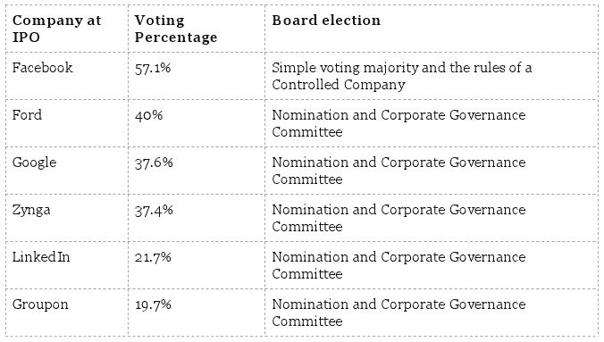

# 马克·扎克伯格在建立王朝的问题上应该三思吗？

> 原文：<https://web.archive.org/web/https://techcrunch.com/2012/02/11/mark-zuckerberg-dynasty/>

**编者按** : *[查理·摩尔](https://web.archive.org/web/20230315140756/https://twitter.com/#!/charleymooreesq)是一名律师，也是在线法律服务[火箭律师](https://web.archive.org/web/20230315140756/http://www.rocketlawyer.com/)的创始人。*

祝贺脸书！你创造了历史，改变了世界。所以，这是你的一个超级粉丝的一些想法。像地球上的其他地方一样，我热爱脸书，每天都在使用它。因此，现在可能是最好的时机，在一切进展顺利的时候，为脸书对话增添一点谦逊和远见。

还记得电影*角斗士*吗？坏儿子康茂德谋杀了他年迈的父亲，皇帝马可·奥勒留，阻止他把帝国传给他的好儿子马克西姆斯。因此，权力没有延续几个世纪以来基于功绩的继承传统，而是传递给了一个不值得的血亲，随之而来的是腐败。

这和脸书创始人马克·扎克伯格有什么关系？根据 50 亿美元的 IPO 申请文件，法律文件赋予他对上市后公司的绝对控制权，甚至在死后，就像罗马皇帝一样。这种权力可能会产生意想不到的后果。

这位脸书极其成功的创始人的故事，为其他希望创造企业王朝的人提供了一个蓝本。不过，无论是他还是那些试图效仿他的人，明智的做法都是采纳历史的建议，至少建立一个最低限度的代表性公司治理结构，包括一名或多名独立董事。

**治理是如何走到这一步的？**

在谷歌的创始人在首次公开募股时获得超级多数控制权后，脸书成年了，随后是 LinkedIn、Groupon 和 Zynga(以及更多)。在公司早期，连续创业者肖恩·帕克(Napster，Plaxo)作为扎克伯格的知己，在早期发挥了重要作用，帮助他说服了创始人保持控制权的重要性。因此，这位脸书创始人通过任命多数席位，长期以来一直主导着他的董事会。

现在，脸书将创始人控制的趋势发挥到了极致。通过在 IPO 时将其股份转换为一类超级投票权股票，并将脸书指定为“受控公司”，扎克伯格不仅将控制 57.1%的投票权，还将拥有任命 100%董事会成员的法律权利。他也可以指定任何他选择的人作为他公司权力的继承人。

这种绝对控制的意外后果可能与扎克伯格所希望的相反。不难相信，他真的想要控制权，以便让企业专注于他在致股东信中描述的长期社会使命，而不是财务经理经常要求的短期收益。相反，可能发生的情况是，上市后业务发现自己受制于异想天开的决策，并容易受到不可避免的证券诉讼的影响。

当创始人控制的公司向公众出售股票时，他们应该为皇帝在某个时候“没穿衣服”的可能性做好准备。最终，即使是最优秀的创始人也可能失去他们的运气，或者任命一位证明无法胜任这项任务的继任者。这时，即使没有法律控制，拥有独立的观点和受托人也有助于保护企业免于承担责任，并引导企业向更好的方向发展。

当然，创始人控制的公司通常非常成功。在美国，创始家族是超过三分之一的标准普尔 500 公司的有影响力的投资者。创始家族企业往往会做得很好，因为这些企业的长期影响力、兴趣和所有者的投资是由使命驱动的，而不仅仅是财务收益。

例如，自亨利·福特于 1903 年将其合并以来，福特汽车公司成功地维持了一个盈利的创始家族企业。自 1956 年以来，福特家族通过建立一个系统来确保只有家族成员才能拥有 B 类股票，从而掌握了公司至少 40%的投票权。家族的投票权包括批准公司合并、出售或清算的专属权利。

出于控制但不扼杀业务的愿望，福特夫妇招募了合格的顾问，包括最初的法律顾问 Clifford Longley、投资者 Goldman Sachs 和独立董事。它成功了。福特经历了多次衰退，包括最近的经济低迷。福特是唯一一家不需要政府救助的美国汽车制造商。(尽管福特并非每个季度都盈利，甚至不是每年都盈利，但有人可能会说，它是历史上盈利能力最强、最持久的企业之一。算是吧。)

迄今为止，扎克伯格对脸书的治理做出了不同的选择。尽管任命雪莉·桑德伯格为强有力的二号人物非常明智，但当她离开时，他会怎么做呢？他和他的继承人可以在 IPO 后行使比私有化时更多的公司权力。选择作为一家“受控公司”，脸书将被豁免于适用于绝大多数上市公司的常规证券交易所公司治理规则。

摘自脸书招股说明书(S-1):

> 因为根据上市公司的公司治理规则，我们符合“受控公司”的资格，所以我们不需要董事会的大多数成员是独立的，也不需要有薪酬委员会或独立提名职能部门。

取代董事提名委员会的是，所有董事都将由扎克伯格挑选、罢免和替换，扎克伯格也有权单方面选择继任者。

> 扎克伯格先生有能力控制提交给我们的股东批准的事项的结果，包括董事的选举以及任何合并、整合或出售我们的全部或几乎全部资产…此外，如果扎克伯格先生在去世时控制我们的公司，控制权可能会转移到他指定为继任者的个人或实体。

虽然谷歌的拉里·佩奇、谢尔盖·布林和埃里克·施密特也保持着控制权，拥有
的多数股权和投票权，但三巨头的方法平衡了治理，他们的权利都没有延伸到随意任命和罢免独立董事的权力。LinkedIn 的雷德·霍夫曼、Groupon 的安德鲁·梅森和 Zynga 的马克·平卡斯也是如此。

因此，如果你是一家公司的创始人，并且一心一意想让你的企业成为一个创始人控制的王朝，脸书就是你的蓝图。另一方面，如果你的目标包括保护你创立的公司的持久性，即使你和你的继承人可能不再像今天一样表现出远见卓识，你也应该:1)授权公司的非创始人股东选举至少一名独立董事；以及 2)承诺一个非默认继承的继任计划。

Eva Arevuo 对本文亦有贡献。