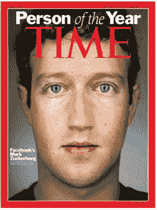

# 马克·扎克伯格被《时代》杂志评为 2010 年度人物 

> 原文：<https://web.archive.org/web/http://techcrunch.com/2010/12/15/mark-zuckerberg-time-magazine/>

# 马克·扎克伯格被《时代》杂志评为 2010 年度人物

脸书首席执行官兼创始人[马克·扎克伯格](https://web.archive.org/web/20230203075140/http://www.crunchbase.com/person/mark-zuckerberg)被[提名为](https://web.archive.org/web/20230203075140/http://www.time.com/time/specials/packages/article/0,28804,2036683_2037183,00.html) [时代杂志的](https://web.archive.org/web/20230203075140/http://www.time.com/time/)年度人物。当然，作为一年内对事件影响最大的个人，他将为杂志特别版的封面增色。

考虑到脸书在大规模用户增长、围绕隐私问题的争议以及新产品发布方面经历的巨大一年，扎克伯格并不是一个令人惊讶的选择。社交网络的成功也促成了媒体对该公司及其创始人的狂热。

关于他们选择扎克的原因，这份出版物是这么说的:“连接了超过 5 亿人，描绘了他们之间的社会关系；创建一个新的信息交流系统；为了改变我们的生活方式，马克·埃利奥特·扎克伯格被《时代》杂志评为 2010 年度人物。

扎克将加入包括巴拉克·奥巴马总统和比尔·克林顿总统在内的众多获此殊荣的总统行列。其他登上《时代》杂志封面的科技名人包括亚马逊创始人杰夫·贝索斯和微软联合创始人比尔·盖茨。