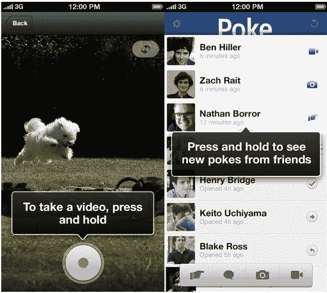

# 马克·扎克伯格是“戳”通知声音背后的声音，并为应用 TechCrunch 编写了代码

> 原文：<https://web.archive.org/web/https://techcrunch.com/2012/12/21/mark-zuckerberg-voice-of-poke/>

马克·扎克伯格发明了戳戳，这是脸书最早的功能之一，所以他是过去 12 天里开发新戳戳应用的小团队的一员是很合适的。有消息称扎克伯格实际上为 Poke 写了代码，尽管他说[很少再为脸书编程了](https://web.archive.org/web/20221003185804/https://beta.techcrunch.com/2012/09/11/the-ceo-of-facebook-still-codes-on-the-side-but-tends-to-break-things/)。还有那个收到推送通知就脱口而出“戳”的声音？那也是扎克。

我的消息来源说，脸书的首席执行官在他的手机上录制了这个声音片段，作为一个笑话。但他被说服让样本通过一些音频过滤器，让它成为现代戳的配乐。你可以在这里听到愚蠢的小噪音:

[soundcloud URL = " http://API . soundcloud . com/tracks/72171288 " params = " " width = " 100% " height = " 166 " iframe = " true "/]

[这款应用的](https://web.archive.org/web/20221003185804/https://itunes.apple.com/app/id588594730)整个开发过程是脸书“黑客文化”的一个例子但这也是对社交网络的潜在竞争对手以及那些可能想为其工作的人的一个信号。

脸书见证了短暂的消息应用 Snapchat 的流行。用户喜欢分享愚蠢的照片和视频，这些照片和视频在收到后几秒钟内就会自动删除。

我们听说脸书试图收购这家小型创业公司，但该团队希望保持独立。就在那时，脸书和扎克伯格进入了黑客模式。距离苹果在圣诞节前停止接受新应用提交只有几周时间了，要及时建立 Poke 还需要冲刺。

因此，包括脸书产品总监布雷克·罗斯在内的一个小团队加快了开发速度，扎克伯格帮助进行了编程，[设计师迈克·马塔斯和莎伦·黄创造了图标](https://web.archive.org/web/20221003185804/https://www.facebook.com/photo.php?fbid=10151391283870229&set=a.28262290228.50478.763080228&type=1)，脸书刚刚在截止日期前发布了 Poke 应用程序。

但是为什么罗斯[会公开向脸书](https://web.archive.org/web/20221003185804/https://www.facebook.com/blake/posts/448334501889024)发帖说这个团队只用了 12 天就完成了这个应用呢？也许是为了证明它可以。正如 [MG Siegler 写的](https://web.archive.org/web/20221003185804/http://parislemon.com/post/38501585852/12-days)，给脸书的竞争对手的信息是，如果你不加入脸书，它可以克隆你的应用程序，并随时与你竞争。

对于顶级工程师、设计师和产品远见者来说，这个笑话的寓意是，脸书不是一家受繁文缛节限制的传统公司。在门洛帕克的 1 Hacker Way，事情可以很快完成。你可以为一家科技公司工作，在那里你的产品可能需要几年才能发货。或者你可以在脸书工作，两周后那里将会有超过 10 亿人在使用你的产品。

*[iOS 下载戳这里](https://web.archive.org/web/20221003185804/https://itunes.apple.com/app/id588594730)*

阅读更多我们的 Snapchat-Poke 报道:

[脸书推出 Snapchat 的竞争对手“Poke”，这是一款用于发送过期文本、照片和视频的 iOS 应用](https://web.archive.org/web/20221003185804/https://beta.techcrunch.com/2012/12/21/facebook-poke-app/)

脸书·普克和 Snapchat:有什么不同？

Snapchat 联合创始人埃文·斯皮格尔回应 Poke:“欢迎你，脸书。说真的。”

[你的脸书密码会保存两天，然后它们的加密密钥会被删除](https://web.archive.org/web/20221003185804/https://beta.techcrunch.com/2012/12/22/your-facebook-pokes-are-stored-for-two-days-then-their-encryption-keys-are-deleted/)

[脸书和 Snapchat 针锋相对:为什么这对两家公司都有好处](https://web.archive.org/web/20221003185804/https://beta.techcrunch.com/2012/12/17/facebook-and-snapchat/)

*【图片鸣谢:保罗·佐久法史/美联社】*

*【更正:布雷克·罗斯是 Poke 团队的一员，是脸书团队的高级成员，但没有领导这个项目。]*