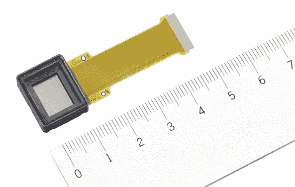

# 漫威在索尼显微镜下的有机发光二极管电子取景器 TechCrunch

> 原文：<https://web.archive.org/web/http://techcrunch.com/2011/08/30/marvel-at-sonys-microscopic-oled-electronic-viewfinder/>

# 漫威在索尼的微观有机发光二极管电子取景器

顺便说一句，索尼新的阿尔法和 NEX 相机的一大特色是新的电子取景器，这款相机看起来非常棒。我从来没有对这些东西特别感兴趣，我更喜欢单反相机上的镜面光学取景器，或者大多数相机背面的大而亮的液晶显示器。但是[富士胶片的 X100](https://web.archive.org/web/20230204194826/https://techcrunch.com/2011/08/29/review-fujifilm-x100/) (尽管它有缺陷)改变了我对 EVF 有用性的看法，我已经准备好接受一部始终属于 EVF 的相机。索尼的新屏幕是小型化的奇迹，这也有所帮助。

[Tech-On 已经获得了一些关于新相机中使用的微型 OLED 面板的信息，看到设备本身的微小荣耀提醒我们成像设备已经变得多么先进:](https://web.archive.org/web/20230204194826/http://techon.nikkeibp.co.jp/english/NEWS_EN/20110830/197833/)

索尼之前的 EVF 是 800×600(我相信)和传统的 LCD。据索尼称，这款新手机不仅分辨率更高，为 1024×768，而且是 OLED 面板，而不是背光液晶显示器，对比度是旧款的十倍。构成面板的大约 240 万个点都是带有红色、绿色或蓝色滤光器的白色二极管；彩色二极管还没有准备好迎接黄金时代。

该显示器由索尼移动显示公司全资拥有和制造，它证实了索尼深深地融入了整个有机发光二极管的事情。通过将他们的显示器业务与东芝和日立的结合，他们看起来像是下一代显示器的竞争对手。目前，世界上最著名的显示器可能是 iPhone 4 和 iPad 显示器，如果[高分辨率 iPad 3 传言](https://web.archive.org/web/20230204194826/https://techcrunch.com/2011/08/15/supply-line-troubles-to-delay-ipad-3-launch/)是正确的，这种情况可能会继续。但是 OLEDs 的魅力是多种多样的，索尼是知道的。希望在接下来的一两年里，我们能看到更多令人印象深刻的技术，比如这个神奇的小 EVF。