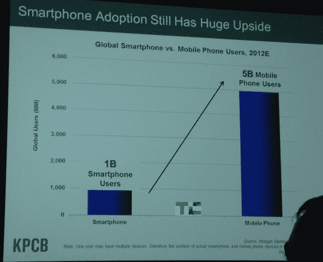
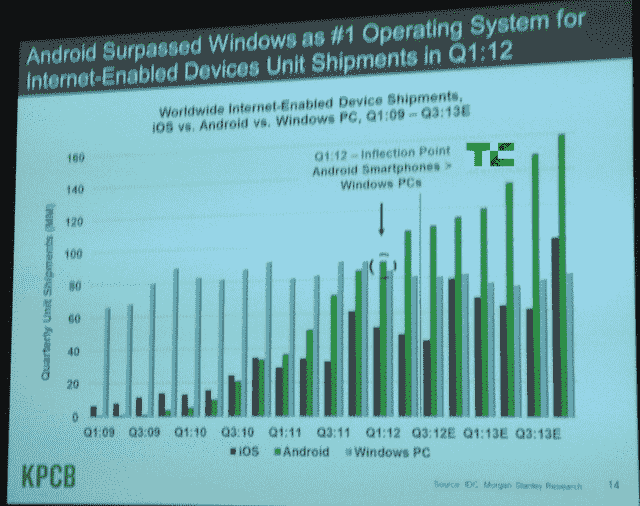
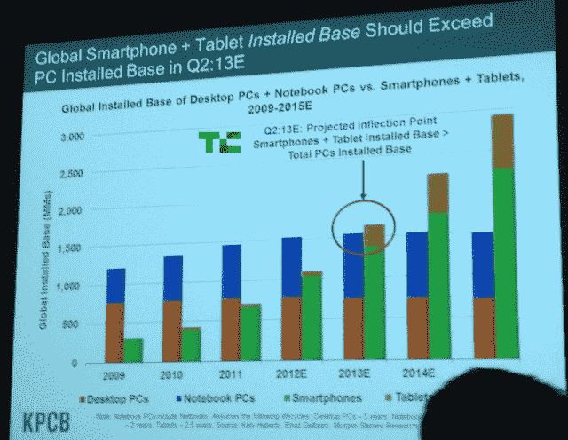

# 玛丽·米克尔发布年中互联网趋势报告:Android 应用速度比 iPhone 快 6 倍

> 原文：<https://web.archive.org/web/https://techcrunch.com/2012/11/05/mary-meeker-internet-trends/>

# 玛丽·米克尔发布年中互联网趋势报告:Android 应用速度比 iPhone 快 6 倍

KPCB 合伙人玛丽·米克尔通常每年发布一次她著名的互联网趋势报告，但今晚给了三藩市的一小群人一个年中更新。最大的新事实？Android 手机的采用速度比 iPhone 快六倍，Android 超过 Windows 成为 2012 年 Q1 互联网设备的头号操作系统。米克还在演讲结束时称马克·扎克伯格的声明“傲慢，但可能是真的。”

请继续阅读其余的新数据。

米克在彭博旧金山总部参加了一个活动，以纪念 T2 凯鹏华盈投资公司 T4 借贷俱乐部，该俱乐部刚刚获得了 10 亿美元的贷款。在那里，Meeker 向一些行业巨头做了一个简短的介绍。

她一开始说移动增长仍然强劲，并展示了她在 2012 年 5 月 30 日发表的 2012 年互联网趋势报告中的一些幻灯片。我对照了她所有的幻灯片和报告中的内容，这就是变化。

Meeker 指出，iPad 的采用速度现在是 iPhone 的五倍，比她五月份报告中的三倍还要快。与此同时，Android 用户的增长速度是 iPhone 的 6 倍，是 iPhone 的 4 倍。

根据她的研究，到 2012 年底，智能手机用户将达到 10 亿，而手机用户将达到 50 亿，这表明了廉价功能手机的广泛流行。今年 5 月，Meeker 报告称，有 9.53 亿人订阅智能手机，61 亿人订阅手机，但这些数字计入了同一个人的多次订阅。

Meeker 表示，在 2012 年的 Q1，支持互联网的 Android 设备的出货量超过了支持 Windows 互联网的设备出货量。那时候，安卓每季度的出货量约为 9000 万台。米克预计，到 2013 年底，每个季度将有 1.6 亿台安卓设备、1 亿台视窗设备和 8000 万台 iOS 设备上市。

最后一个大数据显示，在 2013 年 Q2 展会结束时，Meeker 认为全球智能手机和平板电脑的安装基数将超过个人电脑的安装基数。

Meeker 以回顾各种行业如何被重新定义来结束她的演讲，但首先花了一分钟来回顾 Mark Zuckerberg 对移动的看法。以下是扎克在给潜在股东的信中所说的话，作为脸书首次公开募股的一部分:

> *我们希望重塑人们传播和消费信息的方式……我们认为，一个更加开放和互联的世界将有助于创造一个更强大的经济，让更多真正的企业创造更好的产品和服务。*

米克说，扎克伯格的引用是一个“非常傲慢的声明，但可能是真实的，肯定是一个伟大的想法。”