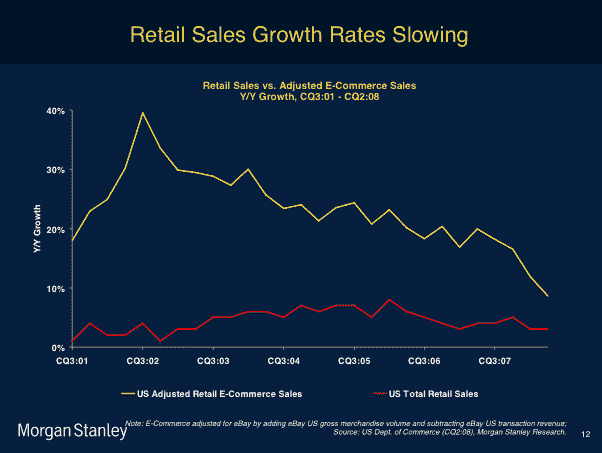
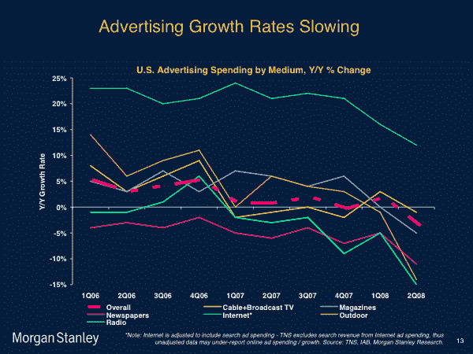
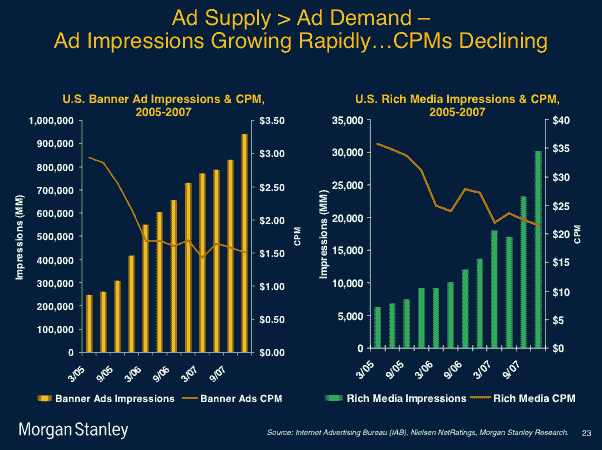
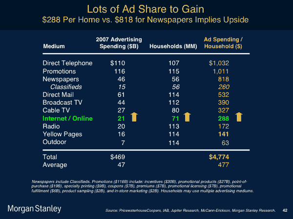

# 玛丽·米克尔用 50 张幻灯片看世界 TechCrunch

> 原文：<https://web.archive.org/web/https://techcrunch.com/2008/11/06/mary-meekers-view-of-the-world-in-50-slides/>

[http://blip.tv/play/AdibBIWZTA 电视台]

每年在 [Web 2.0 峰会](https://web.archive.org/web/20221006021649/http://en.oreilly.com/web2008/public/content/home)上，摩根士丹利互联网分析师玛丽·米克尔都会通过快速浏览大约 50 张幻灯片来阐述她对世界、网络和科技行业的看法，这些幻灯片展示了她所追踪的主要趋势。去年，她瞄准了[中国泡沫](https://web.archive.org/web/20221006021649/http://www.beta.techcrunch.com/2007/10/22/the-china-bubble/)。今年，她谈论了当前经济衰退的根本原因，网络业务的前景，以及她仍然看到主要增长的领域(移动和新兴市场)。

她挑选出移动行业，认为在未来五年里，这个行业既会有最多的机会，也会出现颠覆。此外，她表示，美国正准备引领手机向以网络为中心的模式转变。(我完全同意)。有趣的是，她指出 T-Mobile 推出第一款 Android 手机，而不是推出 iPhone，是即将到来的移动网络时代的关键转折点。

Meeker 昨天做了完整的演讲，视频在上面，幻灯片在下面(谢谢 Henry Blodget 上传)。幻灯片也可以在[这里](https://web.archive.org/web/20221006021649/http://www.morganstanley.com/institutional/techresearch/internet_trends.html)找到。

有几张幻灯片给我留下了特别的印象。首先，与零售和广告的线下增长率相比，电子商务销售和互联网广告的正常化速度比任何人预期的都要快。毫无疑问，整体经济形势加剧了增长的急剧放缓。在下面的第一张幻灯片中，红线是美国零售销售增长，黄线是电子商务销售增长。看到黄线的方向了吗？

在第二张幻灯片中，顶部的绿线是互联网广告的增长。至少它仍然高于所有其他类型的广告，还没有处于负领域，但趋势看起来并不乐观。

事实上，随着广告预算的下降和网页的持续增长，更大的问题是网络上广告位的供应变得大于需求。填补这些空缺的唯一方法是降低每个位置的价格。如下面的幻灯片所示，广告展示持续增长，但每千人成本(CPM)持续下降(平均而言，横幅广告约为 1.50 美元，富媒体广告略高于 20 美元):

从好的方面来看，与电视、印刷品和直邮广告等其他形式的广告支出相比，互联网广告仍有很大的份额可以增加，而且很可能会继续增加。

