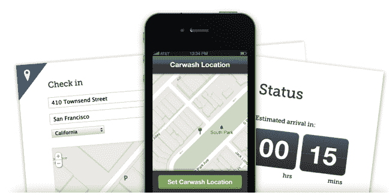

# 麦克斯·拉夫琴、基思·拉博伊斯和大卫·萨克斯在优步洗车，Cherry TechCrunch

> 原文：<https://web.archive.org/web/http://techcrunch.com/2011/11/08/max-levchin-keith-rabois-and-davis-sacks-back-the-uber-for-carwashes-cherry/>

# 麦克斯·拉夫琴，基思·拉博伊斯和大卫·萨克斯回优步洗车，樱桃

洗车是我避免的任务之一，除非我绝对需要完成它。坦率地说，在我周末有空闲时间时想做的事情中，这并不是最重要的。进入 [Cherry](https://web.archive.org/web/20230204162259/http://cherry.com/) ，这是一家新成立的初创公司，为你和你的汽车提供按需洗车服务。这家初创公司还宣布从一些前 PayPal 员工那里获得 75 万美元的种子资金，其中包括 Yammer 首席执行官大卫·萨克斯、PayPal 创始人麦克斯·拉夫琴和 Square 首席运营官基思·拉博伊斯。

这项服务复制了颠覆性打车服务优步允许用户订车的方式。使用网络或 iOS 应用程序(Android 将很快推出)，用户可以指定他们的汽车在街道上的位置(以及汽车的类型、颜色和车牌号码)，在停车场或其他公共区域。一旦你在 Cherry 上登记了你的车的位置，该服务的技术就会立即找到并派遣一名专业洗车人员在你停车的地方洗车，你甚至不需要去那里。

Cherry 今天在旧金山推出这项服务，每次洗车收费 29 美元，包括清洗汽车外部和空气清新剂。Cherry 会在每次洗衣后自动向顾客的卡收费，这样他们就不需要去见洗衣者付款了。顾客对他们洗的衣物进行评分，Cherry 将这些评分作为顾客的小费，并为五星级的洗涤服务向洗衣者支付奖金。

29 美元还包括内部清洁。这有点复杂，因为车主要么不锁门，要么在洗衣机到达时下来开锁(Cherry 会给车主发短信)。就我个人而言，我绝不会在街上或车库里不锁门，但该公司表示，大多数早期用户都选择清洁内部。洗完之后，洗衣机会把车锁上。

在保险方面，每个客户都在 Cherry 的担保范围内，包括客户汽车的任何和所有意外损坏。Cherry 的联合创始人特拉维斯·范德赞登(Travis VanderZanden，前 Yammer 高管)说，他和另一位创始人阿特·亨利亲自会见、审查、培训每一位受雇为 Cherry 洗衣的人，并为他们提供设备。

如果你担心洗车对环境的影响，Cherry 使用 100%可生物降解的环保洗车解决方案。他们的便携式喷雾器设计用于洗车，比传统洗车用水少得多。

对 Cherry 的生意有一个警告——你的车需要停在一个相当公共的地方，以便洗车工进入。很明显，停在街上的汽车可以被该服务的清洗员使用，但是如果你有一个私人车库，Cherry 可能不适合你。也就是说，Cherry 已经能够与一些停车场合作，让雇主进入停车场。例如，该服务已经被许多 Square 的员工在移动支付停车场使用，Cherry 已经能够与该停车场合作，以获得员工汽车的使用权。

与 Airbnb、优步和 GetAround 类似，Cherry 是一家利用数据、定位和移动技术让我们在现实世界中的生活变得更好的企业。这项服务已经获得了一些好评，你可以在这里查看。

