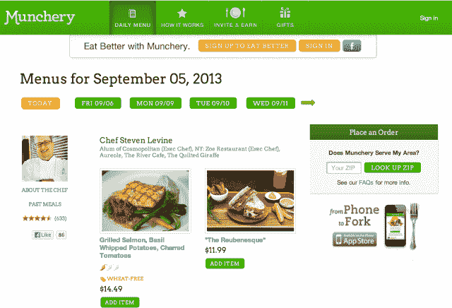
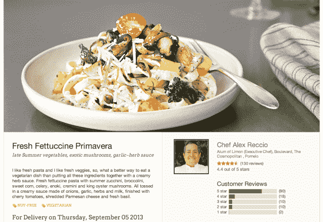

# 餐饮市场 Munchery 增加了新的 A 轮投资者 Menlo、Sherpa Ventures & More，聘请内部厨师 

> 原文：<https://web.archive.org/web/https://techcrunch.com/2013/09/05/meals-marketplace-munchery-adds-new-series-a-investors-menlo-sherpa-ventures-more-hires-in-house-chefs/>

海湾地区的初创公司 Munchery ，提供专业准备的美食，你可以通过网络或手机订购，今天宣布，它已经完成了之前报道的[400 万美元首轮融资](https://web.archive.org/web/20221206030634/https://beta.techcrunch.com/2012/11/08/meals-marketplace-munchery-raises-4-million-for-expansion-now-delivering-high-quality-meals-to-all-of-bay-area-l-a-in-2013/)的剩余金额，引入了新的投资者谢尔文·皮舍瓦和斯科特·斯坦福的[夏尔巴风险投资](https://web.archive.org/web/20221206030634/http://www.crunchbase.com/company/sherpa-foundry)、[门洛风险投资](https://web.archive.org/web/20221206030634/http://www.crunchbase.com/financial-organization/menlo-ventures)，以及星巴克前总裁兼运营主管霍华德·贝哈尔，他通过 Anthos Capital 进行了投资。这使得 Munchery 成为第一批从新夏尔巴风险投资[中涌现出来的投资之一，加入了像](https://web.archive.org/web/20221206030634/https://beta.techcrunch.com/2013/07/01/shervin-pishevar-and-scott-stanfords-new-startup-studio-sherpa-is-raising-150-million-for-new-fund/) [Cluster](https://web.archive.org/web/20221206030634/https://beta.techcrunch.com/2013/08/22/photo-sharing-app-cluster-snags-instagram-seed-investor-steve-anderson-others-to-lead-1-6m-round-launches-version-1-0/) 和 [BlackOps](https://web.archive.org/web/20221206030634/https://beta.techcrunch.com/2013/07/11/backops-raises-7m-to-build-an-army-of-moms-for-managing-startups-and-small-businesses-with-leading-saas-tools/) 这样的其他投资。

在最初宣布融资时，Munchery 已经从正在进行的 400 万美元 A 轮融资中筹集了 330 万美元，但尽管这家初创公司在冬末春初关闭了额外的金额，但由于 SEC 要求的与夏尔巴自己的融资相关的静默期，他们无法披露。

Munchery 目前服务于更广泛的旧金山湾区，由首席执行官 Tri Tran 和首席技术官 Conrad Chu 于 2010 年春天创立，当时，作为年轻的父母和工程师，他们正在寻找一种更简单的方法，在家里吃健康方便的饭菜。像我们大多数人一样，他们不想在时间紧迫时不得不转向快餐。同时，也不是所有的外卖都是健康的。

Munchery 很快就诞生了，以满足这种需求，提供各种膳食选择，包括素食、有机膳食、为有饮食限制的人提供的膳食(例如“无麸质”)等等。膳食是有组织的，并贴上“无小麦”或“低碳水化合物”等标签，让顾客找到适合自己的膳食。

到目前为止，这些食物都是由独立厨师准备的，他们会烹饪和装盘，也可以选择在 Munchery 的商业厨房里租用空间来做这些事情。Munchery 帮助厨师们计算出当天要准备多少餐，并管理业务的送货方面。

该公司表示，这些厨师，或 Munchery 称之为“厨师合伙人”，现在将加入被称为“Munchery 常驻厨师”的内部团队，并补充说，除了提供福利、股票期权、带薪假期、工作日安排和其他津贴外，它计划向这些厨师支付两倍于其他地方行政厨师的工资。事实上，Munchery 的时间表首先吸引了它的厨师——餐饮业通常需要深夜和周末，但 Munchery 的厨师可以选择白天工作。然而，并不是所有的厨师都想独立工作，所以通过开放带薪的全职“雇员”职位，Munchery 希望招募更多优质人才。

该公司表示，到目前为止，它已经找到了一位当地的“大厨”，但还不能宣布是谁。他或她将加入其他新的常驻厨师，亚历克斯·雷西奥(Limon 的前行政总厨，林荫大道、四海为家和柚子的校友)和马修·厄本(SF 的 Yuzu 和西雅图的 Blue Onion Bistro 的前行政总厨，拥有超过 15 年的经验)，以及新的烹饪经理乔恩·赫尔奎斯特(Jon Helquist)，他在伯克利的帕妮丝餐厅工作了十年，曾是纳帕 Seghesio Family Vineyards 的行政总厨。

该公司声称，由于业务增长，需要雇佣内部厨师。他们已经开始经常在中午前卖光他们的饭菜，或者在大多数人开始计划他们的晚餐时几乎没有主菜剩下。

据 Munchery 的营销总监 Michael Schaecher 说，该公司现在每个工作日(营业时)每分钟卖出 1 道菜，每天卖出 1500 道菜。迄今为止，Munchery 已经卖出了超过 20 万份餐点。相比之下，2012 年 11 月，该公司报告了 25%的月环比增长，提供了超过 60，000 份餐饮。然而，目前 Munchery 表示，它看到了 20%的月环比增长。

“我们基本上是混合市场，类似于 Fab 现在也做内部设计和创作，”Schaecher 说。“对于大多数以厨师为特色的食品公司来说，厨师实际上只是一个名人代言人，在工厂般的环境中管理大量低级别的预备厨师。这些厨师甚至很少参与准备你的食物，”他补充道，解释了 Munchery 与名人经营的餐厅的不同之处。

此外，该公司还宣布从几周前开始将服务扩展到 Cupertino 和 Sunnyvale，旧金山的订购时间从之前的下午 4 点延长到下午 6 点。其他地区可以在下午 3 点订购当天 1 小时送达，而不是下午 2 点和 2 小时送达。

正如 TechCrunch [之前评论](https://web.archive.org/web/20221206030634/https://beta.techcrunch.com/2012/07/04/munchery-is-trying-to-reinvent-the-personal-chef/)的那样，Munchery 的饭菜味道不错。但美食不是所有人都能负担得起的，也不需要，这可能会给试图进一步扩大服务带来挑战，尤其是考虑到当今繁忙的空间快餐竞争。其他几家送餐创业公司也存在，提供从配料到全熟的饭菜(是的，有时甚至是健康的饭菜)，包括像 [Plated](https://web.archive.org/web/20221206030634/http://www.plated.com/) 、 [PlateJoy](https://web.archive.org/web/20221206030634/http://www.platejoy.com/) 、 [Blue 围裙](https://web.archive.org/web/20221206030634/http://www.blueapron.com/)、 [Eat CLUB](https://web.archive.org/web/20221206030634/https://www.myeatclub.com/) 、 [SpoonRocket](https://web.archive.org/web/20221206030634/https://www.spoonrocket.com/invite_me) 、[Fresh disk](https://web.archive.org/web/20221206030634/http://chef.freshdish.com/)等公司。所有这些仍然需要廉价快餐和外卖选择。这绝对不是一场容易赢得的战斗，但事实上，有公司试图找出如何使健康食品的规模令人振奋。