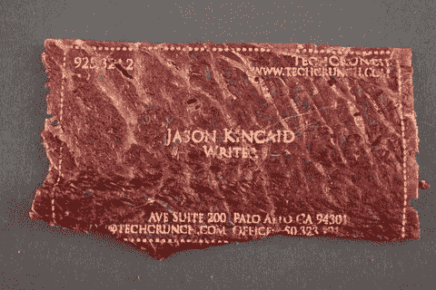
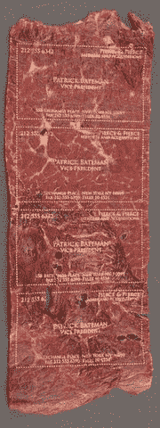
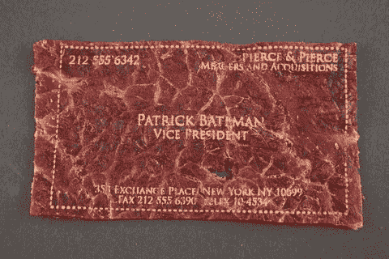

# 肉卡:用该死的激光束在牛肉干上打印你的名片 

> 原文：<https://web.archive.org/web/http://techcrunch.com/2009/05/06/meatcards-print-your-business-cards-on-beef-jerky-with-a-frickin-laser-beam/>

# 肉卡:用该死的激光束把你的名片印在牛肉干上

我毫不掩饰自己对 T2 名片的不屑。在一个我们可以在几秒钟内无线交换照片和电影的时代，为什么我们仍然在摸索着笨拙的纸张，这些纸张既容易丢失*又对环境不友好*？今天，看起来我可能要收回我说的话(或者，视情况而定，你的)。

输入[肉卡](https://web.archive.org/web/20230204222436/http://www.meatcards.com/)。两周前，一些博客[捕捉到了这一奇异且潜在惊人创造的风声](https://web.archive.org/web/20230204222436/http://www.boingboing.net/2009/04/23/business-cards-made.html)，将肉和激光结合在一起，创造出有史以来最富含蛋白质的名片。一些人认为这是一个骗局。但是很真实。

我联系了 MeatCards 背后的人，幸运的是，他们正在准备第一批原型卡片(当然是根据美国《惊魂记》的设计风格)。所以我提交了我的信息，他们打印出了上面看到的原型。为了保护一点隐私，我模糊掉了我的电话号码、电子邮件和我们的邮寄地址中的几个数字。但是大部分文字，比如我的名字和右上角的 TechCrunch 信息，都没有被动过。显然，激光蚀刻并不完美，但它基本上完成了任务。更多样品如下。

我还没有收到我的肉卡，因此无法亲自品尝这些商品。但我得到保证，它们在理论上应该是可以食用的，尽管有一种奇怪的激光烧灼的余味。也就是说，肉卡背后的家伙似乎对找到一种在卡上标记“请勿食用”的方法很感兴趣，以表明他们不希望你吃肉卡——这只会让他们面临太多可能的法律问题和法规。但是他们不能阻止你这么做。

那么什么时候可以给自己订一个呢？该产品仍处于测试阶段，但根据其主页显示，它们应该会很快上市销售。一定要看看这个令人敬畏的 [Flickr 设置](https://web.archive.org/web/20230204222436/http://www.flickr.com/photos/tikaro/sets/72157617689295071/)，看看它是如何做到的。

至于更传统的名片，看看谷歌目前正在[分发的](https://web.archive.org/web/20230204222436/https://techcrunch.com/2009/05/01/the-tasteful-thickness-of-your-new-google-profile-business-card/)名片。

