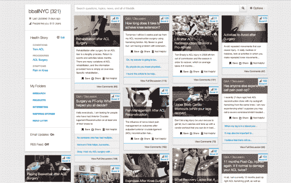

# Meddik 从创始人 Collective & More 获得 75 万美元，用于打造更好的 WebMD 

> 原文：<https://web.archive.org/web/https://techcrunch.com/2012/05/24/meddik-grabs-750k-from-chris-dixon-founder-collective-more-to-build-a-better-webmd/>

创业者们，请开始多关注 healthtech。与其试图打造下一个价值 10 亿美元的手机照片应用，不如精益求精，深入研究更大的问题。正如 ZocDoc [首席执行官 Cyrus Massoumi 最近所说](https://web.archive.org/web/20221205171337/https://beta.techcrunch.com/2012/05/23/zocdoc-ceo-cyrus-massoumis-advice-to-startups-stay-lean-dont-listen-to-the-nay-sayers-hire-the-right-people/)，健康科技在初创公司中的代表性不足，许多人(创始人并不孤单)未能认识到市场的规模(以及相应的机会):例如，仅医疗保健一项在美国就是 2.7 万亿美元的产业。

然而，和五年前一样，healthtech 对脑力、创业热情和一点体力的需求也是如此迫切。昨天在 TechCrunch Disrupt 向人群发表讲话时，ZocDoc 首席执行官基本上发出了行动呼吁，宣称获得医疗保健“是我们这一代人面临的最大挑战之一。”

今天，感谢越来越多专注于健康的创业加速器，仅举几个例子，如总部位于三藩市的 [Rock Health](https://web.archive.org/web/20221205171337/https://beta.techcrunch.com/2011/11/14/the-rise-of-the-health-startup-a-peek-at-the-13-companies-in-rock-healths-inaugural-batch/) 和总部位于纽约市的 [Blueprint Health](https://web.archive.org/web/20221205171337/http://www.blueprinthealth.org/) ，缺乏 HIPAA 或医学院经验不再是绝对的不合格者。更重要的是，有许多问题需要解决，其中一些问题悬而未决，事实上，健康技术也有增长资本。

说到这一点:Blueprint 的健康技术加速器的第一批毕业生之一是一家名为 [Meddik](https://web.archive.org/web/20221205171337/http://www.meddik.com/signup) 的初创公司，它希望为消费者提供更好的方式来搜索健康信息，并找到有针对性的个性化支持。该初创公司仍处于早期阶段，因此其优点仍在形成，但其想法是建立一个平台，聚合用户提交的内容，根据个人感兴趣的具体条件和主题确定最佳建议、文章和解决方案。

尽管仍处于周期的早期，但 Meddik 已经得到了投资者的认可，因为这家初创公司今天宣布，它已经从一群著名的天使和早期风险投资者那里筹集了 75 万美元的种子资金，其中包括克里斯·迪克森(Chris Dixon)、纳特·特纳(Nat Turner)、扎克·温伯格(Zach Weinberg)、鲍勃·斯特恩(Bob Stern)、Vivek Garipalli，以及 Collective、Great Oaks 和 Silicon Badia。

联合创始人 Tim Soo 目前正在宾夕法尼亚大学休假，他和联合创始人 Ben Shyong 正在为今年夏天晚些时候推出 Meddik 而努力，他告诉我们，他们最初打算建立一种谷歌健康搜索。就像 Noodle 目前为教育所做的一样。

但两位创始人最终意识到，他们的范围太广了，因为爬遍整个网络会导致垃圾邮件和垃圾邮件与优质健康内容的比例不利。当然，这触及了在线健康门户网站的一个基本问题。除非你的腿要掉下来了，由于医疗保健和医生/医院就诊的高成本，当涉及到基本的健康问题时，我们的第一步是问谷歌。现在和那时一样真实。

很自然地，谷歌搜索会导致笼统的答案、令人困惑的百科条目或冗长的论坛。但是，如果你找到一个和你一模一样的人(克隆人)呢？！)，他经历过同样的医疗问题、疾病，或者已经问过同样的问题，可以告诉你什么有效，什么无效。

【T2

当然，尽管这是一个很好的开端，但这些信息仍然是轶事。因此，Soo 说，关键是扩大这种体验，增加个性化的、聚合的公共和学术信息，传统和替代疗法，努力不仅为你的健康问题找到一个好答案，而且找到正确的答案。说起来容易做起来难。

这位联合创始人继续说，我们还没有将 Web 2.0 答案应用到最重要的地方，因此一个健康网络游戏“不仅仅意味着更好的新闻提要，或者一个好的餐厅推荐，它还意味着建立正确的健康相关联系可以拯救生命。”

当然，尽管 Massoumi 提醒我们，健康创业公司在生态系统中的代表性不足，但 Meddik 有很多竞争对手——至少名义上是这样。WebMD 和 PatientsLikeMe 以及 Healthline 都为患者提供了广泛的资源，但大多数现有的健康解决方案都倾向于专注于特定的状况(如慢性病)，这使他们固有地受到限制。在上述例子的情况下，用户的进入门槛也可能很高，有比填写复杂档案更好、更容易的方法。

因此，为了解决这些问题并保持广泛的范围，联合创始人建立了一个大型的本体表，将所有常见的健康语言(通过维基和网络搜集)连接到实际的医学代码。根据这些代码，Meddik 计算出搜索者和连接到该网站的所有其他用户之间的临床相似性指数，其目标是创建一个健康网络，其中用户保持匿名，同时能够与最适合帮助你的人联系。希望随着时间的推移和使用，这将产生更加个性化的健康搜索体验。

当然，在这一点上，梅迪克仍然处于建立其 MVP 的早期阶段，球队还有一段路要走。也就是说，这是一个非常值得追求的目标。该服务处于封闭测试阶段，有限数量的测试人员开始播种其内容。Soo 说，当网站建成并完全发挥功能时，它可能会利用其独特的数据集来提供有针对性的健康广告，这与脸书的社交数据/广告模式没有什么不同。

为了让读者了解他们的早期进展，Meddik 将在未来几天向数百名早期参与者开放。[在这里查看它们，](//web.archive.org/web/20221205171337/http://www.meddik.com/signup)让我们知道你的想法。