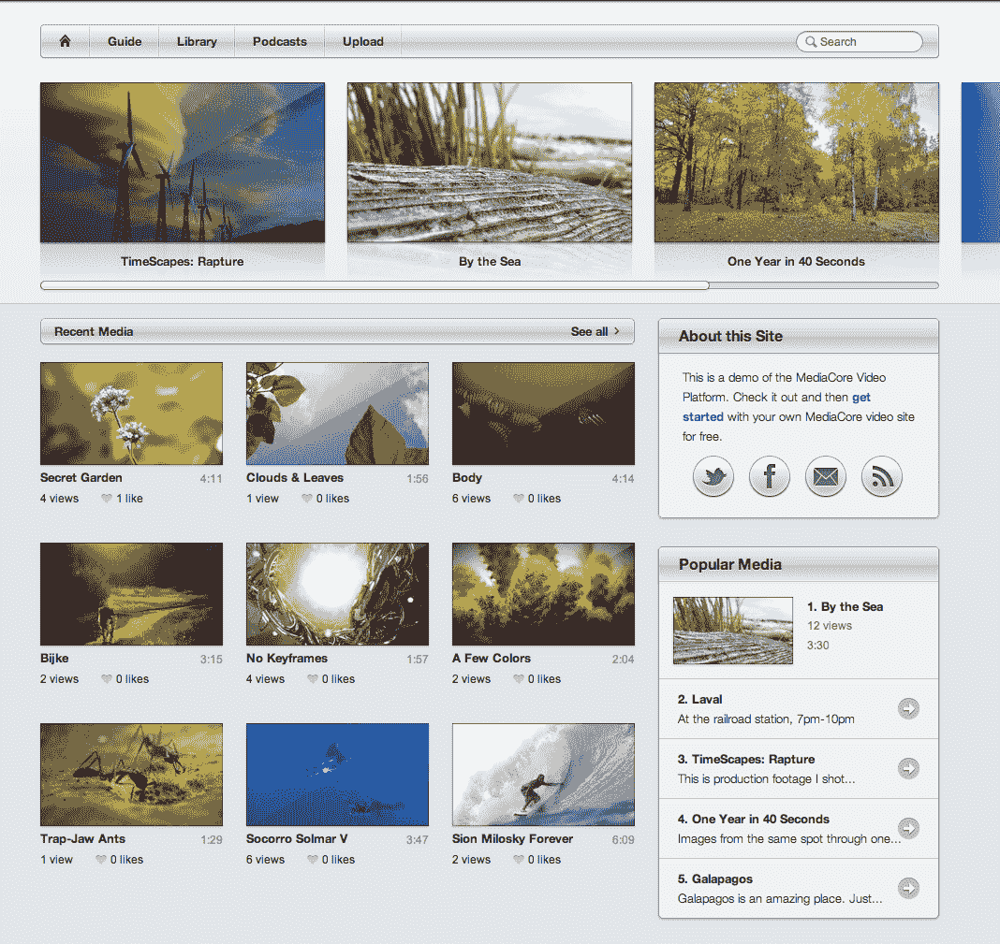

# MediaCore 筹集种子资金，推出平台让中小企业创建自己的 YouTube TechCrunch

> 原文：<https://web.archive.org/web/http://techcrunch.com/2011/08/10/mediacore-raises-seed-funding-launches-platform-to-let-smbs-create-their-own-youtube/>

今天正式向公众推出的是一个名为 [MediaCore](https://web.archive.org/web/20230203093907/http://mediacore.com/) 的新项目，由达米恩·坦纳和斯图尔特·鲍恩斯为您带来，前者负责[推进器](https://web.archive.org/web/20230203093907/http://pusher.com/)，这是一个为应用程序添加实时技术的解决方案，早在 6 月[由 Heroku guys 等人资助。](https://web.archive.org/web/20230203093907/https://techcrunch.com/2011/06/09/pusher-raises-1m-from-passion-capital-heroku-founders-to-bring-realtime-tech-to-your-apps/)

Tanner 和 Bowness 正在推出 MediaCore，为任何旧的小型企业提供推出自己的 YouTube 的能力，使这些组织能够端到端地控制这种体验。换句话说，MediaCore 是一个 SaaS 视频发布平台(配有移动应用程序)，为任何用户或组织提供创建和控制自己的视频网站的能力。而且都是为了好看。

至于它是如何工作的，客户将内容上传到该平台基于云的基础设施，并让视频通过 MediaCore 的播放器播放，除其他外，该播放器会自动确定用户正在连接哪个浏览器，这样他们就不必担心 Flash 和 HTML5 之间的差异。播放器会尽可能地使用 HTML5 为你分类。

访问者可以通过一个很酷的视觉指南浏览视频集，该平台允许所有者轻松地按类别或标签组织他们的视频，并根据相关性和受欢迎程度自动对内容进行分类。用户可以添加徽标、背景，并使用 CSS 来自定义网站的外观。此外，你可以添加自己的域名，利用播客和其他一些漂亮的工具。考虑到创建一个全业务视频平台并不容易，MediaCore 提供了一个非常酷的白色标签解决方案，看起来不错，不需要太多的技术知识。

MediaCore 目前提供 15 天的免费试用，之后的计划是每月 99 美元起。这些计划包括自定义域名、白标播放器、自定义品牌、自动编码、社交视频嵌入等。但最棒的是，每个账户都有 Android 和 iOS 应用，同时看起来也非常棒。接下来是什么？根据 Tanner 和 Bowness 的说法，这是私人视频、个人资料和付费墙。

为了让平台启动并运行起来，这家初创公司正在结束来自 Andrew Wilkinson 的天使投资，他是 MetaLab 的创始人兼首席执行官和 Gawker Media 的 Jesse Ma。虽然创始人拒绝透露细节，但这轮融资可能会有数十万人。(指的是美元。)

当我问他们 MediaCore 的灵感是什么时，他们告诉我，其他视频平台挤满了工程师，往往很少关注设计，导致蹩脚的界面和一系列拙劣的用户体验。因此，在运行了一年的 MediaCore 开源版本后，他们将 SaaS 平台推向市场，试图以设计为先，使其易于使用。

该平台的测试版已经吸引了超过 1，100 家公司，包括伦敦大学、Mentor Graphics、TechVibes、印第安纳大学和各种财富 500 强公司。正如人们从其早期客户和可扩展的云存储中可能猜到的那样，该产品是针对中小企业的，但创始人告诉我，他们将在今年内推出一系列个人计划，价格将低于目前每月 99 美元的价格。

MediaCore 还计划在不久的将来推出一个类似 Tumblr 的主题商店，这将允许用户购买主题和定制他们的网站，所有这些都通过一个 API (a la Tumblr)来工作。

总而言之，当付费墙推出，一个合适的 iPad 界面出现时，MediaCore 很可能会成为视频版的 OnSwipe。这是好事吗？你告诉我们。

如需更多信息，请查看家中的 media core[此处](https://web.archive.org/web/20230203093907/http://mediacore.com/)或前端演示，点击[此处](https://web.archive.org/web/20230203093907/http://demo.mediacore.tv/)。

