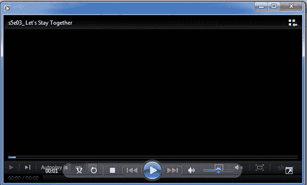
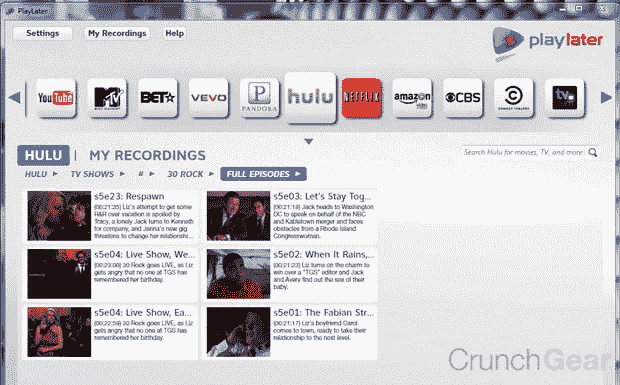
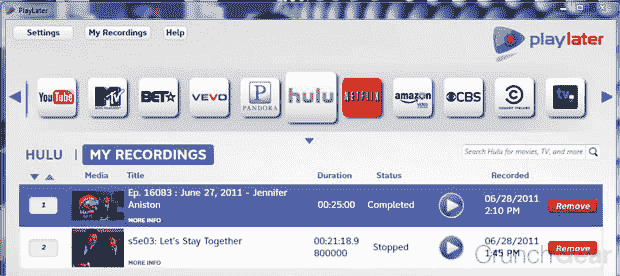

# MediaMall 的 PlayLater 承诺成为互联网视频的 DVR，进入有限的测试版 TechCrunch

> 原文：<https://web.archive.org/web/http://techcrunch.com/2011/06/29/mediamalls-playlater-promises-to-be-a-dvr-for-internet-video-enters-closed-beta/>

# MediaMall 的 PlayLater 承诺将成为互联网视频的 DVR，进入有限的测试阶段

广受欢迎的 PlayOn 媒体软件背后的人 MediaMall 刚刚宣布了 PlayLater 的封闭测试版，这是一款所谓的在线视频 DVR。这项服务从今天开始进行封闭测试，允许用户从十几项服务中“录制”在线节目，供以后在录制节目的电脑上或装有零售版 PlayOn 的设备上观看。

信不信由你，DVR 这个术语在这里其实很合适。我使用过这项服务，它实际上录制了节目，并将视频文件包装在一个带有数字版权管理的文件中。plv 容器只能在批准的程序上播放。它是如何工作的？我不知道，但确实如此，MediaMall 与 PlayOn 的成功分离表明该公司了解媒体流。

启动 PlayLater 后，用户会看到一个漂亮的用户界面和一个服务网格:TV.com、网飞、Hulu、亚马逊视频和其他 26 个服务。在那里，您选择服务，然后选择节目，最后选择您想要录制的剧集或剪辑。您可以选择现在录制或将其添加到队列中。

 
PlayLater 然后开始录制，就好像在电脑屏幕上实时播放一样。例如，在录制 Hulu 节目时，该网站的屏幕播放控件会在制作的视频文件中出现几秒钟。(见上文)广告也在那里，但由于录制的文件只是一个普通的视频容器，你可以随意忽略它们。

这些文件只能通过 Windows Media Player 在 PC 上播放。VLC 和其他人不工作。这些文件是可移植的，但只能在运行 PlayOn 客户端的设备上使用，尽管这项服务几乎可以在所有平台上使用，包括 Android、iOS、谷歌电视、所有游戏系统、Moxi、Roku 等等。

我试着用普通的软件剥离 DRM，但是没有成功；需要比我更聪明的人来破解这个密码。但是会发生的。有人，可能在几天之内，将破解任何锁持有这些文件俘虏。

PlayLater 最终将每月收费 4.99 美元，每年收费 49.99 美元，但目前这项服务只是封闭测试版。但是还没有关闭。下载服务的前 5000 名用户将进入测试阶段，并获得一个月的游戏费。PlayOn 本身收取额外费用，每月 4.99 美元，每年 39.99 美元，或者一次性收费 79.99 美元。

