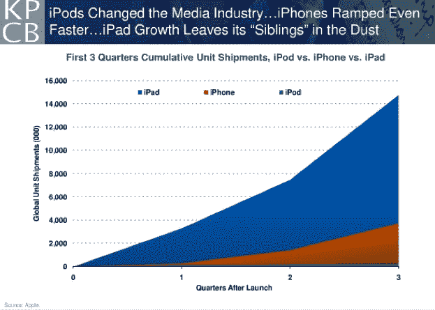
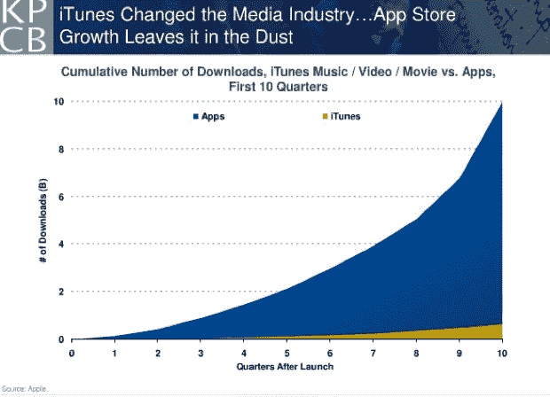
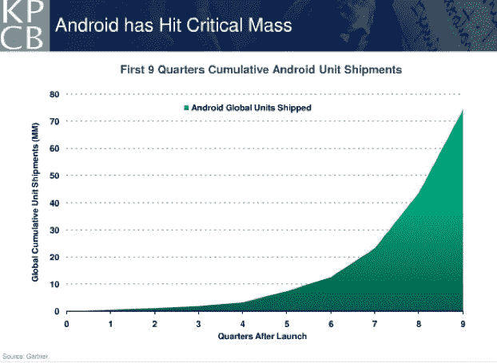

# 升级:玛丽·米克尔最新移动趋势下滑 

> 原文：<https://web.archive.org/web/https://techcrunch.com/2011/02/10/meeker-mobile-slides/>

# 加速:玛丽·米克尔最新的移动趋势下滑

[scribd id = 48586092 key = key-2 lpu 4 hkkstybioa 6d 76 e mode = slide show]

今天，凯鹏华盈合伙人[玛丽·米克尔](https://web.archive.org/web/20221007225853/http://www.crunchbase.com/person/mary-meeker)(前互联网[分析师转型风险投资家](https://web.archive.org/web/20221007225853/https://beta.techcrunch.com/2010/11/29/morgan-stanley-tech-analyst-mary-meeker-joins-kleiner-perkins-as-partner/))和[马特·墨菲](https://web.archive.org/web/20221007225853/http://www.crunchbase.com/person/matt-murphy)在谷歌 [thinkmobile](https://web.archive.org/web/20221007225853/http://www.google.com/events/thinkmobile2011/) 大会上为其最大的 200 家广告客户做演示。上面是完整的幻灯片，展示了凯鹏华盈正在关注和投资的十大移动趋势。米克的幻灯片总是很有洞察力，过去几年她一直专注于手机。

尤其是前三张幻灯片让人大开眼界。第一张显示了从 iPod 到 iPad 的移动设备应用的加速。在 iPod 推出后的前三个季度，出货了 236，000 台。当 iPhone 问世时，它在第三季度的出货量达到 370 万部，但随后 iPad 以 1480 万部的出货量击败了前两款产品。

第二张幻灯片展示了为什么 iTunes 需要更名为 App Store。从 iTunes 下载了 100 亿个应用程序，而只有大约 6.24 亿首歌曲。努夫说。

最后，Android 也不逊色。迄今为止，Android 手机的出货量已超过 7000 万部，Android 的出货量现在超过了 iPhone。在第四季度，智能手机和平板电脑的整体出货量首次超过了个人电脑的出货量。未来五年，全球移动数据流量预计将增长 26 倍。欢迎来到新时代。

