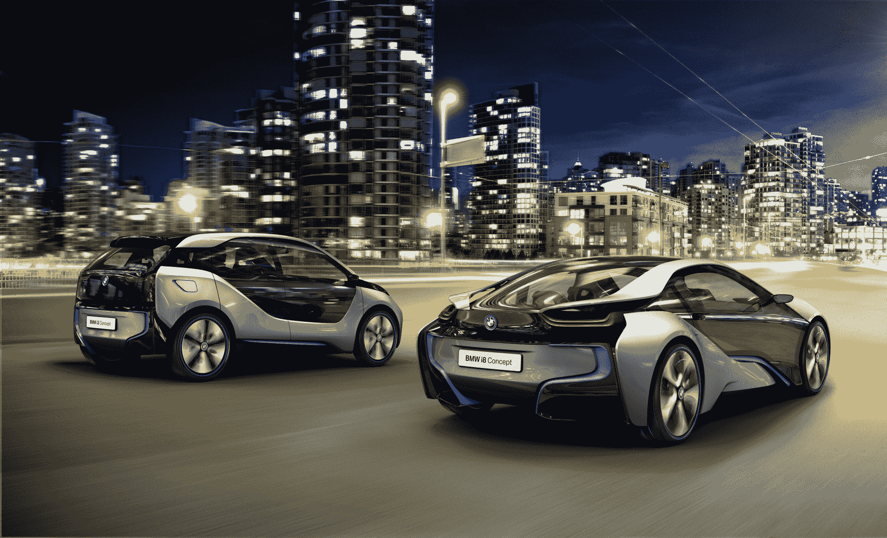

# 了解宝马全新全电动 i3 SUV 和混合电动 i8 跑车 

> 原文：<https://web.archive.org/web/http://techcrunch.com/2011/11/09/meet-bmws-new-all-electric-i3-suv-and-hybrid-electric-i8-sports-car/>

# 认识一下宝马新的全电动 i3 SUV 和混合电动 i8 跑车

因为我们的常驻汽车爱好者马特·伯恩斯(Matt Burns)决定本周去露营，所以我今天有幸参加了宝马在纽约的预览活动，在那里我首次看到了两款新的环保汽车:宝马 i3 和 i8。被称为巨型城市车辆(或 MCV，如果你愿意)，两者都是以城市司机为中心，利用绿色功能和稳定性。全电动 i3 实际上更像是一款紧凑型 SUV，而混合动力 i8 则是一款性感的小跑车。

我们很幸运地联系到了这两款车的外部设计师 Richard Kim，他详细介绍了这些新车的功能和原因。他提出的几个要点是，由于汽车框架使用了碳纤维增强塑料材料，这些汽车比普通汽车轻得多。i3 和 i8 也是从头开始创造的，而不是电动或混合动力汽车，它们只是现有车型的转换。通过这种方式，i3 和 i8 的组装和设计效率更高，体积庞大的电池沿着底部齐平放置，而“生命模块”无缝地位于顶部。

你会在视频中看到这一点，但肯定值得重申的是，这是我见过的最具未来感的两辆车。玻璃多得你都不知道该怎么处理了(虽然还不清楚这些玻璃在碰撞中会有什么作用)，沿着设计线、安全带和灯，宝马的 i blue 有一种很好的暗示，使其看起来流线而运动，与宝马的优雅风格相得益彰。

就范围而言，i3 和 i8 非常不同。全电动 i3 每次充电可行驶 80 至 100 英里，然而宝马知道里程焦虑对消费者的影响有多大，并提供了解决方案。i3 有一个可选的增程器(或宝马称之为 REX ),它使用汽油和马达提供额外的 80 至 100 英里。然而，气体和马达仅仅是为了给电池进一步充电，而不是为汽车的车轮提供动力。

另一方面，i8 是一款混合动力汽车，这意味着它既有一台电动机，又有一台内燃机。你会看到 i8 每次充电约 20 至 30 英里，但当与内燃机搭配时，总里程可达 300 英里。

我知道，我知道…这一切看起来和听起来都很棒。但是耐心是这个游戏的名字。我们要到 2013 年才能看到全电动的 i3，i8 将在 2014 年推出。价格尚未公布。