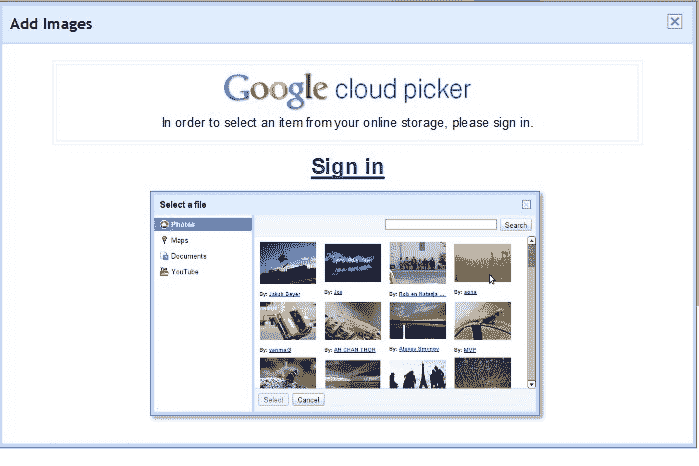

# 认识一下 Cloud Picker，谷歌的秘密存储新产品 

> 原文：<https://web.archive.org/web/https://techcrunch.com/2010/12/02/meet-cloud-picker-googles-stealthy-new-storage-product/>

# 见见云选择器，谷歌的隐形新存储产品

什么是谷歌云选择器？根据这些[博客论坛、](https://web.archive.org/web/20230203091859/http://www.google.com/support/forum/p/blogger/thread?tid=67705257a36f56b6&hl=en) [网站论坛、](https://web.archive.org/web/20230203091859/http://www.google.com/support/forum/p/sites/thread?tid=06e013faed761e33&hl=en)和[其他论坛、](https://web.archive.org/web/20230203091859/http://www.google.com/support/forum/p/blogger/thread?tid=3df4bc43da881b44&hl=en)谷歌一直在测试一种新的在线存储工具，你猜对了，叫做云选择器。

从这些描述来看，这个工具似乎与谷歌应用程序、文档和网站有某种联系，当用户试图在谷歌网站上插入文件或图片时，这个工具就会出现。当他们试图嵌入文件时，一个“谷歌云选择器”窗口打开，并要求用户登录他们的谷歌账户。

许多用户蜂拥至论坛，因为云选择器无法与任何谷歌应用套件账户配合使用。当与普通的 Gmail 帐户一起使用时，云选择器会将用户带到谷歌的登录页面，页面顶部是“个人资料”和“个人设置”，底部是“我的产品”。

一位用户[在](https://web.archive.org/web/20230203091859/http://www.google.com/support/forum/p/blogger/thread?tid=3df4bc43da881b44&hl=en)上发布了一张[云选择器的图片](https://web.archive.org/web/20230203091859/http://i53.tinypic.com/rjjp5l.png)，这张图片确实让人们对产品有了更多的了解。这似乎是一种新的存储产品，允许用户组织和搜索存储在云中的照片、文档、视频等。从表面上看，它似乎更关注消费者，而不是企业工具。

当然，这都是轶事，所以我们肯定错过了云选择器的关键元素。但是当我们联系谷歌以了解新产品的更多信息时，我们收到了一位发言人的回复:

*哎呀…看起来有人太快地推送了一些代码。它还没有完全准备好黄金时间，但请继续关注！*

所以我认为我们可以期待在不久的将来会有一款产品被命名为云挑选者或者类似的产品。