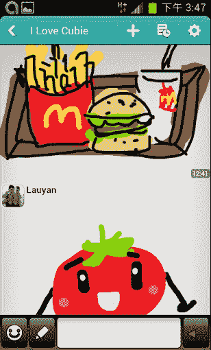

# 见见 Cubie，500 家初创企业支持的消息应用，拥有 550 万用户和幽默感 TechCrunch

> 原文：<https://web.archive.org/web/https://techcrunch.com/2013/03/01/meet-cubie-the-500-startups-backed-messaging-app-with-5-5m-users-a-sense-of-humor/>

如果你在美国或欧洲，很可能你还没有听说过 [Cubie Messenger](https://web.archive.org/web/20221210003305/http://cubie.com/) 。然而，在亚洲，让用户交换文本、贴纸、视频和自己的图画的免费移动通讯应用正在获得大量的关注。自 2012 年 3 月推出以来，Cubie 已经被下载了 550 万次，大多数用户来自东南亚和中东。总部位于台湾台北的公司[早在 10 月份就加入了 500 家创业公司](https://web.archive.org/web/20221210003305/https://beta.techcrunch.com/2012/10/31/500-startups-batch-five/)，目前正在学习如何向美国用户营销这款应用程序特有的亚洲品牌的乐趣和幽默。

【YouTube http://www.youtube.com/watch?v=RNUwDXUKZfE]

创始人 Cjin Cheng 和 Yenwen Feng 于 2011 年 9 月创建了 Cubie，最初打算将它作为一个进军移动应用市场的辅助项目。这是冯自 2004 年以来的第三次创业:第一次是在 2007 年收购了一个名为 [willmobile](https://web.archive.org/web/20221210003305/http://www.willmobile.com/) 的用于 Java 手机的移动股票交易应用程序，第二次是社交游戏公司[Gamelet.com](https://web.archive.org/web/20221210003305/http://tw.gamelet.com/games.do)。

Cubie 与众不同的是，它为用户提供了许多选项，让他们可以在一个屏幕上生成自己的内容，包括绘画、语音信息和动画贴纸，他们可以从 Cubie 的应用程序内商店购买。未来的更新将允许用户在聊天窗口中搜索 YouTube，这是一个经常被请求的功能。动画贴纸包括基于流行动漫系列(如《东京罗曼史》)中角色的贴纸，而其他贴纸则以 Cubie 自己的古怪角色为特色，如独角兽鲍勃。更有艺术倾向的用户可以在名为 Cubie Space 的应用程序中的公共论坛上发布他们的绘画。

“我们看到许多用户绘制了非常详细和有趣的图片，还有一些愚蠢的涂鸦。这反过来促使我们添加了最新的功能，如文本气泡和使用我们的动画贴纸作为装饰，让人们更容易发挥创意，”Cubie 国际使者詹姆斯·希尔告诉我。

希尔说，Cubie 用户经常在社交网络上分享绘画，包括脸书、推特和 Instagram，这对产生病毒式增长特别有用，尤其是在 Cubie 的主要目标市场之一东南亚。

“我们很早就注意到，(东南亚用户)更愿意在社交媒体上分享他们的联系信息(Cubie ID)，并邀请他们可能通过 Twitter 和 Instagram 认识的用户，但不一定是面对面，”希尔说。“我们还意识到，东南亚并不是一个同质的市场，例如，新加坡和印度尼西亚的用户之间存在巨大差异。基础设施以及人们使用手机和支付手机费用的方式存在很大差异。”

“另一个重要的工厂正在泰国的一个电视频道上播出，这让我们几乎一夜之间成为该市场的第一大应用，”他补充道。“传统形式的广告似乎也很有用，所以任何想进入这些市场的人都应该考虑到这一点。”

此外，联合创始人程表示，该公司希望与地区运营商取得联系，探讨数据套餐的可能性，因为在许多新兴市场，大多数用户都使用预付费计划，这使得数据使用成为一个问题。

Cubie 现在热衷于应对美国市场，尽管该公司指出，该应用目前倾向于吸引具有小众兴趣的美国用户，而不是在东亚和东南亚，Cubie 在那里更具主流吸引力。

“我们在博客上介绍了一些美国用户，我们意识到他们的品味和爱好非常小众，比如动漫和亚洲风格的卡通，这是我们绝对可以提供的，”希尔说。“展望未来，我们将寻求接触更多主流用户，要么通过我们添加的功能、我们设计或授权的贴纸和表情符号，要么通过添加其他对美国人有吸引力的东西。”

该公司还将目光投向了日本，正与日本的内容提供商合作，以吸引用户。Cubie 希望利用其日本投资者的关系和专业知识。该公司去年的种子资金轮从日本投资者 B Dash Ventures、NTT 投资伙伴、NEC Biglobe 和谷米风险投资公司以及台湾的 500 Startups 和 Pinehurst 那里筹集了 110 万美元。