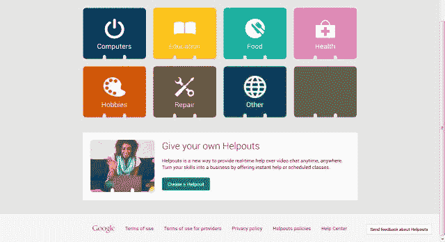
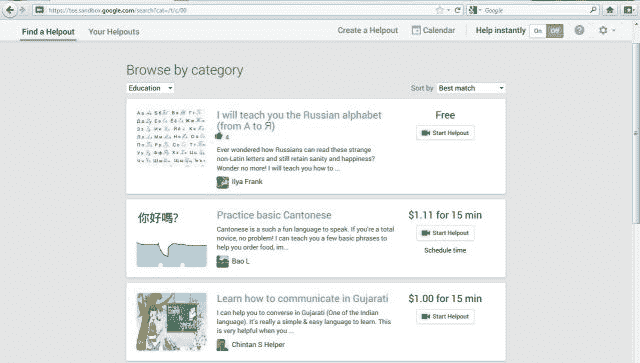
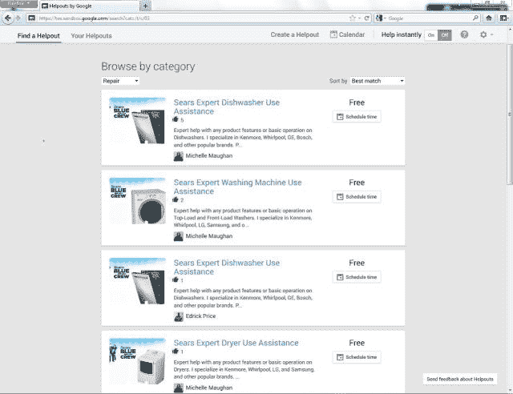

# 认识 Helpouts，谷歌的秘密项目，将 Hangouts 变成一个商业平台 TechCrunch

> 原文：<https://web.archive.org/web/https://techcrunch.com/2013/07/24/meet-helpouts-googles-secret-plan-to-bring-live-video-commerce-to-local-businesses/>

虽然谷歌的根基在于搜索，但如今它身兼多职。从自动驾驶汽车和可穿戴技术到社交网络和移动操作系统，这个搜索和广告巨头还没有涉足的行业很少。然而，最近谷歌的扩张在一个更加单一的方向上采取了引人注目的策略:电子商务。

随着亚马逊(Amazon)和易贝(Alibaba)在建设在线市场方面取得巨大成功，试图消除网上买卖的障碍，谷歌决定把椅子拉到电子商务桌上只是时间问题。今天，TechCrunch 通过一名消息人士了解到，谷歌一直在一个新平台的支持下悄悄地追求其市场野心，该平台利用其日益强大的云服务来推动实时商务。

据报道，该产品被命名为“Helpouts”，目前正在山景城进行内部测试，将成为一个市场，使个人和大小企业能够通过直播视频购买和销售服务。据我们的消息人士称，该平台能够在即时和预定的基础上连接商家和消费者，允许卖家创建自己的档案，并利用信誉管理、计划和支付功能，同时为消费者提供强大的搜索和发现工具。

随着其直播视频基础设施日益成为其不断扩大的实时产品清单的统一后端，谷歌的新市场将利用 Hangouts 通过直播视频提供服务。为此，该平台还将整合谷歌的少数产品，特别是其年轻的虚拟钱包和支付服务谷歌钱包。

据我们所知，谷歌在 6 月下旬开始对该产品进行内部测试，但可能离公开发布至少还有一个月。

与此同时，从我们从泄露的 Helpouts 模型中收集到的信息来看，这个平台似乎让人想起易贝最近推出 Secretguru 来扩大自己的市场，这是一个礼宾式的平台，允许商家直接向消费者提供一系列服务——从商业指导到美容技巧。

【T2

亚马逊在电子商务市场上取得如此领先地位的部分原因是其不断增长的履行中心和配送仓库网络，这使其能够生产出价格低廉、方便快捷的神奇在线零售子弹。没有一个履行网络，谷歌自己的本地购物雄心似乎正在采取不同的形式。在帮助下，谷歌和易贝一样，似乎正在向合作消费市场倾斜，比如 Zaarly、TaskRabbit 和 Live Ninja。

根据我们的消息来源，Helpouts 和之前的创业公司一样，将涵盖一系列类别，包括计算机、教育、食品、健康、爱好和维修。然后，人们可以想象在 Helpouts 上的服务，从健康咨询和健身班到家电维修支持和烹饪课程。

谷歌在内部测试中显然也与许多品牌合作，例如，包括一家医疗集团、西尔斯、慧俪轻体和 Alliance Frances。据报道，在推出时，该平台还将包括一系列个体商家和教练，从瑜伽大师到健身老师——所有人都将能够通过 Helpouts 向消费者提供免费和付费服务。

根据我们的消息来源，借助 Helpouts，谷歌正在寻求消除一些传统上阻碍无缝交付直播服务的障碍。例如，使用 Helpouts，来自阿根廷的西班牙语家庭教师可以为日本的学生提供语言培训，而纽约的瑜伽教练可以为怀俄明州的全职妈妈提供课程，家电维修店可以指导客户修理笔记本电脑上的坏风扇，唯一的要求就是要有互联网连接。

在新的“一个谷歌”时代，该公司已经开始优先考虑其产品之间更大的合作或相互关系。借助 Helpouts，人们还可以想象该平台如何成为谷歌核心搜索和广告业务的逻辑延伸。例如，客户可以联系零售商和制造商，获得关于产品购买的建议和意见，或者获得如何设置产品的指导。

这可能有助于支撑谷歌的一个挥之不去的缺口:当涉及到产品搜索时，人们不再求助于谷歌。都是关于亚马逊的。也不难想象 Helpouts 连接到 YouTube 来提供视频或课程回放，或者与谷歌的书呆子眼镜集成。

当然，就像任何谷歌产品发布一样，对于那些规模较小的竞争对手来说，日子可能会变得更加艰难。与 Helpouts 的某些部分平行或直接竞争的企业有很多，无论是[Live inja](https://web.archive.org/web/20230127055243/https://techcrunch.com/2012/12/07/backed-by-500000-in-seed-funding-liveninja-launches-its-video-chat-marketplace/)、 [PowHow](https://web.archive.org/web/20230127055243/https://techcrunch.com/2012/04/10/powhow-beta-launch/) (信不信由你，它是由一位前谷歌员工创建的)、Live 陆丹蓝、InstaEdu、Shmoop，以及可能不那么直接的平台，如 Angie's List、Udemy、Skillshare、TaskRabbit、CreativeLive 和 quicky。虽然，不可否认的是，其中一些比其他的重叠更多。

当谈到大数据或资源可以投入到策划这样的服务产品时，初创公司正在进行一场枪战。首先，这个领域有足够的空间来开发更精致、更高质量的产品，其次，谷歌拥有已经被个人和企业广泛采用的视频技术。更不用说，大多数创业公司都无法与谷歌的营销机器相提并论。

此外，据我们的消息来源称，谷歌一直在完全保密的情况下构建 Helpouts 嗯，直到现在——该公司几乎没有员工最初意识到这款产品，它是由二十多名工程师组成的团队在过去一年中开发的。除此之外，细节还不清楚。也许谢尔盖和他神秘的谷歌 X 部门应该对此负责。时间会证明一切。

 与此同时，有些人可能想知道，Helpouts 是不是注定要在 YouTube(或者至少是 HangOuts)级别获得采用，抑或这只是一个实验，它最终会落得和 Reader 或极客追捧的 Wave 一样的命运。目前还不完全清楚谷歌将投入多少营销资金，以及它是否打算让此举具有大众吸引力，但基于我们的观察，我倾向于肯定这一点。

此外，虽然推出这种产品的类型和日期仍不清楚，但我们从一些来源获悉，Helpouts 最近成了一次全公司会议的主题，这表明至少有几个谷歌人正在认真对待这个问题。

敬请关注更多信息。

*额外的关键调查和报道由独一无二的弗雷德里克·拉迪诺瓦先生贡献，* *山景城艺术大师。*