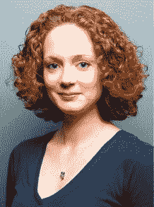

# Y Combinator 的秘密财务和运营武器| TechCrunch

> 原文：<https://web.archive.org/web/https://techcrunch.com/2013/02/09/meet-kirsty-nathoo-y-combinators-secret-financial-and-operational-weapon/>

后台办公室是任何风险公司都不引人注目但至关重要的一部分。Y Combinator 的种子期基金和孵化器近年来发展迅速，它也必须跟上年轻创业公司的步伐。

让这一切成为现实的人是 Kirsty Nathoo，一个有会计背景的英国移民。几年前，她加入了这家公司，并指导了数百家公司从成立、融资到现在的产品开发。

“如果柯斯蒂不在，Y Combinator 将停止运作，”Y Combinator 合伙人哈杰·塔格说。

“她是 Y Combinator 背后的故事，”YC 的一位创始人说，他要求匿名，因为他的公司处于秘密模式。“如果你拨开表面，看看 YC 是如何工作的，柯丝蒂对初创公司至关重要，大多数 YC 公司比任何人都更有可能花时间和她在一起。”

作为孵化器的首席财务官，她掌握着这个王国的钥匙。她不仅控制和管理 Y Combinator 的内部财务，从支付账单到帮助组织演示日，到实际确保 Y Combinator 的钱从正确的账户划拨到创业公司；但她帮助 YC 的初创企业协调外部融资、税务问题、公司注册和其他财政事务。她是整个运营背后的金融头脑，在 Nathoo 的监管下，已经资助和孵化了 368 家初创公司。简而言之，Nathoo 的工作可能由 5 名员工来完成。

正如 Nathoo 讲述加入 Y Combinator 的故事时所说，时机就是一切。

她第一次听说 Y Combinator 是在 2008 年，当时她的丈夫阿米尔·纳特霍被 2008 年冬季项目录取。Amir 最终毕业并推出了移动开发平台 Trigger。当她丈夫进入 Y Combinator 时，Nathoo 就读于剑桥，在英国会计巨头 PricewaterhouseCoopers 担任审计经理。在普华永道，她帮助照看公司簿记。

阿米尔创办 Y Combinator 时，她一去旧金山，就爱上了这座城市。Y Combinator 也成了一个家庭，因为她的丈夫沉浸在这个项目中。在阿米尔项目结束后的一年里，Nathoo 一直在英国和美国为普华永道工作，直到 Y Combinator 创始人保罗·格拉厄姆和杰西卡·利文斯顿找到 Nathoo，帮助他们进行运营和会计工作。2010 年初，Nathoo 正式加入孵化器，担任其内部会计。

2010 年冬季班是 Nathoo 的第一批创业公司，孵化的公司总数为 26 家。Nathoo 指出，这个数字在两年内几乎翻了两番，2012 年夏季班毕业的创业公司多达 85 家(都在 Nathoo 的监管之下)。

### “起初，我被人们对我的信任震惊了”

她开始负责 Y Combinator 自己的簿记工作，组织红杉投资于该公司的资金，并将这笔资金与格雷厄姆、利文斯顿、特雷弗·布莱克威尔(Trevor Blackwell)和罗伯特·莫里斯(Robert Morris)在公司成立时投入公司的原始资金分开。这实际上是一项复杂的任务。2009 年 3 月，红杉向投资了[200 万美元的资金，这笔资金保存在一个账户中。2010 年，红杉资本和其他天使投资者一起，向 Y Combinator 投资了 825 万美元给 T2。这也必须分开，Nathoo 必须向红杉汇报投资金额和回报(如果有的话)。](https://web.archive.org/web/20230328202432/https://techcrunch.com/2009/03/16/y-combinator-gets-the-sequoia-capital-seal-of-approval/)

“一开始，我被人们对我的信任震惊了，”纳特霍说。

她还开始帮助组织演示日，这是创业公司在项目结束时向投资者和媒体做的演示。她还开始与初创公司和创始人合作，她说这是她最喜欢的工作。

Taggar 说，Y Combinator 希望公司在项目期间什么都不做，只写代码和开发他们的想法。“柯斯蒂是让我们发生那种事的人。他补充道:“创始人不必把精力花在后勤上，可以专注于他们想专注的事情。

当谈到帮助 Y Combinator 的企业家进入项目和管理财务时，Nathoo 没有做很多事情，无论是对公司还是对个人。Nathoo 将与获准的企业家协调，以确保他们在启动项目时获得资金，并帮助他们理解协议条款。Y Combinator 向每个创始人(最多 3 个创始人)投入 11，000 美元外加 3，000 美元，以换取约 7%的股权。Nathoo 确保这笔钱被电汇到正确的银行账户，当你与 30、40 甚至 80 家初创公司(以及更多创始人)打交道时，这是一项复杂的任务。

Nathoo 回忆起最近的一个案例，一位海外创始人飞到美国参加 Y Combinator，却没有美国银行账户，也没有办法付款。他甚至没有钱来付房租。因此，Nathoo 在他抵达旧金山国际机场时，带着一叠现金去见他的新房东，这样这位创始人那天晚上就有地方睡觉了。

Nathoo 在创始人和初创公司中的另一个角色是会计顾问。她将确保每家公司都在特拉华州注册，如果他们还没有这样做，她将帮助完成这一过程。Y Combinator 和大多数投资者只会投资已经在特拉华州注册成立的公司，而很多创始人并不知道这一点。Nathoo 表示，在 Y Combinator 目前的 47 家创业公司中，只有一家公司的注册文件在加入该项目时没有问题。她还帮助他们开立银行账户，记录收据和财务状况，以留意税收后果。大多数创始人从未筹集过资金，所以不明白什么是可转换债券，也不知道上限表是如何运作的。

Jospeh Walla 是 YC 2011 届毕业生和电子签名创业公司 HelloSign 的首席执行官和创始人，他回忆了 Nathoo 对 83(b)选举表格的帮助。无论何时发行股票，通过 83(b)表格向 IRS 报告都是很重要的。然而，许多初创公司的创始人并不知道这一点；Nathoo 帮助 Walla 和他的一些同学完成了这个过程。

“有趣的是，她一直保持低调，因为她是 Y Combinator 的重要成员。在财务和会计方面，她有很强的模式识别能力。他说:“我想不出硅谷有谁有那样的经验。“她确保我们成为一家真正的公司，而不是一群有不同想法的人。”

### “她确保我们成为一家真正的公司，而不是一群有不同想法的人”

随着 Nathoo 在 Y Combinator 的日常运营中变得越来越根深蒂固，她承担处理和帮助融资等责任就变得更有意义了。去年，她被[提升为首席财务官](https://web.archive.org/web/20230328202432/http://ycombinator.posterous.com/two-new-yc-partners-kirsty-nathoo-and-carolyn)。Nathoo 说，她已经开发出一种系统的方法来组织 Y Combinator 的公司文件和融资条款清单。

因为她帮助 Y Combinator 和外部投资者形成了数百份融资文件，所以 Nathoo 也有一种模式识别能力，知道特定投资者会放弃或协商哪些条款。虽然她没有指名道姓，但她说她已经开始看到某些投资者想要或不想要的模式，并将相应地为初创公司提供建议。

 此外，Nathoo 还帮助启动基金的财务后勤工作，该基金为每家 Y Combinator 公司提供了来自尤里·米尔纳、安德森·霍洛维茨和通用催化剂公司的 15 万美元投资。Y Combinator 最近[用 YC 风投](https://web.archive.org/web/20230328202432/https://techcrunch.com/2012/11/26/y-combinator-debuts-yc-vc-to-replace-the-start-fund-includes-yuri-milner-andreessen-horowitz/)取而代之，后者包括 Milner，Andreessen Horowitz，General Catalyst 和 Maverick Capital。YC 风投给每个初创公司的投资不是 15 万美元，而是 8 万美元。

不用说，随着所有这些不同的资金来源进入 Y Combinator 初创公司，Nathoo 是 Excel 电子表格方面的大师。

除了管理财务，Nathoo 还担任运营经理以及 Y Combinator 初创公司的调解人/训导员。她邀请风投和天使投资者参加演示日，并确保每个投资者都经过审查。随着 Y Combinator 的成功创业率，投资者都吵着要参加演示日，Nathoo 确保每个参加的投资者都经过审查，并且是创业公司的合适人选。这意味着一些潜在投资者可能会被排除在外。纳特霍说，有些情况下，一些投资者试图带他们的朋友来演示日，但没有经过审查，她不得不要求人们离开。她补充道，投资者也有过几次发脾气。

Nathoo 的一些财务建议也带有个人色彩。许多创始人会带着个人税务和财务问题来找她。从 Y Combinator 毕业的创业公司继续通过电子邮件向 Nathoo 咨询税务问题。不幸的是，当 Y Combinator 的创始人之间进展不顺利时，Nathoo 也会充当调解人，这种情况在每个班级都会发生。“我尽量不偏袒任何一方，但我是来收拾残局的，”她说。“我还建议他们在 Y Combinator 工作之初就制定规则和合同，规定如果一名创始人离开，公司将进行股权分解和拆分。”

使柯丝蒂如此独特的另一个特征是她在通常非常复杂的事情上的效率。例如，她帮助设计了一种方法，一旦最初的 Y Combinator 融资文件归档，资金就会自动转入创始人的银行账户。以前，这是一个手工过程，Nathoo 会为每门课自己进行 60 次或更多的电汇。现在这项任务已经自动化了。

*未来*

Nathoo 告诉我们，红杉的最后一笔资金被用于 2012 年夏季班。现在，Y Combinator 完全通过孵化器对初创公司的投资(即退出)获得资金。Y Combinator 会在没有任何资助的情况下继续运营吗？Nathoo 说，她不确定它会走多远，但该组织在财务上处于良好状态。

Y Combinator 还[最近在山景城买了一栋新建筑](https://web.archive.org/web/20230328202432/http://www.bizjournals.com/sanjose/blog/real-estate/2012/09/y-combinator-crosses-the-road-moves-hq.html)，孵化器将搬进去，因为它已经超出了目前山景城的总部。Nathoo 也将管理财务和运营。

展望未来，她还在产品战略上与创始人合作，她说这是她的下一个大挑战。她也是申请加入该项目的初创公司面试过程的一部分。

“Y Combinator 目前最大的挑战是扩大规模，并找出如何做到这一点，”她解释道。我们试图找出如何帮助越来越多的公司获得成功，这个答案有很多思路。其中一部分是将可以系统化的东西系统化，比如金融。"

对 Nathoo 来说，Y Combinator 不仅仅是一份工作，更是一个家庭。“这是我梦寐以求的工作。我告诉很多人，我拥有世界上最好的工作。”