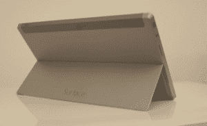
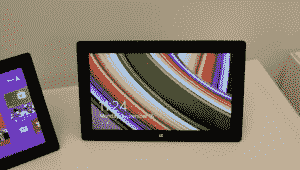
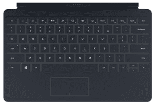
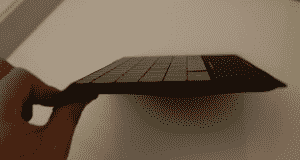
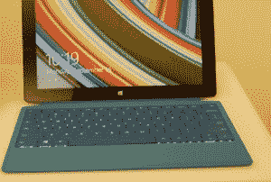
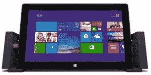

# 认识一下微软的 Surface 2 和 Surface Pro 2 

> 原文：<https://web.archive.org/web/https://techcrunch.com/2013/09/23/meet-microsofts-surface-2-surface-pro-2-new-touch-type-covers-and-more/>

今天，微软揭开了其假日硬件阵容，推出了两款新平板电脑，以及许多新的和更新的配件。需要处理的信息很多，所以让我们按顺序浏览每一部分。

上周，我在雷德蒙德与新硬件和 Surface 项目背后的团队呆了一段时间。关于 Surface 2 和 Surface Pro 2 的实践笔记将在这篇文章之后发表，同时还将发表对 Surface 现任总经理布莱恩·霍尔和微软公司副总裁兼 Surface 首席执行官帕诺斯·帕内的广泛采访。

现在，您需要对新内容有一个概述。我们将很快得到粒度。这里是一遍。

### 表面 2

Surface 2 是 Surface RT 的第二代产品，尽管它的名字并不像它的祖先一样。从最基本的配方来看，Surface 2 与其前身非常相似:它是一款基于 ARM 的平板电脑，支持可连接键盘，旨在让 Windows 8(.1)运行。

除此之外，微软对产品本身进行了全面的改进。电池寿命延长了 25%。一种新的处理器(NVIDIA Tegra 4 芯片)提高了速度和图形性能。支架现在包括第二个更深的角度，使在膝盖上使用设备变得更加简单。它有一个新的外观，银镁外壳可以抵抗指纹，并且更加坚固。它改进了摄像头，以更好地支持弱光设置，帮助您在黑暗的房间里与人 Skype。而且，它更便宜，起价 449 美元——Surface RT 以 499 美元的价格进入市场。

如果你认为 Windows 8.1 使 Windows 8 平台成熟到足以满足日常使用，并且 Windows Store 在其生命周期中已经充满了足够多的应用程序，Surface 2 可能是一款你喜欢的设备。当然，硬件自第一代以来已经有了很大的改进。问题是 Windows 8.1 能在多大程度上利用这些升级。

坦率地说，Surface 2 是一款非常好看的设备，如果我曾经在这样杂乱的地方工作，我会觉得在咖啡馆使用它很棒。

在这种情况下，它的成功与 Windows 8.1 的成功密切相关:Windows 8.1 越好，Surface 2 的升级就越有可能大放异彩。Surface 2(同样，在我非常有限的动手时间内)被证明是一款有能力的设备。例如，我可以看到学生喜欢它。

### Surface Pro 2

如果说 Surface 2 的升级是广泛和多样的，那么 Surface Pro 2 的变化是有针对性的和垂直的:这一切都与电池寿命有关，宝贝。根据微软的说法——稍后还会有更多——它不断收到反馈，称商业客户对 Surface Pro 感兴趣，但无法忍受其表现不佳的电池寿命。该公司坦率地表示，它的第一代 Pro 在这方面有所欠缺。

因此，微软没有从外部改变设备，而是将设备的内部重新调整为它所谓的 Surface Pro 2，这将使电池寿命延长 60%左右，这一数字据称在某些使用情况下可能会更高。

Surface Pro 2 已经升级到 Haswell 一代英特尔芯片，可以包含高达 8gb 的低功耗 DDR RAM，以及一个可以达到 5tb 的 SSD。它还获得了新的支架位置，这是微软引以为豪的，主要是因为它的工作。

Surface Pro 2 看起来像它的前辈，大小和重量相同，但寿命更长，如果你正确装配它，它会更硬更快。它的起价和它的前身一样:899 美元。

### 免费的数码产品

微软在你购买的每台新 Surface 上绑定了两样东西:为期两年的 200g sky drive 存储空间，以及为期一年的 Skype 服务，包括国际通话。这里的玩法很简单:买一台微软设备，该公司的服务就随之而来。你肯定记得，微软正在追求“设备和服务”模式——这是两者的融合。

如果你要购买 100 的 SkyDrive 存储一年，会花掉你 50 美元。你目前不能一次购买 200。因此，SkyDrive perk 本身理论上价值 200 美元。微软本质上是在购买你的数字存储定制。

失败者？其他不符合那个规模的存储公司，比如 Box。

### 新触摸盖

旧的 Touch Cover 是一个整洁的硬件，我，也许你也一样，从来没有真正掌握过。我从来没有完全信任过它。在过去的一年里，微软已经开发了一种新的触摸盖，它包含了 14 倍多的传感器，并进行固件升级。

实际上，更好的软件和一大堆新的键盘感应技术让新的 Touch Cover 拥有更好的打字体验。我会用新的 Touch Cover 替换我的机械键盘吗？不，但如果我生活在一个地面设备上，这将使在飞机上打字变得简单得多。

新款 Touch Cover 比上一代产品更薄更轻，并且采用背光设计。

新的 Touch Cover 最有趣的是手势:用两个手指滑过数字键线，Touch Cover 就会高亮显示文本。释放，所选文本将被删除。空格键手势与 Windows 8.1 的单词推荐系统对话。还有其他输入法值得学习。我在快速测试中发现我的航海腿有些困难，但我想我应该能在一天内掌握这套。

最初的 Touch Cover 可能是 Surface 产品线中最具创新性的部分。微软已经获得了它的初始产品，并对其进行了极大的改进。

有什么坏处？每个新 Touch Cover 119 美元的高价。这相当于去年发布的原始 Touch Cover 的价格。

### 保留旧的

以上是今天宣布的新硬件的最重要的部分，所以这是一个适当的时机来休息一下，讨论一下微软在去年的设备系列中保留了什么。售价 349 美元的 Surface RT 和售价 79 美元的原始 Touch Cover 将在可预见的未来继续销售。

微软可能有相当多的额外设备想要摆脱，在市场上拥有更便宜的硬件可以在某种程度上与 iPad Mini 和 Chromebooks 竞争，这些设备正在吞噬低端个人电脑市场的份额。

然而，请记住，Surface 系列的关键营销点是，它是一款让你完成任务的平板电脑。但如果没有键盘，你真的无法在生产力方面做很多事情，这意味着如果算上键盘配件，Windows 8.1 平板电脑的最低价格仍在 400 美元以上。微软可以以 400 美元的价格发布 Surface RT 和 Touch Cover 的捆绑包，但该公司告诉我，它已经不再捆绑其硬件，所以不要指望它。

有趣的是:微软 Office 2013 Professional 目前在亚马逊上的售价是 400 美元。这几乎相当于基本办公套件附带的 Surface RT 和 Touch Cover。我们看到硬件价格下降削减了软件成本。这是一个需要记住的市场趋势。

### 电源盖

微软为其 Surface 平板电脑推出了第三种新的键盘:电源盖。它是 Type Cover 的更厚版本，本质上，可以大大增加平板电脑可以饮用的果汁量。

有人告诉我，一个充满电的电源盖 Surface Pro 2 的续航时间大约是一个 Type Cover 的 Surface Pro 的 2.5 倍。在当前的 Surface Pro 上扣上电源盖，电池寿命将延长约 60%。

因此，如果你有一次长途飞行，这个封面可能是你的。目前我还没有定价细节，但预计电源盖的价格在 150 美元到 200 美元之间。   

电源盖的一个巧妙之处在于，只要它还有能量，它就会将能量释放到地表。因此，如果你有一个 90%充电的 Surface Pro 2，连接到一个带有任何电池的电源盖上，它会将该电量上传到平板电脑本身，即使藏在公文包中。这不是一个便宜的解决方案，而是那些需要它并且对价格不敏感的人的一个选择。

### 新型封面

随着新的触摸和电源盖，微软已经重新制作了它的类型盖，包括更安静的按键，背光和不同的颜色。因此，如果你想拥有一个包括移动键的键盘，你可以选择洋红色或蓝色。随便你喜欢什么。

以前，虽然 Touch Covers 有多种颜色，但 Type Cover 却是福特黑，以适应其更多的业务重点。嗯，看来人们希望他们的打字更时尚一点。

### 码头

码头。这已经是很久以前的事了，但还是值得在这里简单讨论一下。Surface dock 是微软为了更好地将其 Surface Pro 2 设备融入工作场所而采取的一项举措。

它有 USB 3.0 和 2.0 端口，一个以太网插孔，一个迷你显示端口和两个音频插孔。如果你使用所有四个 USB 端口，微软向 TechCrunch 证实，dock 可以在全功率下支持它们。

dock 的工作方式如下:你将 Surface Pro 2 设备(键盘可能会受到攻击)放在 dock 的双臂之间，然后将它压入设备，设备两侧的一个端口用于固定它。

从那里，你有有线互联网，你需要的外围设备，当然，简单的多显示器支持。如果你愿意，你也可以拉下触摸盖，使用更大的键盘。

### 其他零碎的东西

今天还有什么？一个用于触摸和打字外壳的无线适配器，可以将它们无线化，这样您就可以从屏幕上打字了。我不确定 doodad 会有多受欢迎，但如果你能在非 Surface 设备上使用 Touch Cover，那可能会提高这对设备的受欢迎程度。

最后，微软开发了一款鼠标变体，叫做触摸鼠标 Surface Edition。它是为地面设备设计的。老实说，我没有太多，但如果我得到一个，我会为你审查它。

—

那是这片土地的大致情况。TechCrunch 即将发布更多爆炸性新闻和分析，所以请系好安全带。

*顶级形象信用:*