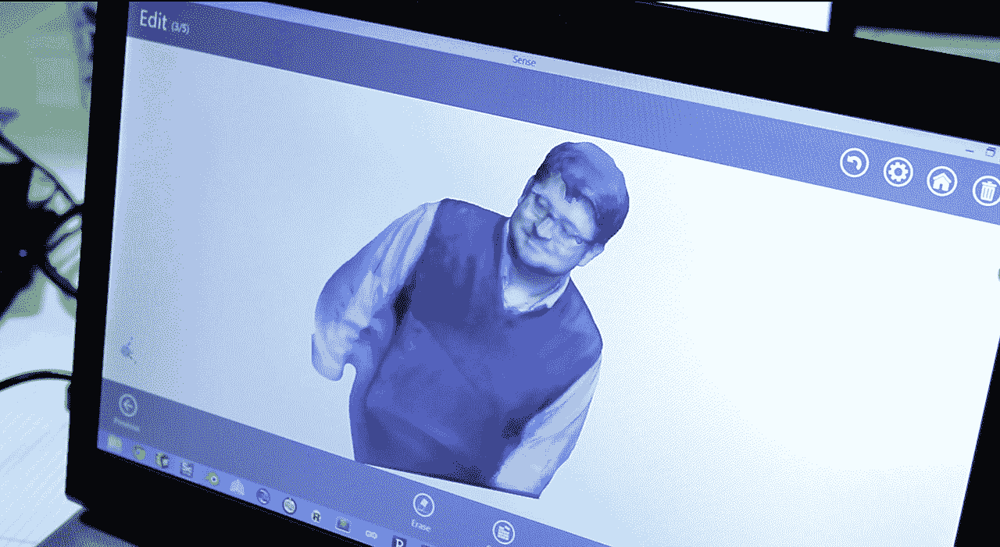

# 认识 Sense，3D Systems 面向大众的廉价、极其简单的 3D 扫描仪 TechCrunch

> 原文：<https://web.archive.org/web/https://techcrunch.com/2013/11/10/meet-sense-3d-systems-cheap-dead-simple-3d-scanner-for-the-masses/>

我们已经看到不少初创公司开发出了自己令人印象深刻的 3D 扫描仪——仅举几个例子，有 [Makerbot](https://web.archive.org/web/20221208091021/http://www.makerbot.com/) 和它的数字化仪，还有黑马[occial](https://web.archive.org/web/20221208091021/http://www.occipital.com/)和它的移动结构传感器——但是 3D 打印机中最古老和最大的名字之一显然也渴望进入这个游戏。总部位于南卡罗来纳州的 3D 系统公司最近发布了一款便宜的、对消费者友好的扫描仪，名为 Sense，本周末我顺便参观了 Engadget 在纽约的 Expand 展，想看看这款产品的实际应用。

这是 TL。博士:如果你的时间很紧:399 美元的价格是正确的，我对这个小东西留下了非常深刻的印象。我的意思是很少，因为 3D 系统炮制了一个便携式的东西，大约是一个小精装书或钉枪的大小。多亏了塑料底盘，它也不会太重，这只有在你实际应该如何使用它的情况下才有意义。

你看，虽然像 Makerbot 这样的空间中更多的 buzzy 玩家选择了限制性的转盘设计，但这种感觉意味着被牢牢抓在手中，而不是被动地支撑在桌子上。一旦配套软件安装在联网的电脑上，剩下的就是站在你的主题周围，慢慢地挥动感觉，直到你捕捉到你想要的一切。由于与 PC 的持续连接，用户可以监控正在进行的扫描的实时可视化表示。

所以是的，很方便。自然，如果感觉没有兑现它的承诺，那也不会有什么不同，但它似乎确实泰然自若地完成了工作。如果你见过 3D 扫描仪，那么你可能对这些东西的工作原理有很深的理解:相机和红外传感器捕捉物体的视觉和几何特征，并将它们转换为 3D 模型。多亏了来自 Primesense 的传感器阵列，sense 能够扫描 10 英尺长 10 英尺宽的物体——最终你可以制作出你地下室里那张备受宠爱的沙发的数字图像。

扫描结果看起来如何？这一切都取决于你。扫描过程奖励缓慢的、有条不紊的动作，而不是嗖嗖嗖地挥动翅膀的滑稽动作；手动操作过于匆忙只会增加在混音中引入错误和偏差的风险。令人欣慰的是，Sense 附带的软件足够智能，可以解决一些突然出现的小问题，只需点击几下，就可以将模型固化为适合打印的结构。

但关于 Sense 最令人好奇的事情是:从价格到严肃的设计，再到首席执行官阿维·赖兴塔尔充满社交媒体友好的“Sense speak”实例的演讲，一切都表明 3D Systems 仍致力于试图打开消费市场。对于该公司来说，这并不是一个陌生的领域——两年前，它开始推出一系列以消费者为中心的 3D 打印机，但其中最便宜的价格仍然高达 1299 美元。

这与 Makerbot 旗舰产品 Replicator 2 的高昂价格形成了鲜明对比，但即使是这种较低的价格壁垒也足以确保 3D 打印机(以及支持 3D 打印机的设备)的大规模市场采用仍有一段路要走。虽然在自己家里舒适地打印出替代物的想法很棒，但我认为还没有人制造出 3D 打印机的 T 型——这种产品代表了价格和性能的完美融合，让人们真正思考如何通过按需生产物品来改善他们的生活(如果有的话)。

然而，3D 打印爱好者中的普遍观点是，有人破解打印机代码，世界其他地方开始集体关注挤出塑料和激光烧结的奇迹，这只是时间问题。一旦发生这种情况，像 Sense 这样的设备的价值将变得非常明显——它们旨在解决 3D 打印内容的差距。毕竟，如果所有这些真的将成为普通用户的领域，这些用户将需要打印事物的数字示意图，而不必费心使用复杂的软件套件。3D Systems 通过让它变得非常简单，并对其进行定价，试图诱使人们现在就填补内容空白，以便每个人都能更快赶上。

这种感觉本身会改变普通人(而不是顽固的书呆子、乐观的近未来主义者和约翰·比格斯)对 3D 打印的看法吗？大概不会。但这是朝着正确方向迈出的一步，如果运气好的话，Sense 及其低成本产品将预示着更好的 3D 打印时代的到来。