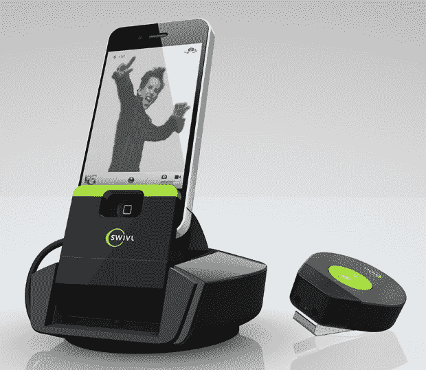

# 认识一下 Swivl，它是一个动作跟踪 iPhone 基座，可以让你一直保持在镜头前 

> 原文：<https://web.archive.org/web/https://techcrunch.com/2011/11/09/meet-swivl-the-motion-tracking-iphone-dock-that-always-keeps-you-on-camera/>

# 认识一下 Swivl，它是一个动作跟踪 iPhone 基座，可以让你一直保持在镜头前

哦，我们生活的这个奇妙的世界。不到一年前，[我在他们的车库办公室会见了两人团队【Satarii，检查一个他们称之为“Star”的产品。这是一种相机底座，但有一个有趣的变化:它会自动跟随你的动作，让你在拍摄视频时保持在帧中。](https://web.archive.org/web/20230203183327/https://techcrunch.com/2011/01/24/meet-the-satarii-star-the-crowdfunded-iphone-accessory-of-every-bloggers-dreams/)

当时，他们有两个原型:一个小的，死的，喷漆的塑料“看起来像”原型，和一个工作原型，大约是圣诞火腿的大小。然而，很明显他们有所发现。

今天早上，该团队首次亮相明星的最终演变:满足 Swivl。

这个东西最好用视频来解释，所以我让他们的演示来说话:

[维梅奥·http://www.vimeo.com/31713891 w = 601 & h = 338]

基本上:把你的 iPhone(或其他类似大小的相机)放进去，把记号笔拍在你身上的某个地方(或拿着它)，按下 record，Swivl 就会旋转，让你保持在镜头中。需要一个你玩滑板的视频，但是没有摄像师？出于这样或那样的原因，需要有一个“免提”Facetime 会话(嘿，我不是在问问题)？这就是 Swivl 的切入点。

自从我上次与他们交谈以来，事情发生了相当大的变化，似乎一切都在好转:

*   Swivl 现在可以在使用中为苹果设备充电，并且可以通过无线标记开始/停止视频录制
*   虽然他们最初的价格目标是“低于 200 美元”，但预购价格和预计零售价格现在定为 159.99 美元
*   我看到的原始原型只能水平转动；最终产品也可以垂直倾斜。

我真的想知道旋转时马达的声音有多大。原始原型上的马达声音足够大，可以被对接的摄像机记录下来，有趣的是，上面演示视频中的几乎所有镜头都完全用配乐配音。当然，一点嗡嗡声和呼呼声几乎是不可避免的。

~~之星~~ Swivl 将于“2012 年初”在北美推出([产品页面此处为](https://web.archive.org/web/20230203183327/http://www.swivl.com/))，尽管这是他们即将推出的具体时间。我等不及了。恭喜，伙计们！

