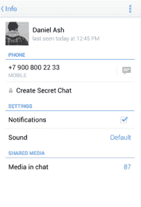

# 认识一下 Telegram，这是俄罗斯最大的社交网络 TechCrunch VK 创始人开发的一款安全消息应用

> 原文：<https://web.archive.org/web/https://techcrunch.com/2013/10/27/meet-telegram-a-secure-messaging-app-from-the-founders-of-vk-russias-largest-social-network/>

由俄罗斯最大的社交网络平台的创始人创建的 [Telegram](https://web.archive.org/web/20221123114507/http://telegram.org/) 是一款新的消息应用，提供速度、安全性和功能，如端到端加密的秘密聊天和自毁消息。

尼古拉和帕维尔·杜罗夫兄弟在 2006 年推出了 [VK](https://web.archive.org/web/20221123114507/http://vk.com/) (原名 VKontakte)，18 个月前开始研究 Telegram，因为他们想创造一种“既安全又有趣”的东西今年 6 月，爱德华·斯诺登(Edward Snowden)披露的美国国家安全局(NSA)和棱镜计划(PRISM)首次公之于众，突显了 Telegram 的重要性。

“这让很多人非常害怕，并对当前的形势感到担忧。我们肯定是开始想办法解决这个问题的许多人之一，”帕维尔在电话采访中告诉我。

杜罗夫自己也与俄罗斯法律当局发生过冲突。本月早些时候，对杜罗夫否认参与的一起交通事故的调查第二次被叫停，但在此之前[VK 的办公室和杜罗夫的家都被搜查](https://web.archive.org/web/20221123114507/http://www.theguardian.com/world/2013/apr/18/russian-internet-social-media-network)。今年早些时候，VK 也被俄罗斯国家电信监管机构列入黑名单。尽管该组织后来声称黑名单是一个意外，但一些分析人士表示，这是政府试图恐吓网络活动人士。(在我们的电话采访中，杜罗夫指出，他使用的是俄罗斯 SIM 卡，我们的谈话很有可能被俄罗斯法律当局录音。)

### 通过非盈利性和开放性获得信任

Telegram 基于一个名为 MTProto 的自定义数据协议，由数学家尼古拉·杜罗夫(Nikolai Durov)构建。该应用的秘密聊天是一个独立于普通聊天的功能，使用端到端加密。它们不能被转发，并且可以被设置为在一定时间后自毁。Telegram 的秘密聊天和普通聊天的一个关键区别是，秘密聊天并不存储在应用程序的云中，这意味着你只能访问来自其原始设备的消息。

Telegram 希望通过运营一个非盈利的开放平台来赢得用户的信任。

“我们想要澄清的第一件事是，没有人必须信任任何人。帕维尔·杜罗夫说:“我们不认为人们对电报的信任是理所当然的。

杜罗夫表示，目前每天约有 10 万活跃用户，他希望用户和开发者能够利用 Telegram 的开放 API 和协议。

Durov 解释说，这样一来，“我们将能够邀请每个人来审查我们在 Telegram 上使用的消息传递算法，并检查应用程序的源代码。我们可以从他们那里赢得信任，端到端加密可以在客户端完成。这样，任何感兴趣的人都可以检查该应用程序是否确实如其所声称的那样，并且不会向其他来源发送信息或做任何其他不安全的事情。”

】Telegram 的创始人表示，该应用将保持非营利性，因为这使他们能够避免商业和法律压力。如果他们最终需要资金来扩大规模，Telegram 将要求用户捐款或提供额外的应用内购买服务。这些可以包括一个可以用来代替真实手机号码的虚拟号码，以确保更多的保密性。

尼古拉·杜罗夫(Nikolai Durov)监督了 VK 平台的扩大，在 7 年多的时间里，该平台的每日独立用户增加到了 5000 万。Pavel 表示，兄弟俩在 VK 发展过程中吸取的教训意味着，即使 Telegram 的用户群迅速扩大，他们也能确保 Telegram 的安全。

去年 12 月，中东用户一天之内下载 Telegram 超过 10 万次，而平时平均每天下载量为 2000 次。根据 Twitter 聊天记录，Telegram 团队发现该地区说英语的用户下载该应用程序是因为他们对其群组和媒体共享功能感兴趣。与 WhatsApp 将群聊限制在 50 名成员不同，Telegram 目前允许多达 100 名成员。

### 哲学

Telegram 的团队希望这款消息应用能够提供速度和安全性，以及对众包和社区驱动的努力的依赖，从而脱颖而出。

杜罗夫说:“VK 因其在第三方开发者中的竞争而闻名，这些第三方开发者基于其开放 API 构建 VK 的替代版本。“我希望 Telegram 能够比 VK 更依赖社区，因为这是一个非营利项目，希望能够吸引那些分享其背后理念的人。”

Telegram 的团队从与 VK 打交道的经历中学到的另一个教训是远离俄国政府。该应用在世界各地租赁数据中心和服务器，包括伦敦、旧金山、新加坡和赫尔辛基。

“作为一家外国公司和离岸实体，我们没有义务遵守俄罗斯、中国、沙特阿拉伯等国的规定，”杜罗夫表示。

如果 Telegram 收到来自政府或法律组织的请求，它无论如何都无法为端到端加密聊天提供数据，因为加密密钥是在每个用户的设备上生成的，而不是在服务器上。

“任何人都可以查看我们的文档和应用程序的源代码，并确保我们没有试图愚弄任何人。就此而言，美国国家安全局可以做同样的事情，并看到我们不能为他们提供任何纯粹出于算法和数学原因的数据，”他补充道。“我认为这是一种拒绝数据请求的方式，不会公然违反美国或任何其他国家的当地规则。”

Telegram 是由杜罗夫兄弟创立的新公司 Digital Fortress 的第一个项目。下一个项目将涉及语音通信，尽管 Durov 仍然不确定它是作为一个单独的项目开发还是作为 Telegram 的一个新功能。Telegram 的小型工程团队目前的首要任务包括让用户能够永久删除账户。

“我们将提出解决方案，真正确保人们的数据被完全删除，”杜罗夫说。“我们必须考虑几个选项，并选择最好的一个，以透明的方式做到这一点。”